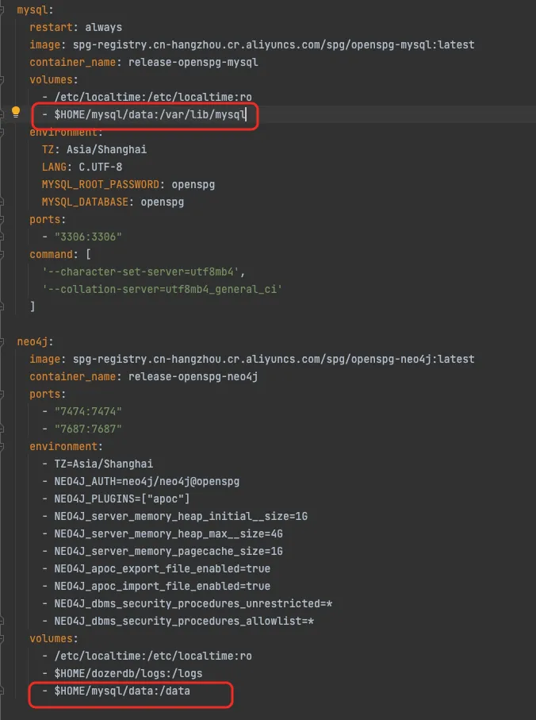
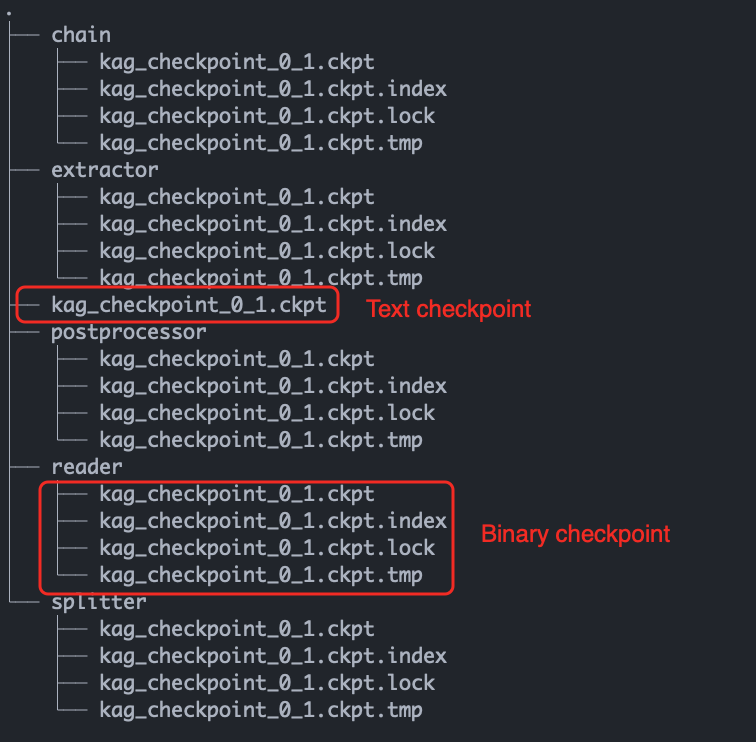
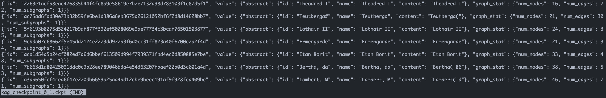

# 常见问题

在使用过程中，遇到任何关于OpenSPG或KAG的相关问题，可通过GitHub Issue进行提问或到GitHub Discussions 参与讨论，你的提问会沉淀下来帮到其他小伙伴。

有些问题可能是之前已经遇到过的，可以在Issue当中进行搜索， 如果你在使用过程中解决了一些问题，也非常欢迎在社区互动，解决并关闭对应的Issue

| | **Issue** | **Discussions** |
| --- | --- | --- |
| **OpenSPG** | [https://github.com/OpenSPG/openspg/issues](https://github.com/OpenSPG/openspg/issues) | [https://github.com/OpenSPG/KAG/discussions](https://github.com/OpenSPG/KAG/discussions) |
| **KAG** | [https://github.com/OpenSPG/KAG/issues](https://github.com/OpenSPG/KAG/issues) | [https://github.com/OpenSPG/openspg/discussions](https://github.com/OpenSPG/openspg/discussions) |


## 问题1：图储存配置，模型配置，向量配置是否有内置服务
图存储配置，通过docker-compose.yml安装镜像后有对应的内置服务，对性能要求不高希望快速验证的场景 可直接使用以下配置

```json
{
  "uri":"neo4j://release-openspg-neo4j:7687",
  "user":"neo4j"
}
```

模型服务、向量服务暂未进行内置，需要用户自己进行搭建或者调用第三方的API，具体流程可参考：[生成(chat)模型](https://openspg.yuque.com/ndx6g9/docs/hwsng2zg3fefggas) [表示(embedding)模型](https://openspg.yuque.com/ndx6g9/docs/zxdbplek55gv0oq3)

## 问题2：项目的配置文件kag_config修改后，为何没有生效？
解决：由于元数据都存储在服务端(openspg-server)中，修改KAG目录下文件后需要将对应配置更新到服务端。步骤：在项目目录下，执行knext project update --proj_path . 将项目配置进行更新，同时在OpenSPG服务端页面中也直接修改对应配置信息，其他命令可参考：[命令行工具](https://openspg.yuque.com/ndx6g9/docs/hhcv6l993gbhm54w)


## 问题3：我想保留或者清空 Neo4j镜像中的数据，应该如何设置？
如果需要将数据持久化在宿主机上可在docker-compose.yml中配置 - $HOME/dozerdb/data:/data，反之去掉该代码，删除Container时数据也会丢失，默认未设置。MySQL同理




## 问题4：正确配置完生成模型和表示模型，都可以在宿主机上通过curl命令成功访问后，但在OpenSPG服务端的知识问答页面中，还是出现connection refused或者timeout
OpenSPG问答页面进行自然语言问答，需要spg-server的容器能正常访问到宿主机上的向量服务，对于使用windows或mac上的docker desktop的同学来说，可以指定向量服务base_url = `http://host.docker.internal:11434/${path}` 访问宿主机，对于使用linux的同学来说，可以指定base_url = `http://172.17.0.1:11434/${path}` 通过访问docker0网络的网关从而访问宿主机。此外，需要注意启动ollama服务前，export OLLAMA_HOST=0.0.0.0:11434，配置ollama监听来自所有地址的访问请求。

同时我们在创建项目时，会对所有配置进行校验，验证通过后才能进行保存


## 问题5：我的文档比较大，发现调用模型服务时消耗的tokens太多，应该如何解决
通过产品使用时，根据实际的情况可以适当调大Chunk切分的长度，比如由200调整至2000甚至更高，切分长度越小后续的抽取效果相对越好，可根据实际情况进行调整。


## 问题6：为什么我找不到对应的Python包No matching distribution found for openspg-knext==xxxx
openspg的包部署在pypi.org，可通过以下地址进行查看对应包是否存在：

[https://pypi.org/project/openspg-kag](https://pypi.org/project/openspg-kag)

[https://pypi.org/project/openspg-knext](https://pypi.org/project/openspg-knext)

如果报错的版本已经存在，请检查本地环境是否进行了代理，或者转发到了其他pypi仓库

如果报错版本在pypi.org中未查询到请及时与我们联系


## 问题7：前端代码是否开源 ，kag-model何时开源
**前端代码**：前端代码目前暂无开源计划，后续会根据社区使用情况 评估后判断是否开源

**kag-model**：kag-model的优化时KAG后续的工作重点，我们将在后续版本中进行开源，KAG后续计划如下：

+ 领域知识注入，实现领域概念图与实体图的融合
+ kag-model 优化，实现构图&问答的效率提升
+ 知识逻辑约束的幻觉抑制

## 问题8：怎么查看checkpoint文件的内容
KAG框架内置了text和binary两种checkpoint格式：text格式用于记录执行日志，位于ckpt目录的顶层，binary格式用于记录任务执行各阶段的中间结果，如Extractor组件抽取出的图数据。

+ **统计信息查看**




对于text格式的checkpoint文件，可以直接打开查看：

```shell
less kag_checkpoint_0_1.ckpt
```

其中记录了每条记录构建出的点/边/图的数量



+ **binary 信息查看：**

binary格式的checkpoint基于zodb实现kv存储，用户可参考zodb官方文档获取更详细的使用信息：[https://zodb.org/en/latest/](https://zodb.org/en/latest/)


下面给出了一个示例程序，从extractor组件的checkpoint文件中提取出所有产出的原始图数据，并写入到一个jsonl文件中做进一步分析优化：

```python
import json
import pickle
from ZODB import DB
from ZODB.FileStorage import FileStorage


storage = FileStorage("extractor/kag_checkpoint_0_1.ckpt")
db = DB(storage)
connection = db.open()
print(len(connection.root.data))
graphs = []
for k, v in connection.root.data.items():
    """
    The data is pickled to prevent it from being modified by ZODB in subsequent processes. 
    So it needs to be deserialized upon reading.
    """
    graphs+=pickle.loads(v)
with open("extracted_subgraphs.jsonl", "w") as writer:
    for g in graphs:
        writer.write(json.dumps(g.to_dict(), ensure_ascii=False))
        writer.write("\n")
```

需要注意的是，zodb可以追踪对象在程序中的修改并自动同步到文件中，因此我们在这里使用pickle将数据序列化成不可变的字节序列后再写入zodb，以免在后续处理组件中被zodb修改。在读出的时候，我们同样需要用pickle反序列化，从而获取原始数据。

## 问题9：如何自定义抽取或问答任务
KAG框架在0.6版本引入了基于注册器的代码与配置管理机制。用户可以重载KAG各个内置组件，并注册到框架中替换默认实现。详情请参考[自定义代码](https://openspg.yuque.com/ndx6g9/docs/mxdhqfad16p4f8pk)部分文档：


