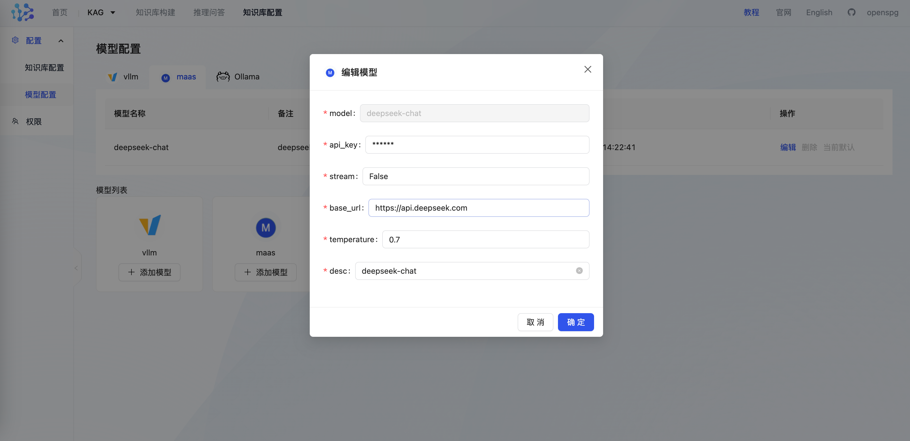
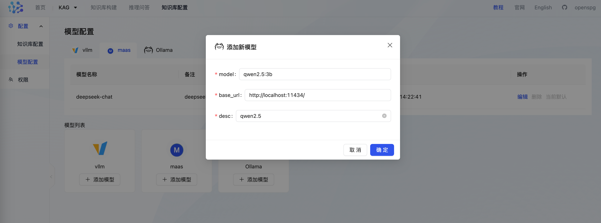

# 生成(chat)模型

用户在为 kag 配置生成模型服务时，可以选配商业模型api(MaaS)，或基于vllm、ollama 拉起的本地模型服务。

# **MaaS(****OpenAI兼容接口****)**
maas 是指（Model As Service）。kag 支持openai兼容类接口的所有在线大模型服务，如deepseek、qwen、openai 等。开发者可自行前往[deepseek官网](https://www.deepseek.com/)、[通义千问官网](https://tongyi.aliyun.com/)、[openai官网](https://chat.openai.com/)，提前完成账户的注册以及模型服务的开通，并获取api-key，填入到后续的项目配置中。

## 产品模式配置
用户通过Docker部署openspg-server后在模型配置页面进行设置，我们建议新手用户可使用商业模型API进行快速上手

+ **配置项**



+ **配置示例**

```json
{
  "type": "maas",
  "base_url": "https://api.deepseek.com",
  "api_key": "deepseek api key",
  "model": "deepseek-chat",
  "stream":"False",
  "temperature":0.7
}
```

+ **模型服务可用性测试**

配置保存时，kag 会根据生成模型配置调用大模型api，如果调用失败则提示保存失败。用户可在openspg 容器中通过curl 命令验证服务的可达性、以及api-key 是否过期。

```bash
# 将获取到的api-key 替换掉下述命令中的 <DeepSeek API Key>

$ curl https://api.deepseek.com/chat/completions \
  -H "Content-Type: application/json" \
  -H "Authorization: Bearer <DeepSeek API Key>" \
  -d '{
        "model": "deepseek-chat",
        "messages": [
          {"role": "system", "content": "You are a helpful assistant."},
          {"role": "user", "content": "Hello!"}
        ],
        "stream": false
      }'
```

## 开发者模式
用户可根据配置文件 kag_config.yaml 中的[llm]条目自行更改kag所有环节依赖的大模型。

```python
chat_llm: &chat_llm
  api_key: put your openai api key here
  base_url: https://api.openai.com
  model: gpt-3.5-turbo
  type: maas

```

```python
# TongYi
chat_llm: &chat_llm
  api_key: put your openai api key here
  base_url: https://dashscope.aliyuncs.com
  model: qwen-turbo
  type: maas
```

```python
# Deepseek
chat_llm: &chat_llm
  api_key: put your openai api key here
  base_url: https://api.deepseek.com
  model: deepseek-chat
  type: maas
```

注：开发者模式下，配置修改后，需要同步到服务端。具体参考文档：[更新项目配置](https://openspg.yuque.com/ndx6g9/docs/zxh5a5dr03945l1x#VxszD)。

# Ollama/Vllm(本地模型服务)
## 如何部署本地模型服务
kag 为 openai 类大模型推理服务对接提供了支持，用户可选择 ollama、vllm 等模型服务框架中的一个，自行搭建大模型推理服务。

### ollama 模型推理服务
+ **安装ollama**
    - **mac用户：**brew install ollama
    - **windows和linux用户：**到[ollama官网](https://ollama.com/)下载ollama
+ **启动模型服务：**
    - **启动ollama: **

```shell
# 配置ollama监听来自所有地址的访问请求
$ export OLLAMA_HOST=0.0.0.0:11434
$ ollama serve
```

    - **拉取模型：**

```shell
$ ollama pull qwen2.5:3b
```

即可开启模型服务

    - **查看模型列表**

```shell
$ ollama list

NAME                                 ID              SIZE      MODIFIED     
bge-m3:latest                        790764642607    1.2 GB    25 hours ago   
qwen2.5:3b                           357c53fb659c    1.9 GB    9 days ago     
```

    - **测试：**

```shell
# 发送测试请求
$ curl http://localhost:11434/v1/chat/completions \
    -H "Content-Type: application/json" \
    -d '{
        "model": "qwen2.5:3b",
        "messages": [
            {"role": "system", "content": "You are a helpful assistant."},
            {"role": "user", "content": "你是谁？"}
        ]
    }'

$ {"id":"chatcmpl-360","object":"chat.completion","created":1732100271,"model":"qwen2.5:3b","system_fingerprint":"fp_ollama","choices":[{"index":0,"message":{"role":"assistant","content":"我是来自阿里云的大规模语言模型，我叫通义千问。很乐意为您提供帮助，请您告诉我您具体的问题或需求是什么，期待与您的交流合作！"},"finish_reason":"stop"}],"usage":{"prompt_tokens":22,"completion_tokens":37,"total_tokens":59}}
```

### vllm 模型推理服务
根据 vLLM 官方博客 [vLLM: Easy, Fast, and Cheap LLM Serving with PagedAttention](https://blog.vllm.ai/2023/06/20/vllm.html)所说：进行了 NVIDIA A10 GPU 上推理 LLaMA-7 B 和 在 NVIDIA A100 GPU（40 GB）上推理 LLaMA-13 B 两个实验。**在吞吐量上 vLLM 比最基础的 HuggingFace Transformers 高 24 倍，比 TGI 高 3.5 倍**。

+ 首先要准备一个 GPU 环境，可以参考这篇文章：[GPU 环境搭建指南：如何在裸机、Docker、K8s 等环境中使用 GPU](https://www.lixueduan.com/posts/ai/01-how-to-use-gpu/)
+ 为避免干扰，建议使用 conda 单独创建一个 Python 虚拟环境安装 vLLM。

```shell
# 配置conda 加速

$ conda config --add channels https://mirrors.aliyun.com/anaconda/pkgs/main
$ conda create -n vllm_py310 python=3.10

$ conda activate vllm_py310

# 配置 pip 源
$ pip config set global.index-url https://mirrors.aliyun.com/pypi/simple

# 在虚拟环境中安装 vllm
$ pip install vllm
```

+ 模型下载，可以通过modelsope下载模型

```shell
$ pip install modelscope
$ modelscope download --model Qwen/Qwen2.5-7B-Chat
```

+ 启动vllm服务

```shell
modelpath=/path/to/model/Qwen2.5-7B-Chat

# 单卡
python3 -m vllm.entrypoints.openai.api_server \
        --model $modelpath \
        --served-model-name qwen25-7B-chat \
        --trust-remote-code

```

+ 发送测试请求

```shell
# model 就是前面启动服务时的 served-model-name 参数
curl http://localhost:8000/v1/chat/completions \
    -H "Content-Type: application/json" \
    -d '{
        "model": "qwen25-7B-chat",
        "messages": [
            {"role": "system", "content": "You are a helpful assistant."},
            {"role": "user", "content": "你是谁？"}
        ]
    }'

```

### 容器访问宿主机模型服务
当用户以产品模式运行 kag 时，涉及容器内访问容器外模型服务的诉求。对于如下情形：

+ **kag 容器与模型推理服务 部署于相同宿主机：**
    - **Mac & Windows 环境：**容器中访问 host.docker.internal 可路由到宿主机上的服务，修改生成模型配置中，base_url 对应的域名即可。

```shell
# 宿主机上 ollama 加载的qwen2.5:3b 模型服务，在容器中可通过如下方式访问
$ curl http://host.docker.internal:11434/v1/chat/completions \
    -H "Content-Type: application/json" \
    -d '{
        "model": "qwen2.5:3b",
        "messages": [
            {"role": "system", "content": "You are a helpful assistant."},
            {"role": "user", "content": "你是谁？"}
        ]
    }'
```

    - **Linux 环境：**容器中访问 172.17.0.1, 可通过访问docker0网络的网关从而访问宿主机，修改生成模型配置中，base_url 对应的域名即可。

```shell
# 宿主机上 ollama 加载的qwen2.5:3b 模型服务，在容器中可通过如下方式访问
$ curl http://172.17.0.1:11434/v1/chat/completions \
    -H "Content-Type: application/json" \
    -d '{
        "model": "qwen2.5:3b",
        "messages": [
            {"role": "system", "content": "You are a helpful assistant."},
            {"role": "user", "content": "你是谁？"}
        ]
    }'
```

+ **kag 容器与模型推理服务 部署于不同宿主机：**

通过访问模型服务所在宿主机的ip 来实现请求路由。

## 模型服务配置
### 产品模式配置
用户通过docker 部署的openspg-server后在模型配置页面进行设置

+ **配置项**

model name 和 ollama list 所展示的一致。



+ **ollama 配置示例**

如果以ollama 加载模型提供模型推理服务，则设置 type = ollama。

```json
# localhost 需要根据实际情况改成对应域名，参考 "容器访问宿主机模型服务"一节

{
  "type": "ollama",
  "base_url": "http://localhost:11434/",
  "model": "qwen2.5:3b"
}
```

+ **vllm 配置示例**

如果以vllm 加载模型提供模型推理服务，则设置 type = vllm。

```json
# localhost 需要根据实际情况改成对应域名，参考 "容器访问宿主机模型服务"一节

{
  "type": "vllm",
  "base_url": "http://localhost:8000/v1/chat/completions",
  "model": "qwen25-7B-chat"
}
```

+ **其它**

如果用户倾向于使用其它的模型推理服务框架（如 xinference），可以自行搭建。调用前完成 设置type = vllm（相当于默认值），base_url = xx 即可。

+ **模型服务可用性测试**

配置保存时，kag 会根据生成模型配置调用大模型api，如果调用失败则提示保存失败。用户可在openspg 容器中通过curl 命令验证服务的可达性，避免模型已停止服务影响调用。具体可参考 “容器访问宿主机模型服务”一节。

### 开发者模式配置
用户可根据配置文件 kag_config.yaml 中的[llm]条目自行更改kag所有环节依赖的大模型。

开发者模式下，知识抽取、推理问答相关的大模型调用，是从kag 运行时所在的本地环境发起的。模型推理服务对应的域名，需要保证 kag 运行时所在的环境能够解析即可。

+ **ollama**

```python
# localhost 需要确保 能被kag 运行时所在的环境正确解析。
[llm]
type = ollama
base_url = http://localhost:11434/
model = qwen2.5:3b
```

+ **vllm**

```python
# localhost 需要确保 能被kag 运行时所在的环境正确解析。
[llm]
type = vllm
base_url = http://localhost:8000/v1/chat/completions
model = qwen25-7B-chat
```

注：开发者模式下，配置修改后，需要同步到服务端。具体参考文档：[更新项目配置](https://openspg.yuque.com/ndx6g9/docs/zxh5a5dr03945l1x#VxszD)。


