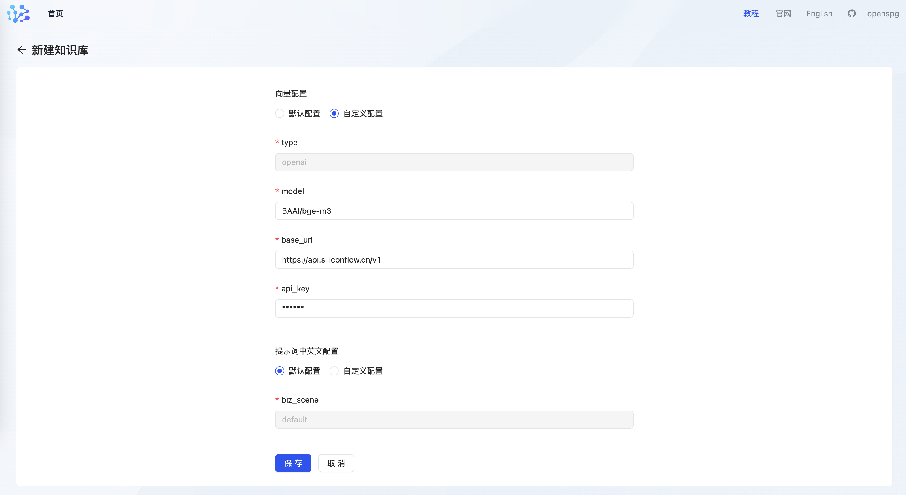
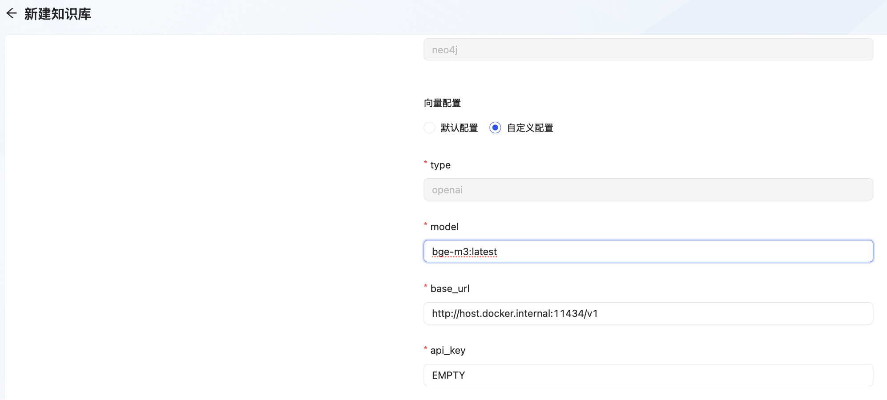

# 表示(embedding)模型

KAG 系统利用表示模型服务来生成实体属性和查询语句的向量表示。这一步骤对于图谱构建、推理以及问答等任务至关重要。实体属性的向量设置，参考 "知识建模"相关章节。

**支持多种表示模型接口 **

为了满足不同用户的需求，KAG 支持接入多种流行的表示模型服务。这意味着您可以根据自己的偏好或者已有资源来选择最合适的解决方案

+ **MaaS(OpenAI兼容接口)：**如果您已经熟悉或正在使用 OpenAI 提供的服务，那么可以直接通过其API调用来获取所需的向量表示。此外，还有其他提供类似功能的服务商如硅基流动也完全兼容。 
+ **Ollama/Vllm(本地模型服务)：**除了上述选项外，我们也支持与 Ollama 和 **Vllm** 这样的模型服务框架对接。它们各自拥有独特的特点，在某些特定场景下可能表现更佳。 

**如何选择？**

+ 如果您希望快速上手，并且对现有技术栈有一定了解，那么采用 **MaaS** 模式可能是最佳起点。 
+ 对于追求更高灵活性或是有特殊需求（比如需要定制化调整）的用户，则建议探索 **Ollama** 或 **Vllm** 等提供更多自定义选项的服务。


**特别注意：****不同表示模型生成的向量，即使维度相同，也不能混用；因此，知识库配置中，表示模型相关的配置，一经设置，便不能修改。**

# **MaaS(****OpenAI兼容接口****)**
开发者可自行前往 [硅基流动官网](https://docs.siliconflow.cn/api-reference/embeddings/create-embeddings)、[OpenAI官网](https://chat.openai.com/)，提前完成账户的注册以及模型服务的开通，并获取api-key，填入到后续的项目配置中。

硅基流动 的 API 同时提供了文本生成和 embedding 生成的 API，且目前大模型 `Qwen/Qwen2.5-7B-Instruct` 和向量模型 `BAAI/bge-m3` 完全免费，适合快速验证测试。也可在[模型广场](https://cloud.siliconflow.cn/models)查找更多免费模型。通过[硅基流动](https://account.siliconflow.cn/login) 注册账号后获取 API 密钥即可使用

**特别注意**：免费模型有 RPM 和 TPM 限制，适合小规模数据快速验证，调用量大时可能报错。

## **产品模式配置**
用户通过Docker部署openspg-server后在创建知识库时进行向量配置，我们建议新手用户可使用商业模型API进行快速上手

+ **配置项**



+ **配置示例**

```json
# replace base_url with siliconflow hostaddr
{
    "type": "openai",
    "model": "BAAI/bge-m3",
    "base_url": "https://api.siliconflow.cn/v1",
    "api_key": "YOUR_API_KEY",
    "vector_dimensions": "1024"
}
```

```json
# base_url use openai default hostaddr
{
    "type": "openai",
    "model": "text-embedding-ada-002",
    "base_url": "https://api.openai.com/v1",
    "api_key": "YOUR_API_KEY",
    "vector_dimensions": "1536"
}
```


| **参数名** | **参数说明** |
| --- | --- |
| type | Maas模式下为固定值 openai |
| model | 访问 [Models - OpenAI API](https://platform.openai.com/docs/models/embeddings) 查看可用的 OpenAI 表示模型，如 text-embedding-ada-002、text-embedding-3-small 等。<br/>访问 [Embedding Models - siliconflow API](https://docs.siliconflow.cn/api-reference/embeddings/create-embeddings) 查看可用的表示模型，如 BAAI/bge-m3、BAAI/bge-large-zh-v1.5 等。 |
| base_url | 对应商业模型向量服务的地址 |
| api_key | 获取您的api_key，请前往 [硅基流动官网](https://docs.siliconflow.cn/api-reference/embeddings/create-embeddings)、[openai官网](https://chat.openai.com/) 获取。 |


+ **模型服务可用性测试**

配置保存时，kag 会根据表示模型配置调用大模型api，如果调用失败则提示保存失败。用户可在openspg 容器中通过curl 命令验证服务的可达性、以及api-key 是否过期。

```bash
# 将获取到的api-key 替换掉下述命令中的 <token>

$ curl --request POST \
  --url https://api.siliconflow.cn/v1/embeddings \
  --header 'Authorization: Bearer <token>' \
  --header 'Content-Type: application/json' \
  --data '{
      "model": "BAAI/bge-m3",
      "input": "硅基流动embedding上线，多快好省的 embedding 服务，快来试试吧",
      "encoding_format": "float"
    }'
```

## **开发者模式**
用户可根据配置文件 kag_config.yaml 中的 vectorize_model 条目自行更改 kag 所有环节依赖的表示模型。

```python
vectorize_model: &vectorize_model
  api_key: put your api key here
  base_url: https://api.siliconflow.cn/v1
  model: BAAI/bge-m3
  type: openai
  vector_dimensions: 1024
vectorizer: *vectorize_model
```

注：向量模型无法混用，如果表示模型配置需要修改，建议新建知识库完成。

# Ollama(本地模型服务)
## 模型服务启动
+ **安装ollama**
    - **mac用户：**brew install ollama
    - **windows和linux用户：**到[ollama官网](https://ollama.com/)下载ollama
+ **启动模型服务：**
    - **启动ollama: **

```shell
# 配置ollama监听来自所有地址的访问请求
$ export OLLAMA_HOST=0.0.0.0:11434
$ ollama serve
```

    - **拉取模型：**

```shell
$ ollama pull bge-m3
```

即可开启模型服务

    - **查看模型列表**

```shell
$ ollama list

NAME                                 ID              SIZE      MODIFIED     
bge-m3:latest                        790764642607    1.2 GB    25 hours ago    
qwen2.5:3b                           357c53fb659c    1.9 GB    9 days ago      
```

    - **测试：**

```shell
# 发送测试请求

$ curl http://127.0.0.1:11434/v1/embeddings -d '
    {
    "model": "bge-m3:latest",
    "input": [
        "work"
    ]
}'
```

## 产品模式配置
### 配置项&示例
用户通过docker 部署的openspg-server后再创建知识库时进行向量配置

+ **配置项**

model name 和 ollama list 所展示的一致。



+ **配置示例**

```json
# replace base_url with real hostaddr
# OpenAIVectorizer will append postfix of "/embeddings", there is no need for user to provide it in the url
{
  "type": "openai",
  "model": "bge-m3:latest",
  "base_url": "http://host.docker.internal:11434/v1",
  "api_key": "empty",
  "vector_dimensions": "1024"
}
```

注：向量模型无法混用，如果表示模型配置需要修改，建议新建知识库完成。

### 表示模型域名设置
当用户以产品模式运行 kag 时，涉及容器内访问容器外模型服务的诉求。对于如下情形：

+ **kag 容器与模型推理服务 部署于相同宿主机：**
    - **Mac & Windows 环境：**容器中访问 host.docker.internal 可路由到宿主机上的服务，修改生成模型配置中，base_url 对应的域名即可。

```shell
# 宿主机上 ollama 加载的 bge-m3 模型服务，在容器中可通过如下方式访问

$ curl http://host.docker.internal:11434/v1/embeddings -d '
    {
    "model": "bge-m3",
    "input": [
        "work"
    ]
}'
```

    - **Linux 环境：**容器中访问 172.17.0.1, 可通过访问docker0网络的网关从而访问宿主机，修改生成模型配置中，base_url 对应的域名即可。

```shell
# 宿主机上 ollama 加载的qwen2.5:3b 模型服务，在容器中可通过如下方式访问

$ curl http://172.17.0.1:11434/v1/embeddings -d '
    {
    "model": "bge-m3",
    "input": [
        "work"
    ]
}'
```

+ **kag 容器与模型推理服务 部署于不同宿主机：**

通过访问模型服务所在宿主机的ip 来实现请求路由。

## 开发者模式配置
用户可根据配置文件 kag_config.yml 中的 vectorize_model 条目自行更改 kag 所有环节依赖的表示模型。

```yaml
vectorize_model: &vectorize_model
  api_key: EMPTY
  base_url: http://127.0.0.1:11434/v1
  model: bge-m3
  type: openai
  vector_dimensions: 1024
vectorizer: *vectorize_model
```

注：向量模型无法混用，如果表示模型配置需要修改，建议新建知识库完成。


