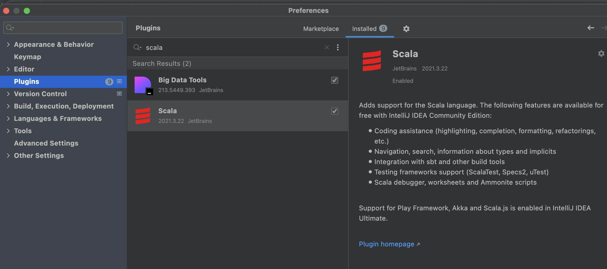
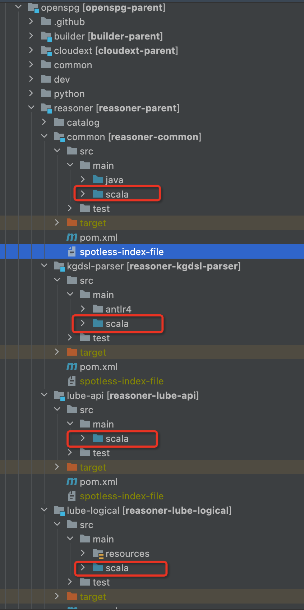
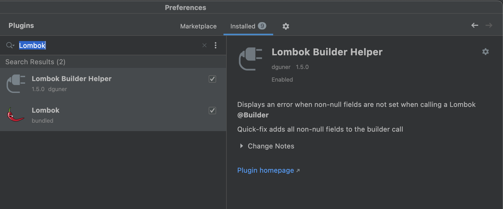
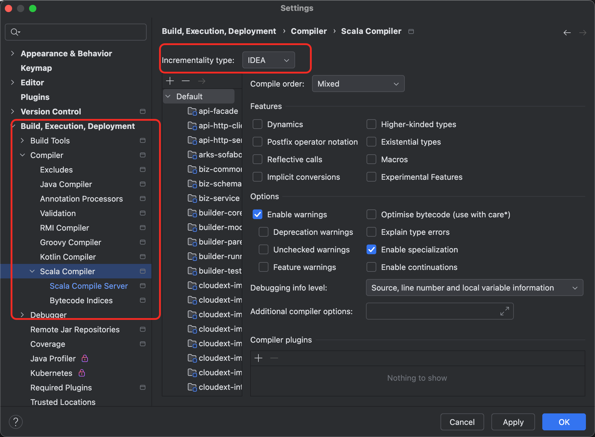

# 源码编译&部署

# 1、源码编译流程
## 1.1、前置依赖
+ **Java：**

java 18 （推荐OpenJDK version 18）

+ **Maven：**

maven 3.8（推荐Maven version 3.8.5）

+ **idea: **

idea 社区版 2024.1.2 以上版本

+ **Scala：**

idea安装scala插件



并将reasoner下设置scala目录设置为Sources Root



+ **Lombok：**

idea安装Lombok插件



+ **设置 Incrementality Type 为 IDEA**

Settings > Build, Execution, Deployment > Compiler > Scala Compiler 设置 Incrementality Type 为 IDEA



## 1.2、源码下载
克隆 OpenSPG 源码，并在IDE中打开

```shell
$ git clone git@github.com:OpenSPG/openspg.git

$ cd openspg
$ tree -L 1
.
├── CITATION.cff
├── LEGAL.md
├── LICENSE
├── README.md
├── README_cn.md
├── builder
├── cloudext
├── common
├── dev
├── lib
├── pom.xml
├── python
├── reasoner

```

******后续命令执行都需在openspg代码库的根目录下**

## 1.3、源码编译
执行 mvn 编译命令

```shell
$ mvn clean install -Dmaven.test.skip=true -Dspotless.check.skip -Dspotless.apply.skip
```

## 1.4、启动镜像
本地启动MySQL、Graph等容器

```plain
sh dev/test/docker-compose.sh
```

## 1.5、启动server
启动 server 入口位于

```plain
com.antgroup.openspg.server.arks.sofaboot.Application
```


**目前前端代码暂未开源，如需使用 http://127.0.0.1:8887 进行前端可视化页面操作，请通过镜像安装**

****

# 2、Mac 环境编译示例
环境： MacBook Air 

芯片： Apple M1

## 2.1、安装Homebrew
安装Homebrew后用于后续安装 git、wget、java 等工具。如果已经安装可直接忽略

```shell
## 安装Homebrew
/bin/bash -c "$(curl -fsSL https://raw.githubusercontent.com/Homebrew/install/HEAD/install.sh)"
## 打开 并编辑.zshrc文件
vim ~/.zshrc
## 在文件末尾添加以下行
export PATH="/opt/homebrew/bin:/opt/homebrew/sbin:$PATH"
##运行以下命令使更改生效
source ~/.zshrc
##检验 安装Homebrew 是否成功
brew --version
brew update
```

[此处为语雀卡片，点击链接查看](https://www.yuque.com/ndx6g9/docs/gowzigml9ay0pr4g#UCqa2)


## 2.2、安装git、wget
```shell
brew install git
brew install wget
git --version
wget --version
```

[此处为语雀卡片，点击链接查看](https://www.yuque.com/ndx6g9/docs/gowzigml9ay0pr4g#rzpsS)


## 2.3、安装Maven、JAVA
```shell
cd /Users/opt
## 下载 maven 3.8.5
wget https://alipay-sdtag.oss-cn-qingdao.aliyuncs.com/openspg/apache-maven-3.8.5.zip
## 解压
unzip apache-maven-3.8.5.zip
## 下载JAVA 18 （其他环境版本可到 https://jdk.java.net/archive/ 进行手动下载）
wget https://download.java.net/java/GA/jdk18.0.2/f6ad4b4450fd4d298113270ec84f30ee/9/GPL/openjdk-18.0.2_macos-aarch64_bin.tar.gz
##解压
tar -xzvf openjdk-18.0.2_macos-aarch64_bin.tar.gz

##设置java和maven的环境变量
vim ~/.zshrc
## PATH中添加java和maven地址，注意：/Users/opt 需修改为你本地的安装路径
export PATH="/Users/opt/jdk-18.0.2.jdk/Contents/Home/bin:/Users/opt/apache-maven-3.8.5/bin:/opt/homebrew/bin:/opt/homebrew/sbin:$PATH"
##运行以下命令使更改生效
source ~/.zshrc
##校验安装是否成功
java -version
mvn -v
```

[此处为语雀卡片，点击链接查看](https://www.yuque.com/ndx6g9/docs/gowzigml9ay0pr4g#pXUIC)


## 2.4、下载OpenSPG源码编译并启动
```shell
cd /Users/opt

## 下载openspg源码
git clone --depth=1 https://github.com/OpenSPG/openspg.git

## 1.通过IDEA打开OpenSPG
## 2.安装Lombok和scala插件
## 3.设置 Incrementality Type 为 IDEA
##  Settings > Build, Execution, Deployment > Compiler > Scala Compiler 设置 Incrementality Type: Zinc -> IDEA

## 编译代码
mvn clean install -Dmaven.test.skip=true -Dspotless.check.skip -Dspotless.apply.skip

## 启动docker Docker Desktop安装地址(https://www.docker.com/products/docker-desktop/)

## 安装mysql、neo4j 镜像依赖
sh dev/test/docker-compose.sh

##启动应用
com.antgroup.openspg.server.arks.sofaboot.Application

```

[此处为语雀卡片，点击链接查看](https://www.yuque.com/ndx6g9/docs/gowzigml9ay0pr4g#AmMes)


