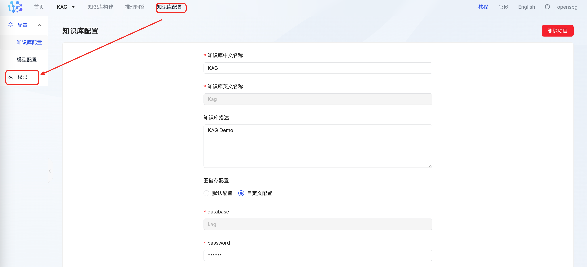
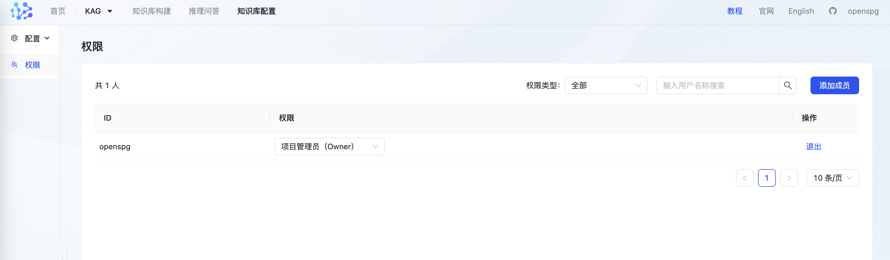
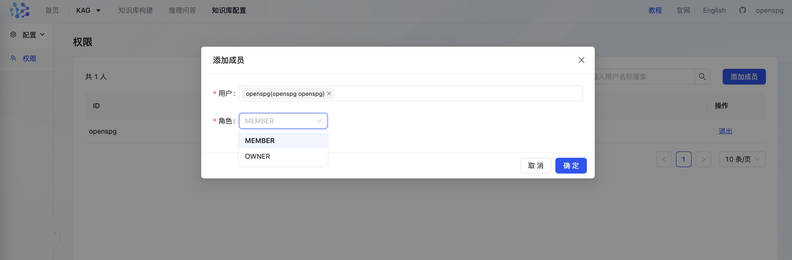

# 用户权限管理

## 1、知识库权限

知识库--权限 tab页，可以进行用户知识库权限管理设置

### 1.1 权限类型
+ 项目管理员（Owner）: 知识库创建者，可以操作知识库schema，可分配知识库管理员和成员，可退出，可删除知识库其他成员
+ 项目成员（Member）:可以操作知识库schema，可退出知识库

### 1.2 权限列表
+ 列出知识库所有有权限的用户信息，包括用户名称、权限类型、操作
+ 筛选：可按权限类型筛选，也可以按用户名称模糊搜索
+ 操作：当前用户可退出知识库，项目管理员可删除知识库其他成员

### 1.3 成员添加

+ 用户：支持按用户名模糊搜索，搜索用户来自于之前系统管理员添加的系统用户，如查不到用户，则请系统管理员先添加用户，再分配权限
+ 角色：Owner、Member

