# 可视化查看

## 一、入口：
使用knext创建项目后，在项目列表页展示对应的项目卡片；点击「知识库管理」后点击「知识模型」可进入Schema查看页

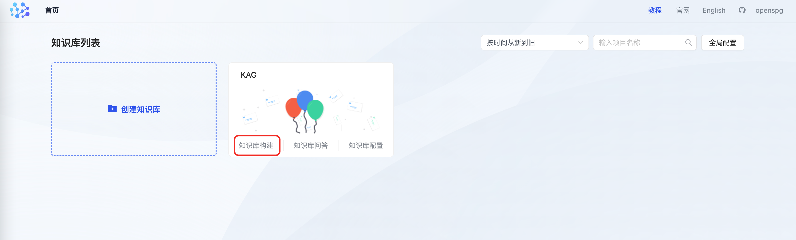

## 二、知识模型：
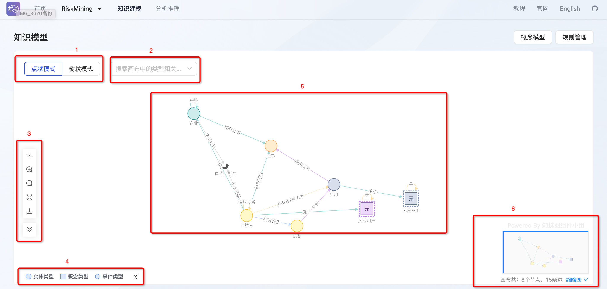

### 画布模式：
分为点状模式和树状模式；

点状模式查看实体类型及类型间的关系，树状模式查看实体类型的层级关系；

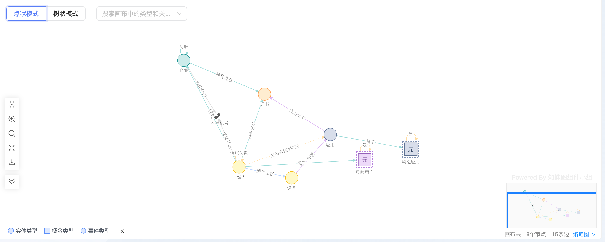

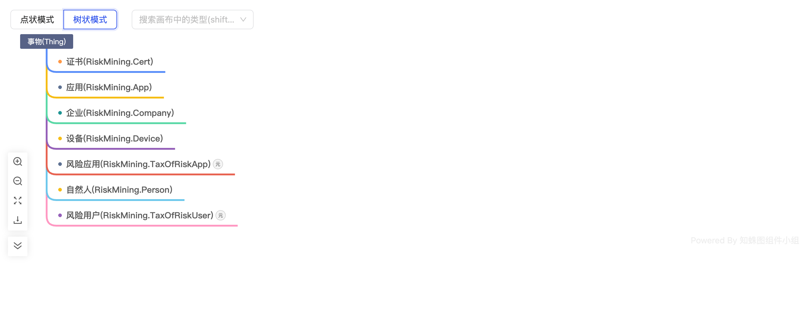

### 搜索框：
用户可通过输入节点类型的方式，查找画布上的节点；

被选中的点展开节点详情；

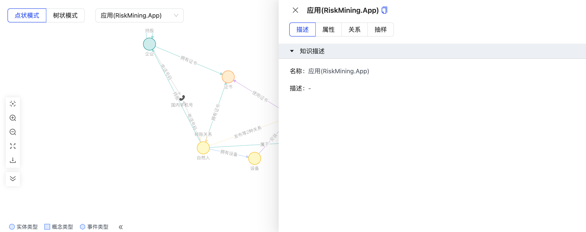

### 画布工具：
分为居中、放大、缩小、全屏、下载和收起工具栏；

点击居中、放大、缩小、全屏可调整画布大小和节点大小、位置；

点击下载将会导出当前画布的png格式；

### 画布图例：
分为实体类型、概念类型和事件类型；

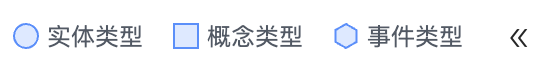

### 画布中心区：
展示创建的schema，包括节点类型和节点类型间的关系类型；

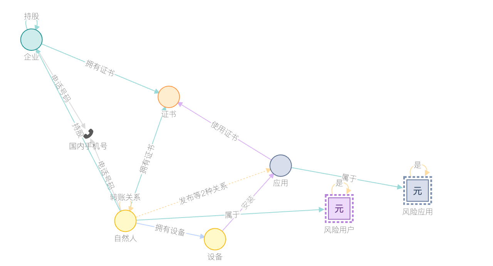

节点对应类型可根据左下角的图例查看，标准类型在画布上以图标形式展示，如手机号-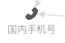；

**双击/右键点击**节点展开节点详情；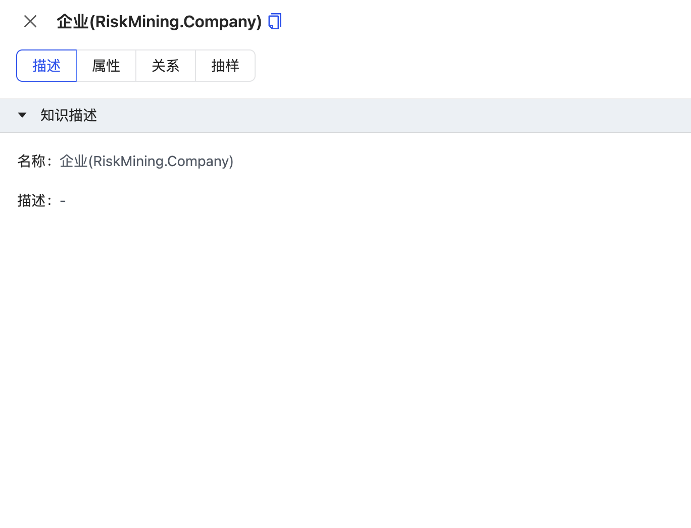

#### 节点详情：
展示节点的描述、属性、关系和数据抽样；

1. 描述：展示节点的名称（name）和描述（description）；

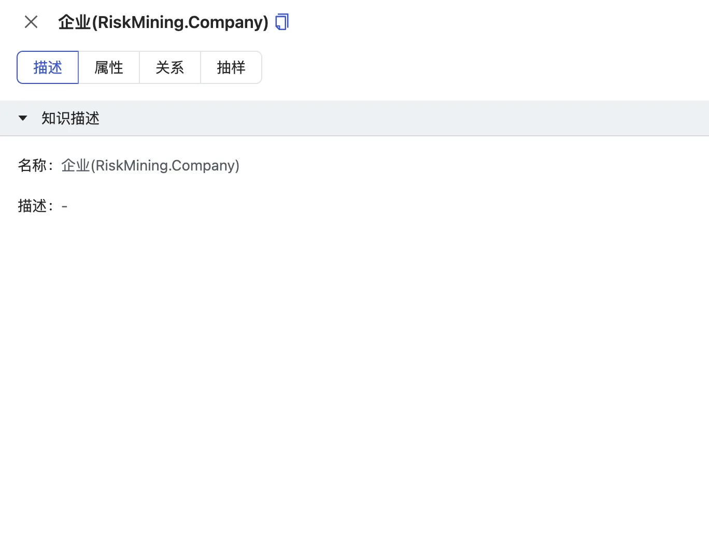

2. 属性：展示节点的属性信息，包括属性名称（中文&英文）、属性类型和高级配置（约束类型）；支持搜索属性；

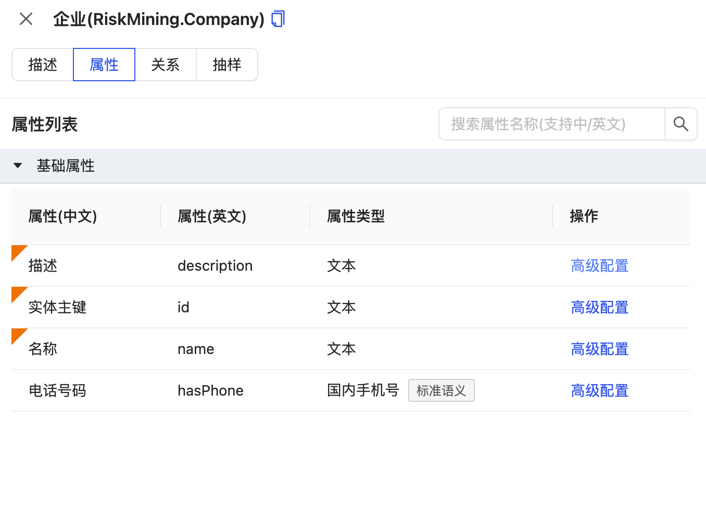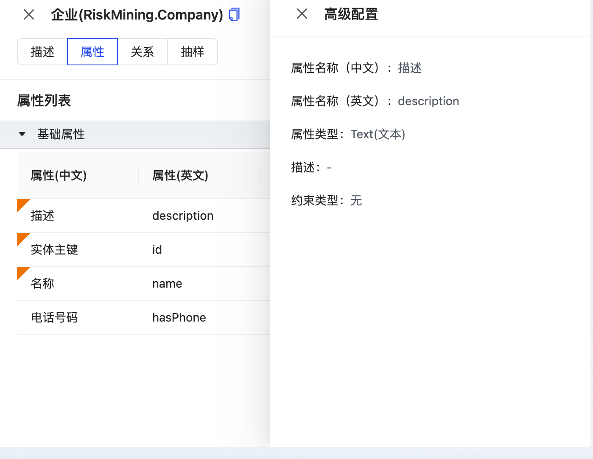

3. 关系：展示当前节点连接的所有关系：分为一度展开关系、概念/事件/标准/实体类型关系；（一度展开关系为概念/事件/标准/实体类型关系的合集）

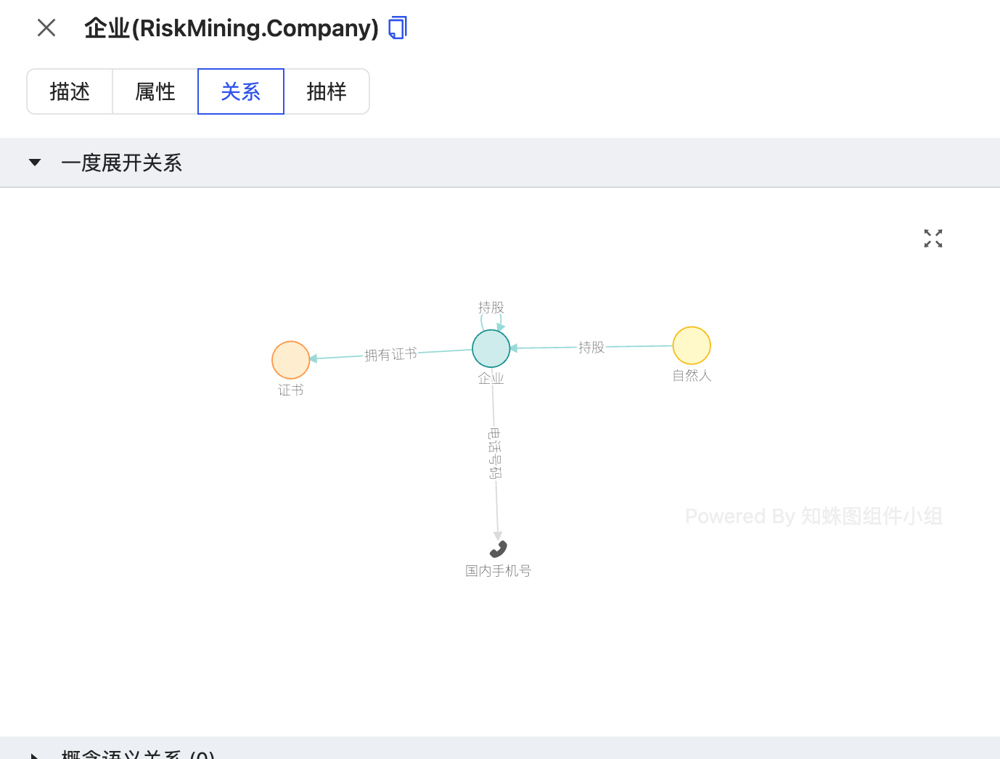

4. 抽样：展示当前节点内的数据抽样；默认抽样10条数据；

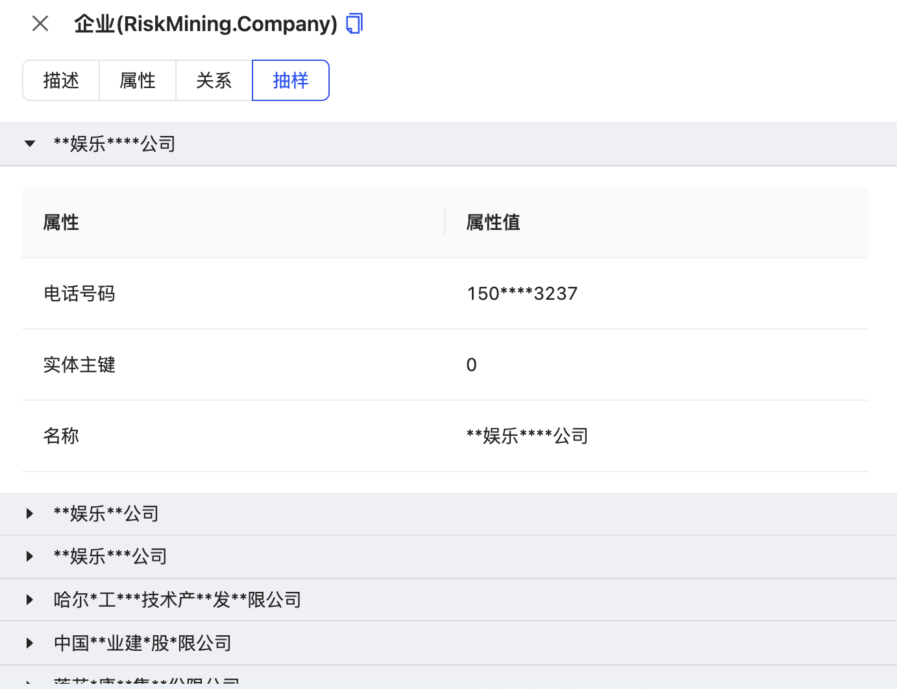

### 画布缩略图：
展示当前画布的缩略图，节点类型和关系类型的统计；

## 三、概念模型：
展示当前项目概念的合集，包括概念类型、子概念以及概念间的层级关系；

概念画布采用树状模式，展示概念类型和概念类型下的子概念；

默认只展示概念类型和概念类型下子概念的数量，可通过**双击概念类型下的数字**展开子概念；

单击概念类型，可展示概念类型的详情面板，展示信息与节点的详情面板一致；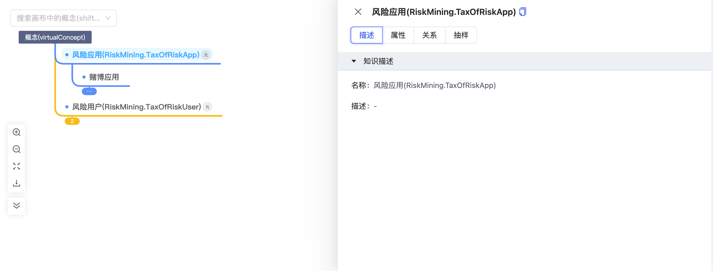

单击概念，可展示概念的详情面板；详情面板包括描述、属性和规则；

#### 节点详情：
1. 描述：展示概念名称（name）、概念描述（description）、父概念、概念类型和别名；

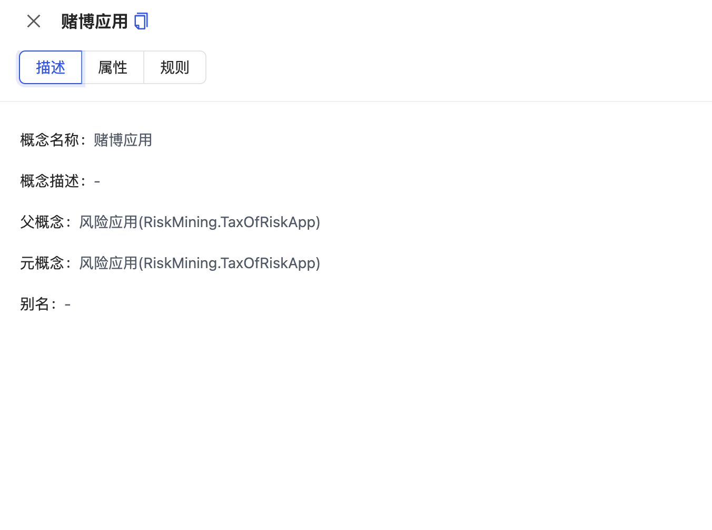

2. 属性：展示当前概念的属性和属性值；

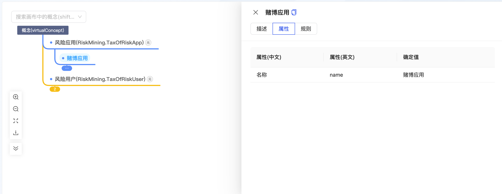

3. 规则：若在当前概念上写了用于推理的规则，则展示具体的规则；

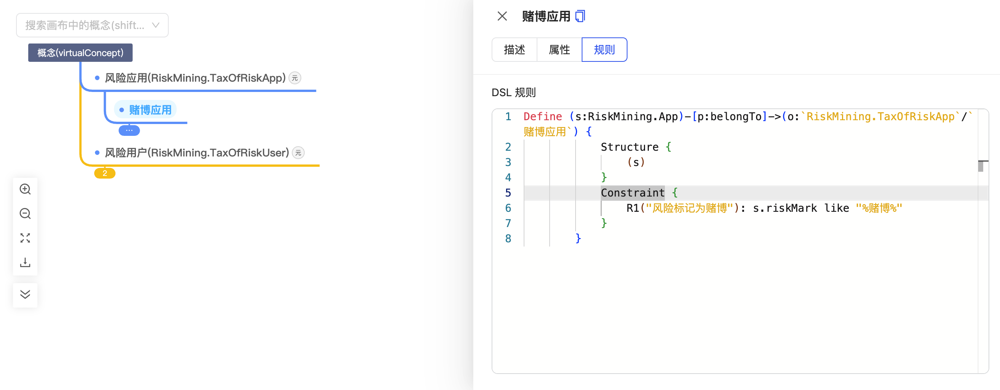

## 四、规则管理：
展示当前项目中的所有规则，包括实体类型属性上的规则、关系类型上的规则和概念上的规则；

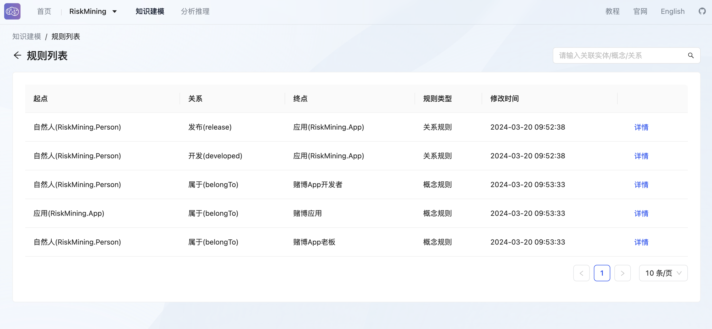

展示规则的起点（s）、关系（p）和终点（o）、规则类型、规则修改事件和规则详情；

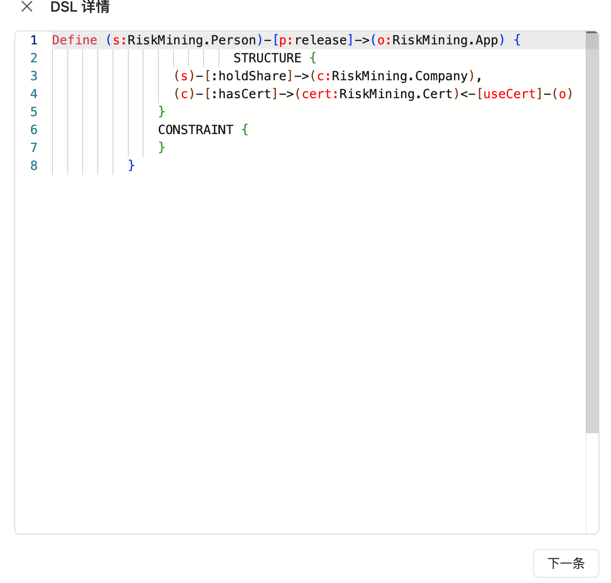

1. 属性规则：起点是实体类型，关系是属性名称，终点是属性值（规则列表上不展示）；
2. 关系规则：起点是实体类型，关系是关系类型，终点是实体类型；
3. 概念规则：起点是实体类型，关系是关系类型，终点是子概念；

