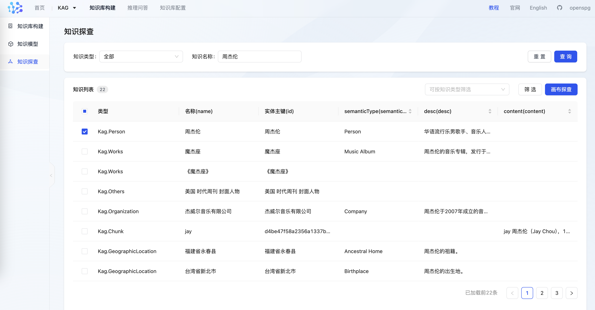
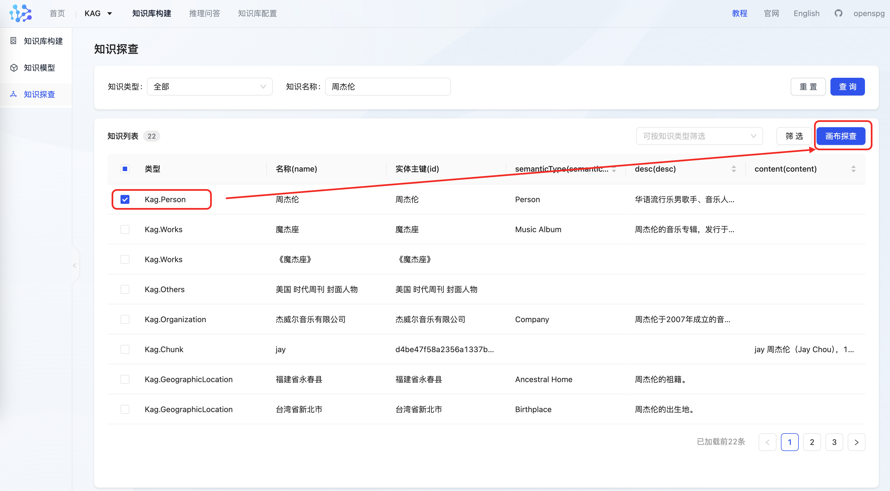
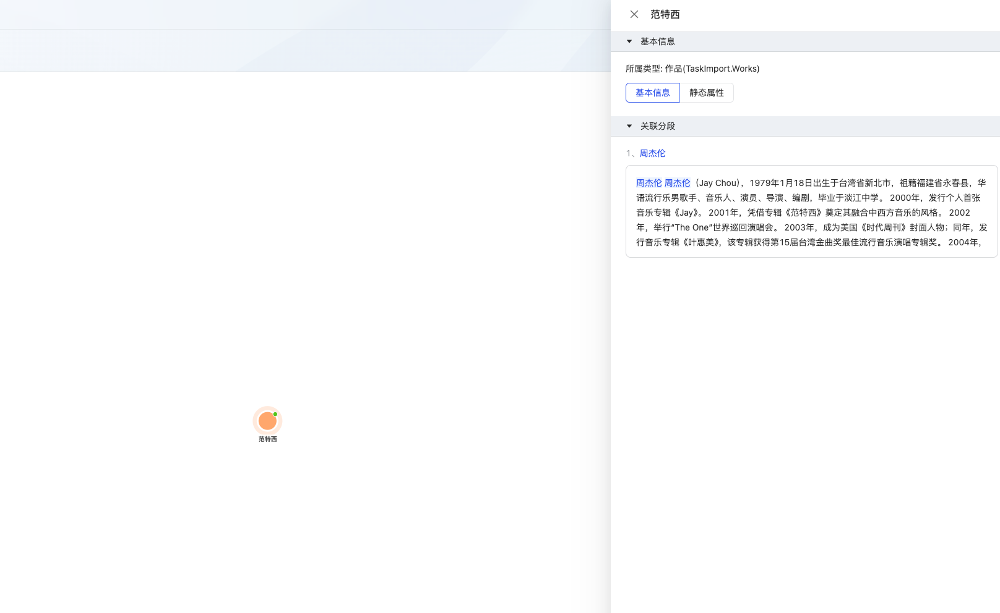
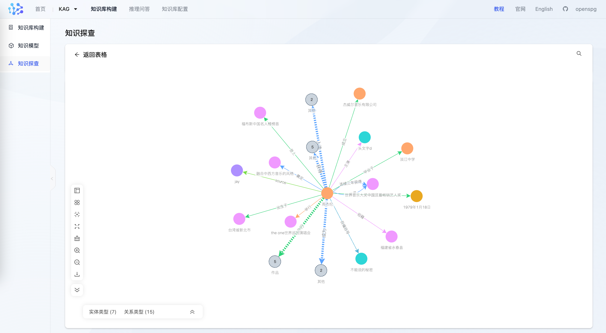
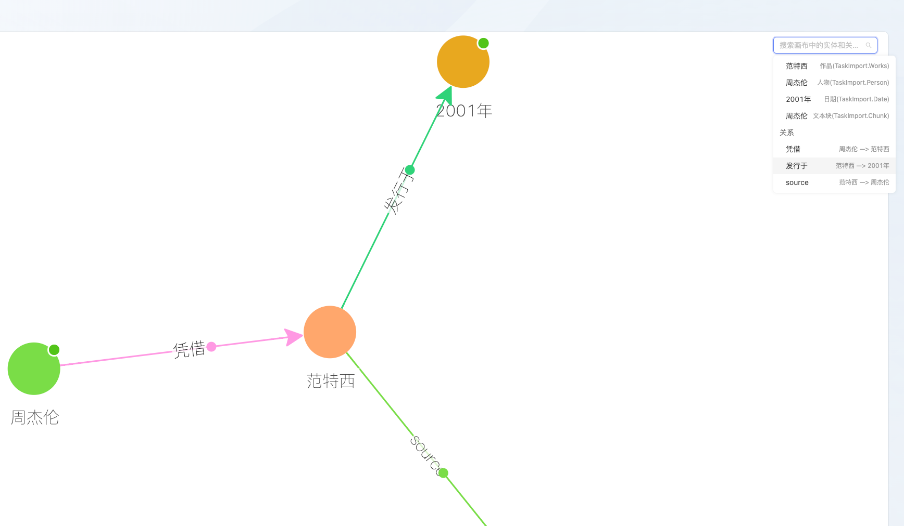
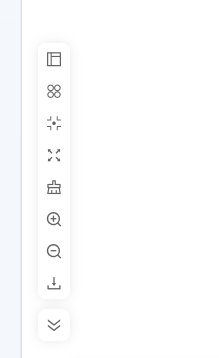

# 知识探查

kag支持以图形化方式探查抽取沉淀的知识，目前提供三种方式

+ 搜索实体
+ 获取实体详情，以及实体对应的文章片段
+ 获取实体一跳子图

## 1、实体搜索
根据关键字，模糊搜索匹配的所有实体；Schema 中设置了对应索引 并完成知识库构建的实体类型属性，都能够被检索。实体类型预定义的name 字段，默认创建索引。

```yaml
Works(作品): EntityType
     properties:
        desc(描述): Text
            index: TextAndVector
```

搜索后的结果，可基于类型二次筛选，也可基于属性及属性值二次筛选



## 2、画布探查
在搜索列表中，选定知识点，进入 画布探查，可以在画布上 查询点详情、一跳子图



### 2.1、实体详情
单击画布上的点，查看实体详情



+ 基本信息：实体的chunk来源
+ 静态属性：实体的属性及属性值，如属性过多，可以按属性的中英名进行搜索单条属性及属性值

### 2.2、实体一跳子图
+ **一度展开**

右键单击实体点，展开一度关系（全部），包括出边和入边



+ **搜索**

根据点和边，在画布上快速定位



+ **画布工具**

布局切换、节点合并、画布自适应、居中、放大、缩小、全屏、下载和收起工具栏




