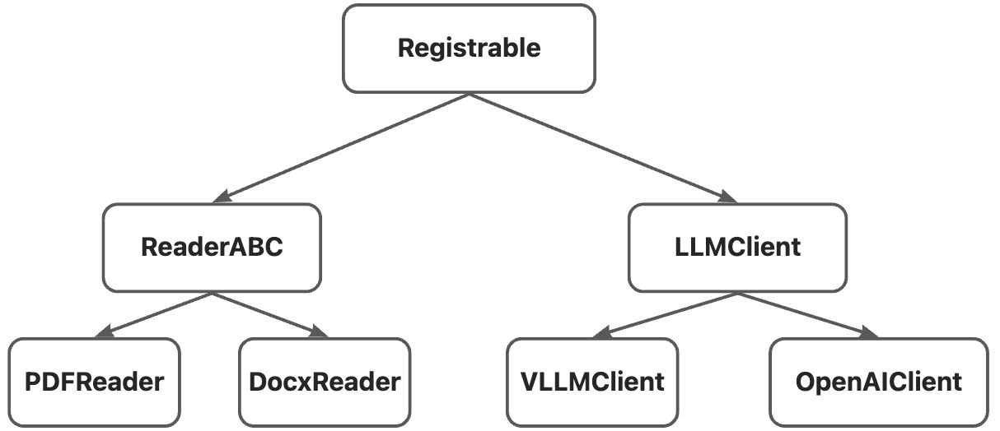
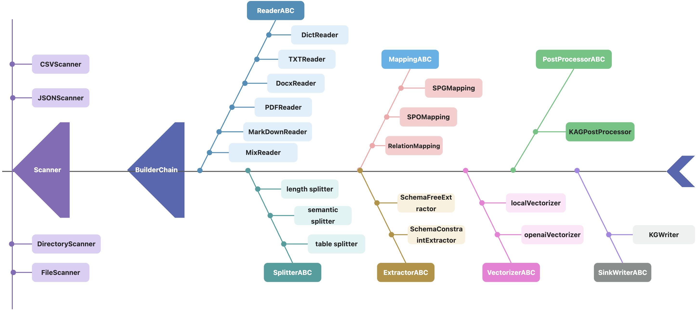
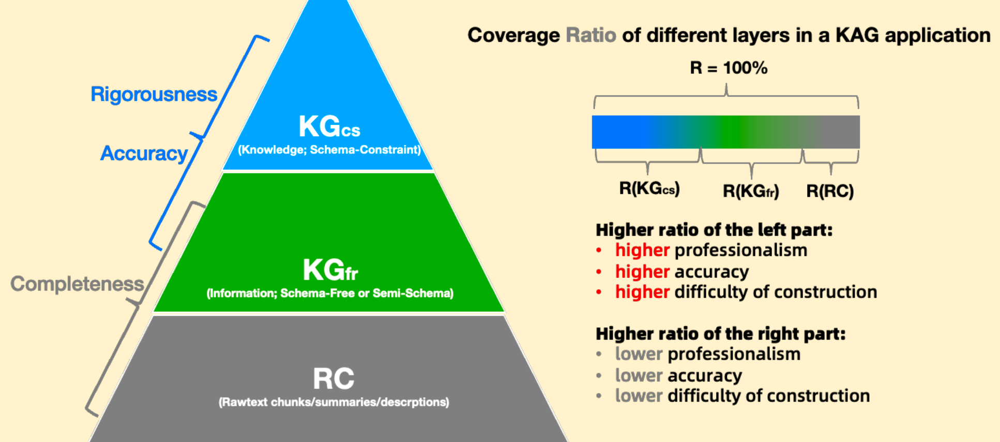

# 自定义代码

KAG V0.6提供了一套基于注册器的组件管理机制来管理KAG链路中的各种组件，如BuilderChain、Extractor、Reader等等。通过这套注册机制，用户可以灵活地自定义KAG链路中的各类组件，并注册到KAG框架中，实现替换内置组件的效果。同时这些被注册器管理的组件还提供了基于配置直接实例化类对象的功能，通过显式指定每个类对象的配置，提升了项目配置的灵活性和可读性。

# KAG 注册机制
KAG的注册机制基于`kag.common.registry.Registrable`类实现，所有可注册类都需要继承自该基类。以其作为起点，所有被注册器管理的子类构成了一个树结构，如下图所示：



图1

如图1所示，`ReaderABC`为所有Reader类的基类，其中可以定义一些Reader需要实现的接口，类似的LLMClient作为所有大模型客户端的基类。

## 注册器接口说明
`Registrable`提供了两个核心函数来支持注册机制：

+ `**register**`

以全局的注册器统一管理所有注册进来的类型，为每个类型分配注册名

+ `**from_config**`

以配置化的方式实例化类对象

## 注册器接口示例
以下是图1中Reader类的一个简单的实现：

```python
from kag.common.registry import Registrable, Lazy, Functor


class ReaderABC(Registrable):
    def __init__(self, name: str):
        self.name = name

    def invoke(self, file_path):
        raise NotImplementedError("invoke not implement yet")

class RunnerABC(Registrable):
    def __init__(self, reader:ReaderABC):
        self.reader=reader


@RunnerABC.register("test_runner")
class TestRunner(RunnerABC):        
    def invoke(self, file_path):
        return self.reader.invoke(file_path)

@ReaderABC.register("docx_reader")
class DocxReader(ReaderABC):
    def invoke(self, file_path):
        print(f"DocxReader read {file_path}")


@ReaderABC.register("pdf_reader")
class PDFReader(ReaderABC):
    def invoke(self, file_path):
        print(f"PDFReader read {file_path}")

pdf_reader = ReaderABC.from_config({"type": "pdf_reader", "name": "111"})
pdf_reader.invoke("a.pdf") # output: PDFReader read a.pdf
docx_reader = ReaderABC.from_config({"type": "docx_reader", "name": "111"})
pdf_reader.invoke("a.docx") #output: DocxReader read a.docx

runner=RunnerABC.from_config(
    {
        "type": "test_runner", 
        "reader": {"type": "pdf_reader", "name": "111"}
    }
)
runner.invoke("aaa.pdf") # output: PDFReader read aaa.pdf
```


### 关键点
+ 定义`ReaderABC`和`RunnerABC`类分别作为所有reader和runner的基类
+ 定义了`DocxReader`和`PDFReader`两个reader类实现，并通过`@ReaderABC.register`分别指定了各自的注册名为`docx_reader`和`pdf_reader`
+ 定义`TestRunner`作为`RunnerABC`的实现，并通过`@RunnerABC.register`注册为`test_runner`
+ 使用各自基类的`from_config`实例化相应对象。

### 配置编写规则
`from_config`函数接受dict格式的配置并将其实例化成相关对象，配置编写规则如下：

+ type字段指定要实例化的对象的注册名，如`PDFReader`的注册名是`pdf_reader`
+ 剩余字段与要实例化类的初始化函数的入参一一对应

例如所有Reader的__init__接受一个名为name的字符串，那么配置中需要指定该字段的值。但是如果某个入参有默认值，那么可以在配置中省略。

+ 如果初始化函数接受`**kwargs`可变参数，那么多余的参数会被放到`kwargs`中，否则多余参数会被丢弃并打印警告。
+ 类的初始化函数一定要指定入参的类型，因为`from_config`会自动将配置转化成与入参一致的类型，从而可以实现递归的实例化过程。例如`RunnerABC`的入参reader的类型是`ReaderABC`，该reader可以自动通过runner的配置实例化得到。
+ 另外，被注册器管理的类同样可以和普通类型一样，通过`__init__`函数进行实例化。

# 代码扩展点
## 能力介绍
### 扩展点介绍
KAG框架以及基于`Registrable`定义了多个组件的基类，并统一放在kag.interface模块下，其代码结构如下所示，主要划分为三类：

+ builder

包含知识构建相关的组件

+ solver

包含知识问答相关的组件

+ common

一些通用的组件，如提示词、大模型客户端、向量模型等

```python
.
├── __init__.py
├── builder
│   ├── __init__.py
│   ├── aligner_abc.py
│   ├── base.py
│   ├── builder_chain_abc.py
│   ├── external_graph_abc.py
│   ├── extractor_abc.py
│   ├── mapping_abc.py
│   ├── postprocessor_abc.py
│   ├── reader_abc.py
│   ├── scanner_abc.py
│   ├── splitter_abc.py
│   ├── vectorizer_abc.py
│   └── writer_abc.py
├── common
│   ├── __init__.py
│   ├── llm_client.py
│   ├── prompt.py
│   └── vectorize_model.py
└── solver
    ├── __init__.py
    ├── base.py
    ├── base_model.py
    ├── execute
    │   ├── __init__.py

    │   ├── lf_executor_abc.py
    │   └── lf_sub_query_merger_abc.py
    ├── kag_generator_abc.py
    ├── kag_memory_abc.py
    ├── kag_reasoner_abc.py
    ├── kag_reflector_abc.py
    └── plan
        ├── __init__.py
        └── lf_planner_abc.py
```

### 查看可扩展项信息
KAG提供了`kag interface`命令来查询相关信息，包含如下两个命令：

+ **打印KAG提供的组件基类**

在终端输入：

```bash
$ kag interface --list
```

会显示如下表格，其中包含了所有可供用户继承扩展的基类

```bash
+------------------------+------------------------------------------------------+
| class                  | module                                               |
+========================+======================================================+
| Command                | kag.bin.base                                         |
+------------------------+------------------------------------------------------+
| BuilderChainRunner     | kag.builder.runner                                   |
+------------------------+------------------------------------------------------+
| CheckPointer           | kag.common.checkpointer.base                         |
+------------------------+------------------------------------------------------+
| Registrable            | kag.common.registry.registrable                      |
+------------------------+------------------------------------------------------+
| ShardingInfo           | kag.common.sharding_info                             |
+------------------------+------------------------------------------------------+
| AlignerABC             | kag.interface.builder.aligner_abc                    |
+------------------------+------------------------------------------------------+
| KAGBuilderChain        | kag.interface.builder.builder_chain_abc              |
+------------------------+------------------------------------------------------+
| ExternalGraphLoaderABC | kag.interface.builder.external_graph_abc             |
+------------------------+------------------------------------------------------+
| MatchConfig            | kag.interface.builder.external_graph_abc             |
+------------------------+------------------------------------------------------+
| ExtractorABC           | kag.interface.builder.extractor_abc                  |
+------------------------+------------------------------------------------------+
| MappingABC             | kag.interface.builder.mapping_abc                    |
+------------------------+------------------------------------------------------+
| PostProcessorABC       | kag.interface.builder.postprocessor_abc              |
+------------------------+------------------------------------------------------+
| ReaderABC              | kag.interface.builder.reader_abc                     |
+------------------------+------------------------------------------------------+
| ScannerABC             | kag.interface.builder.scanner_abc                    |
+------------------------+------------------------------------------------------+
| SplitterABC            | kag.interface.builder.splitter_abc                   |
+------------------------+------------------------------------------------------+
| VectorizerABC          | kag.interface.builder.vectorizer_abc                 |
+------------------------+------------------------------------------------------+
| SinkWriterABC          | kag.interface.builder.writer_abc                     |
+------------------------+------------------------------------------------------+
| LLMClient              | kag.interface.common.llm_client                      |
+------------------------+------------------------------------------------------+
| PromptABC              | kag.interface.common.prompt                          |
+------------------------+------------------------------------------------------+
| VectorizeModelABC      | kag.interface.common.vectorize_model                 |
+------------------------+------------------------------------------------------+
| LFExecutorABC          | kag.interface.solver.execute.lf_executor_abc         |
+------------------------+------------------------------------------------------+
| LFSubQueryResMerger    | kag.interface.solver.execute.lf_sub_query_merger_abc |
+------------------------+------------------------------------------------------+
| KAGGeneratorABC        | kag.interface.solver.kag_generator_abc               |
+------------------------+------------------------------------------------------+
| KagMemoryABC           | kag.interface.solver.kag_memory_abc                  |
+------------------------+------------------------------------------------------+
| KagReasonerABC         | kag.interface.solver.kag_reasoner_abc                |
+------------------------+------------------------------------------------------+
| KagReflectorABC        | kag.interface.solver.kag_reflector_abc               |
+------------------------+------------------------------------------------------+
| LFPlannerABC           | kag.interface.solver.plan.lf_planner_abc             |
+------------------------+------------------------------------------------------+
| ChunkRetriever         | kag.solver.retriever.chunk_retriever                 |
+------------------------+------------------------------------------------------+
| ExactKgRetriever       | kag.solver.retriever.exact_kg_retriever              |
+------------------------+------------------------------------------------------+
| FuzzyKgRetriever       | kag.solver.retriever.fuzzy_kg_retriever              |
+------------------------+------------------------------------------------------+
| GraphApiABC            | kag.solver.tools.graph_api.graph_api_abc             |
+------------------------+------------------------------------------------------+
| SearchApiABC           | kag.solver.tools.search_api.search_api_abc           |
+------------------------+------------------------------------------------------+
```

+ **显示某个组件的具体实现类**

在终端输入

```bash
$ kag interface --cls $class_name
```

如，想要查看框架中提供了哪些大模型组件，可以输入：

```bash
$ kag interface --cls LLMClient
```

会输出如下信息：

其中包含了每个LLMClient子类的类名、注册名、文档、入参、以及示例配置。

```bash
                    Documentation of LLMClient
A class that provides methods for performing inference using large language model.

This class includes methods to call the model with a prompt, parse the response, and handle batch processing of prompts.
                    Registered subclasses of LLMClient
[kag.common.llm.openai_client.OpenAIClient]
Register Name: "openai" / "maas"

Documentation:
A client class for interacting with the OpenAI API.

Initializes the client with an API key, base URL, streaming option, temperature parameter, and default model.

Initializer:
Initializes the OpenAIClient instance.

Args:
    api_key (str): The API key for accessing the OpenAI API.
    base_url (str): The base URL for the OpenAI API.
    model (str): The default model to use for requests.
    stream (bool, optional): Whether to stream the response. Defaults to False.
    temperature (float, optional): The temperature parameter for the model. Defaults to 0.7.

Required Arguments:
  api_key: str
  base_url: str
  model: str

Optional Arguments:
  stream: bool = False
  temperature: float = 0.7

Sample Useage:
  LLMClient.from_config({'type': 'openai', 'api_key': 'Your api_key config', 'base_url': 'Your base_url config', 'model': 'Your model config', 'stream': False, 'temperature': 0.7})


[kag.common.llm.vllm_client.VLLMClient]
Register Name: "vllm"

Documentation:
A client class for interacting with a language model deployed by VLLM.

This class provides methods to make synchronous requests to the VLLM server, handle model calls, and parse responses.

Initializer:
Initializes the VLLMClient instance.

Args:
    model (str): The model to use for requests.
    base_url (str): The base URL for the VLLM API.

Required Arguments:
  model: str
  base_url: str

Optional Arguments:
  No Optional Arguments found

Sample Useage:
  LLMClient.from_config({'type': 'vllm', 'model': 'Your model config', 'base_url': 'Your base_url config'})


[kag.common.llm.ollama_client.OllamaClient]
Register Name: "ollama"

Documentation:
A client class for interacting with the Ollama API.

This class provides methods to make synchronous requests to the Ollama API, handle model calls, and parse responses.

Initializer:
Initializes the OllamaClient instance.

Args:
    model (str): The model to use for requests.
    base_url (str): The base URL for the Ollama API.

Required Arguments:
  model: str
  base_url: str

Optional Arguments:
  No Optional Arguments found

Sample Useage:
  LLMClient.from_config({'type': 'ollama', 'model': 'Your model config', 'base_url': 'Your base_url config'})


[kag.common.llm.mock_llm.MockLLMClient]
Register Name: "mock"

Documentation:
MockLLMClient is a mock implementation of the LLMClient class, used for testing purposes.

This class provides a method to simulate the behavior of a language model client by matching input prompts.

Initializer:
Initializes the MockLLMClient instance.

Required Arguments:
  No Required Arguments found

Optional Arguments:
  No Optional Arguments found

Sample Useage:
  LLMClient.from_config({'type': 'mock'})

```

### 自定义扩展的简单示例
假设我们需要Mock一个大模型，以便调试代码使用，可以通过以下步骤实现：

+ 继承`LLMClient`，实现一个`MockLLMClient`子类，返回固定的内容:

```python
import json
from kag.interface import LLMClient


# Register MockLLMClient with the registration name mock_llm into the base class LLMClient.
@LLMClient.register("mock_llm")
class MockLLMClient(LLMClient):
    def __init__(self):
        pass

    def __call__(self, prompt):
        return json.dumps({"input": prompt, "output": "Hello, world!"})

    def call_with_json_parse(self, prompt):
        return {"input": prompt, "output": "Hello, world!"}

```

+ 假设自定义的`MockLLMClient`代码存储在`./llm/mock_llm.py`文件中，通过以下代码执行调用：

```python
from kag.interface import LLMClient
from kag.common.registry import import_modules_from_path

# Important: We need to explicitly import the custom code to ensure that the registration takes effect.
import_modules_from_path("./llm")

llm = LLMClient.from_config({"type": "mock_llm"})
llm("who are you?")
```

注意：对于自定义代码，我们需要**显式导入代码目录**（目的是为了执行`@BaseClass.register`语句），才能将类加载到注册器中。而对于KAG内置组件，会在环境初始化的时候自动执行注册，无需显式导入。

## 2.2、KAG builder 链路扩展
KAG builder的目的是为给定文档数据构建知识图谱索引，以供后续问答检索应用。KAG builder的入口是`kag.builder.runner.BuilderChainRunner`，其整体执行流程如下图所示，给定一组数据，`BuilderChainRunner`会先执行`Scanner`扫描数据， 然后进入`BuilderChain`并依次执行其中包含的各个组件，完成图谱的构建。



注：

1. 如无特殊说明，图中每个组件的入口函数均为`invoke()`，用户可以重载该函数来实现自定义的处理逻辑。
2. 用户可以使用 `kag inteface --cls ${BaseClass}` 命令查看各个组件的文档以及KAG框架内置的实现。

### Scanner
**基类：**`**kag.interface.ScannerABC**`

`Scanner`的作用是扫描数据源并分发数据到下游的BuilderChain。数据源分为两大类，一类是类似CSV、Json格式的文件，其中每个文件可能包含多条记录；另一类是单个文件或者单个目录，此时每个文件会被作为一条记录。

除了invoke接口之外，Scanner还提供了generate接口，两者的介绍如下：

+ invoke

以list结构一次性返回所有记录。

+ generate

返回一个迭代器，该迭代器每次返回一条记录。


`Scanner`的设计支持分布式数据构建。具体地说，Scanner会按照worker总数和worker编号，自动计算本worker需要扫描的数据源范围。例如对于包含200条数据的文件，如果有两个worker同时执行构建任务，那么worker1和worker2会分别负责前100条和后100条数据。用户可以基于该功能扩展`Scanner`来支持更多数据源，如数据库表等。如果需要在分布式环境执行，需要为每个worker上的scanner设置worker总数和worker编号两个参数，有如下两种方式：

+ 在`__init__`中传入`rank`和`world_size`两个关键词变量。`rank`和`world_size`分别代表worker编号和worker总数，与torch保持一致。例如如`MyScanner(rank=0, world_size=1)`
+ 在kubeflow环境中，通过pytorchjob或tensorflowjob提交分布式任务，KAG会自动通过环境变量获取worker编号和worker总数，无需额外设置。


此外，需要注意的是，**Scanner只是负责数据扫描和分发，需要配合下游BuilderChain中的reader数据来执行数据的读取与解析。**例如`DirectoryScanner`只是输出目录下所有符合约束的文件名，并不会实际读取文件内容，而是到后续的reader里才会执行。


KAG框架内置了以下Scanner的实现：

+ `**CSVScanner**`

扫描单个csv文件，将每行作为一条数据记录，以dict格式返回

+ `**JSONScanner**`

扫描单个json文件，要求json文件是List[Dict]结构，将list中每个dict对象作为一条数据记录返回

+ `**FileScanner**`

读取单个文件并返回文件路径。如果文件名是http链接，会自动下载到本地并返回本地文件路径

+ `**DirectoryScanner**`

扫描某个目录及其子目录，获取符合要求的所有文件路径，将每个文件名作为一条记录返回

### BuilderChain
**基类：**`**kag.interface.KAGBuilderChain**`

`BuilderChain`是负责实际执行构建的组件，其通过串联reader、splitter、mapping、extractor、aligner、vectorizer 等工具组件，来完成具体的构建任务。

KAG框架中内置了`DefaultStructuredBuilderChain`和`DefaultUnstructuredBuilderChain`两个默认实现，分别用于执行结构化构建和非结构化构建任务：

+ `**DefaultStructuredBuilderChain**`

会依次执行mapping、vectorizer、writer三个组件，主要用于将现有结构化图数据直接导入到图数据库中

+ `**DefaultUnstructuredBuilderChain**`

会依次执行reader、splitter、extractor、 vectorizer、postprocessor、writer组件，主要用于对非结构化数据（如文本数据）建立图谱索引。


用户可以自定义新的BuilderChain，但是多数情况下我们建议尽量直接使用这两个默认的chain组件，通过自定义工具组件的方式来定义自己的构建链路，以获得更好的并发性能和checkpoint等功能支持。

####  Reader
**基类：**`**kag.interface.ReaderABC**`

`Reader`组件提供了多种格式的文件读取能力，通过与上游`Scanner`搭配可以将数据转成`Chunk`对象。以下是几个典型的应用场景：

1. 读取csv/json文件

使用`CSVScanner`/`JSONScanner`将文件的每条记录转换成dict对象，然后使用`DictReader`将dict字段映射到`Chunk`的属性中。

2. 读取某个文件

使用`FileScanner`获取文件路径，然后使用对应的Reader将文件内容读出，转为`Chunk`对象。

3. 读取某个目录下的txt文件

使用`DirectoryScanner`获得目录下所有txt文件路径，然后使用`TXTReader`将文件内容读出，转为`Chunk`对象。

3. 读取某个目录下的所有支持的文件（pdf,txt, docs,md..）

使用`DirectoryScanner`获得目录下所有符合要求的文件路径，然后使用MixReader根据文件后缀名将文件内容读出，转为`Chunk`对象。

####  Splitter
**基类: **`**kag.interface.SplitterABC**`

`Splitter`的作用是对输出chunk内容做切分，以避免文档内容过长，超出LLM设置的阈值。例如`LengthSplitter`，会使用滑动窗口的切分策略，将一个chunk的内容按照预设的长度切分为多个chunk。

#### Extractor
**基类: **`**kag.interface.ExtractorABC**`

`Extractor`是构建链路的核心组件，负责从非结构化数据中抽取关键信息，并构建成知识图谱。KAG内置了两种Extractor组件：

+ `**SchemaFreeExtractor**`

这种模式给予抽取模型的约束较少，从而期望大模型可以抽取出更多的关键内容。

+ `**SchemaConstraintExtractor**`

该组件通过读取解析用户的schema文件，约束大模型按照schema定义进行实体和事件的抽取。例如在有些垂直领域中，我们可能希望更细粒度的实体抽取，如不同实体具有不同的属性。同时，除了实体之外，该组件还支持抽取包含多个主客体实体的事件。

例如，一个新闻图谱的schema文件如下：

```yaml
namespace News

Chunk(文本块): EntityType
     properties:
        content(内容): Text
        
          index: TextAndVector

Date(日期): EntityType
     properties:
        info(信息): Text
            index: TextAndVector

GeographicLocation(地理位置): EntityType
     properties:
        type(类型): Text
            desc: 地理位置的具体类型，如国家、地区、省市

Entity(实体): EntityType
     desc: 具有特定意义的命名对象或概念，如人物、机构、产品等
     properties:
         type(类型): Text

NewsEvent(事件): EventType
     properties:
       time(事件): Date
           desc: 事件发生的时间点或时间段
       location(地点): GeographicLocation
           desc: 事件发生的具体地点或区域
       subject(主体): Entity
           desc: 事件的主体，即事件的主要参与者
       relation(关系): Text
           desc: 事件的关系名称，即事件的主要动作或行为
       object(客体): Entity
           desc: 事件的客体，即事件的次要参与者或对象
           constraint: MultiValue
       cause(原因): Text
           desc: 导致事件发生的原因或动机
       process(过程): Text
           desc: 事件发生的过程或步骤
       outcome(结果): Text
           desc: 事件发生后产生的结果或影响
       context(背景): Text
           desc: 事件发生的背景或环境
       impact(影响): Text
           desc: 事件对相关方或社会产生的影响
```

上述schema除了定义实体及其属性之外，还定义了事件类型（EventType）的NewsEvent。该类型包含了多个属性，有些属性是简单的文本类型，如cause, process等，有些属性是schema中定义的实体类型，如time, location, subject等，并且有些属性还包含了MultiValue约束，如object。

使用schema-constraint模式的知识抽取可以指示大模型根据schema的约束执行抽取。一个可能的事件抽取输入输出如下：

```yaml
{'input': '北京时间8月27日下午，美国总统国家安全事务助理杰克·沙利文乘机抵达北京，开始任期内首次访华。谭主发现，此次随行人员中几乎都会说中文，而沙利文本人在2015年也曾来华参加“读懂中国”国际会议。此次访华之行，美国派出如此之多会说中文的代表，望沙利文此行真的能读懂中国。',
 'output': [{'category': 'NewsEvent',
   'name': '沙利文任内首次访华',
   'properties': {'cause': None,
    'impact': None,
    'relation': '访华',
    'context': '美国总统国家安全事务助理杰克·沙利文乘机抵达北京，开始任期内首次访华',
    'subject': [{'name': '杰克·沙利文', 'type': '政治人物'}],
    'time': {"name": '北京时间8月27日下午'},
    'outcome': '任期内首次访华',
    'location': {"name": '北京', "type": "城市"},
    'process': None,
    'object': [{'name': '中国', 'type': '国家'}]}}, 
  {'category': 'NewsEvent',
   'name': '沙利文2015年参加‘读懂中国’国际会议',
   'properties': {'cause': None,
    'impact': None,
    'relation': '参加会议',
    'context': '沙利文本人在2015年也曾来华参加‘读懂中国’国际会议',
    'subject': [{'name': '杰克·沙利文', 'type': '政治人物'}],
    'time': {"name": "2015年"},
    'outcome': None,
    'location': {"name": '中国', "type": "国家"},
    'process': None,
    'object': [{'name': '‘读懂中国’国际会议', 'type': '会议'}]}}]}
```

可见事件中包含了多个属性，并且每个属性值都与schema中定义的类型吻合。

实体类型的抽取与事件类型相似，也可以按照上述示例定义复杂的实体类型与属性。

注：

    1. 关于schema-constraint知识抽取的完整流程，可以参考百科数据问答示例：examples/baike
    2. 当前版本（v0.6）暂时只支持SPG schema的constrains字段的MultiValue属性，NotNull尚未支持

####  Mapping
**基类: **`**kag.interface.MappingABC**`

Mapping作用和Extractor类似，是将结构化数据直接映射为点或者边，从而得到一个知识图谱。KAG内置了以下Mapping组件的实现：

+ `**SPGTypeMapping**`

根据SPGType对象构造子图

+ `**RelationMapping**`

结构化数据中，关系数据的导入时用于映射起点、终点、关系属性。

+ `**SPOMapping**`

根据给定的SPO(Subject, Predicate, Object)三元组来构造子图

####  Vectorizer
**基类: **`**kag.interface.VectorizerABC**`

`Vectorizer`的作用是为`Extractor`/`Mapping`组件产出的图节点生成向量索引。用户可以在schema文件中为每个实体/事件属性配置是否要生成向量索引，例如：

```python
namespace News

Chunk(文本块): EntityType
     properties:
        content(内容): Text
        
          index: TextAndVector # 为content属性创建文本和向量索引
```

KAG内置了`BatchVectorizer`实现，支持批量为图中的节点属性创建向量索引。用户需要在vectorize_model属性/配置项中指定调用的模型，如本地部署的向量模型，或模型服务提供商的embedding API。

#### PostProcessor
**基类: **`**kag.interface.PostProcessorABC**`

`PostProcessor`负责在图数据写入到图数据库之前，执行一些额外的加工处理。当前KAG框架内置的`KAGPostProcessor`实现主要执行以下操作：

1. 过滤掉非法的数据，如缺少必须字段的点边等
2. 实体链指，即将当前图中的节点，与图数据库中已有的相似节点建立一条等价边。

#### Writer
**基类: **`**kag.interface.SinkWriterABC**`

`Writer`是将最终构建的知识图谱数据写入到图存储。由于SPGServer封装了与后端图数据库的交互逻辑，对用户在python端无感，因此无需对该类进行重载，直接使用内置实现`KGWriter`即可。

## KAG solver 链路扩展
### Reasoner扩展
**基类：**`**kag.interface.solver.kag_reasoner_abc.KagReasonerABC**`

```python
    @abstractmethod
    def reason(self, question: str, **kwargs) -> LFExecuteResult:
        """
        Processes a given question by planning and executing logical forms to derive an answer.

        Parameters:
        - question (str): The input question to be processed.

        Returns:
        LFExecuteResult
        - solved_answer: The final answer derived from solving the logical forms.
        - supporting_fact: Supporting facts gathered during the reasoning process.
        - history_log: A dictionary containing the history of QA pairs and re-ranked documents.
        """
```

这里将输入的问题进行推理求解，返回最终求解的答案和支撑的facts和执行记录

+ 目前只有一个默认实现`kag.solver.implementation.default_reasoner.DefaultReasoner`

该模块由`Planner`和`Executor`两部分组成，均可扩展

#### Planer扩展
**基类: **`**kag.interface.solver.plan.lf_planner_abc.LFPlannerABC**`

`LFPlanner`作用为将输入的query和memory规划出Logic Form的符号化表达

```python
    def lf_planing(self, question: str, memory: KagMemoryABC = None, llm_output=None) -> List[LFPlan]:
        """
        Method that should be implemented by all subclasses for planning logic.
        This is a default impl

         :
        question (str): The question or task to plan.
        memory (KagMemoryABC): the execute memory. Defaults to None.
        llm_output (Any, optional): Output from the LLM module. Defaults to None.

        Returns:
        list of LFPlanResult
        """
        return []
```

KAG内置了基于大模型的规划器`kag.solver.plan.default_lf_planner.DefaultLFPlanner`

该规划器是通过调用prompt：`kag/solver/prompt/default/logic_form_plan.py`，实现规划能力，依赖大模型本身能力，后续KAG版本中会对此部分进行增强。

#### Executor扩展
**基类：**`**kag.interface.solver.execute.lf_executor_abc.LFExecutorABC**`

将Planner规划结果进行执行。默认实现是根据KAG设计提到的三层架构进行设计，如下图



+ KG Schema-Constraint，这部分是严格按照schema约束的知识，有着较高的准确度，但是覆盖度较低
+ KG Schema-Free，这部分是通过开发抽取抽检的图谱，准确度对比KG Schema-Constraint降低，但覆盖率高
+ Rawtext chunks，这部分是存储的chunk文档，有较高的覆盖度，但是并没有准确的知识描述

根据上面三类数据的情况，Executor也是实现了三类不同的检索器

##### 精确的KGRetriever
**基类：**`**kag.solver.retriever.exact_kg_retriever.ExactKgRetriever**`

**默认实现：**`**kag.solver.retriever.impl.default_exact_kg_retriever.DefaultExactKgRetriever**`

需要实现3个接口：

###### 链指接口
```python
def retrieval_entity(
    self, mention_entity: SPOEntity, **kwargs
) -> List[EntityData]:
    """
        Retrieve related entities based on the given entity mention.

        This function aims to retrieve the most relevant entities from storage or an index based on the provided entity name.

        Parameters:
            entity_mention (str): The name of the entity to retrieve.
            kwargs: additional optional parameters

        Returns:
            list of EntityData
        """

```

此处，会严格按照schema定义进行KG检索，例如实体链指函数实现

```python
    def retrieval_entity(
            self, mention_entity: SPOEntity, **kwargs
    ) -> List[EntityData]:
        """
        Retrieve related entities based on the given entity mention.

        This function aims to retrieve the most relevant entities from storage or an index based on the provided entity name.

        Parameters:
            entity_mention (str): The name of the entity to retrieve.
            topk (int, optional): The number of top results to return. Defaults to 1.
            kwargs: additional optional parameters

        Returns:
            list of EntityData
        """

        return default_search_entity_by_name_algorithm(
            mention_entity=mention_entity,
            schema=self.schema,
            vectorize_model=self.vectorize_model,
            text_similarity=self.text_similarity,
            search_api=self.search_api,
            topk=self.el_num,
            recognition_threshold=0.9,
            use_query_type=True,
            kwargs=kwargs
        )
```

这里调用了我们的一个默认实现的链指算法，这里设置了较高的相似度阈值0.9，并且使用了类型约束查询use_query_type=True。

###### 数据召回接口
```python
    def recall_one_hop_graph(self, n: GetSPONode, heads: List[EntityData], tails: List[EntityData], **kwargs) -> List[
        OneHopGraphData]:
        """
        Recall one-hop graph data for a given entity.

        Parameters:
            n (GetSPONode): The entity to be standardized.
            heads (List[EntityData]): A list of candidate entities 's'.
            tails (List[EntityData]): A list of candidate entities 'o'.
            kwargs: Additional optional parameters.

        Returns:
            List[OneHopGraphData]: A list of one-hop graph data for the given entity.
        """
```

该接口主要通过graph_api接口拼装DSL，精确KGRetriever中，根绝GetSPONode结构，拼装模板如下

```python
exact_dsls.append(f"""
MATCH (s:{dsl_header_label})-[p:{'|'.join(p_label_set)}]->(o:{dsl_tail_label})
WHERE {' and '.join(where_caluse)}
RETURN s,p,o,s.id,o.id
""")
```

当然考虑到p类型可能不是预定义的schema，当精确dsl无法召回数据时，会退化到召回一跳数据

```python
 # if exact ql failed, we call one hop graph to filter
exact_dsls.append(f"""
MATCH (s:{dsl_header_label})-[p:rdf_expand({p_label})]->(o:{dsl_tail_label})
WHERE {' and '.join(where_caluse)}
RETURN s,p,o,s.id,o.id
""")
```

这里使用了rdf_expand的关系函数，将原有点的属性和关系都扩展成为rdf图返回

###### 关系挑选接口
```python
    def retrieval_relation(
            self, n: GetSPONode, one_hop_graph_list: List[OneHopGraphData], **kwargs
    ) -> KgGraph:
        """
        Input:
            n: GetSPONode, the relation to be standardized
            one_hop_graph_list: List[OneHopGraphData], list of candidate sets
            kwargs: additional optional parameters

        Output:
            Returns KgGraph
        """
```

该接口是logic form和第二个接口中召回的数据进行筛选，精确匹配当前默认策略是字符串级别匹配，如下

```python
def find_best_match_p_name(p: str, candi_set: list):
    if p in candi_set:
        return p
    return None
```

##### 模糊的KGRetriever
**基类：**`**kag.solver.retriever.fuzzy_kg_retriever.FuzzyKgRetriever**`

**默认实现：**`**kag.solver.retriever.impl.default_fuzzy_kg_retriever.DefaultFuzzyKgRetriever**`

同`ExactKgRetriever`类似，也需要实现链指接口、数据召回接口、关系挑选接口，此处只描述差别

###### 链指接口
```python
    def retrieval_entity(
            self, mention_entity: SPOEntity, **kwargs
    ) -> List[EntityData]:
        """
        Retrieve related entities based on the given entity mention.

        This function aims to retrieve the most relevant entities from storage or an index based on the provided entity name.

        Parameters:
            entity_mention (str): The name of the entity to retrieve.
            kwargs: additional optional parameters

        Returns:
            list of EntityData
        """
        return default_search_entity_by_name_algorithm(
            mention_entity=mention_entity,
            schema=self.schema,
            vectorize_model=self.vectorize_model,
            text_similarity=self.text_similarity,
            search_api=self.search_api,
            topk=self.el_num,
            recognition_threshold=0.8,
            use_query_type=False
            kwargs=kwargs
        )

```

此处和精确匹配调用参数主要有两个不一样

1）recognition_threshold阈值较低，只有0.8

2）use_query_type为False，忽略召回的类型

###### 数据召回接口
数据召回拼装的dsl直接按照rdf进行返回

```python
dsl = f"""
MATCH (s:{dsl_header_label})-[p:rdf_expand()]-(o:{dsl_tail_label})
WHERE {' and '.join(where_caluse)}
RETURN s,p,o,s.id,o.id
"""
```

此外还有一个策略差异为，当上述dsl无法召回数据时，会分别召回起点和终点的一跳图

```python
with concurrent.futures.ThreadPoolExecutor() as executor:
    map_dict = {
        "s": heads,
        "o": tails
    }
    for k, v in map_dict.items():
        futures = [
            executor.submit(self.graph_api.get_entity_one_hop, entity) for entity in v]
        results = [future.result() for future in concurrent.futures.as_completed(futures)]
        for r in results:
            if r is None:
                logger.warning(f"{n} recall chunk data")
                continue
            r.s_alias_name = k
            one_hop_graph_list.append(r)
```

###### 关系挑选接口
关系挑选此处直接是调用大模型进行筛选

```python
kag.solver.prompt
            ├── default
            │   └── spo_retrieval.py   # 挑选满足条件的spoN元组
            ├── lawbench
            └── medical
```

如下

```python
{
  "指令": "你是一名语言专家。你的任务是根据以下规则从给定的 SPO 候选项中选择正确的 SPO 文本来回答给定的问题。请确保它与 SPO 提及或问题匹配。",
  "要求": [
    "输出必须从 SPO 候选项中选择，并且必须与其内容保持一致，以列表格式呈现。",
    "如果在 SPO 候选项中没有合适的答案，输出一个空列表。确保输出与问题或 SPO 提及高度匹配。",
    "如果在 SPO 候选项中有多个正确答案，以json列表形式输出所有匹配的 SPO。"
  ],
  "示例": [
    {
      "问题": "Woman's Viewpoint 是一本英国出版物吗？",
      "SPO 提及": "出版物[Woman's Viewpoint] 国籍 国家",
      "SPO 候选项": [
        "Woman's Viewpoint 从 1923 年出版到 1927 年",
        "Woman's Viewpoint 由 Florence M. Sterling 出版",
        "Woman's Viewpoint 创立于 1923 年",
        "Woman's Viewpoint 在德克萨斯州创立",
        "Woman's Viewpoint 是一本女性杂志",
        "Rolandos Liatsos 出演 Woman in Mind",
        "Rolandos Liatsos 出演 Woman in Mind"
      ],
      "分析": "根据问题和 SPO 提及，我们需要找到出版物 “Woman's Viewpoint” 的出版国家。SPO 'Woman's Viewpoint 在德克萨斯州创立' 包含了地理位置信息，可从这里推断出所在国籍。",
      "output": [
        "Woman's Viewpoint 在德克萨斯州创立"
      ]
    },
    {
      "问题": "哪位德国音乐家的手稿是《C大调长笛奏鸣曲，BWV 1033》的？",
      "SPO 提及": "实体[Flute Sonata in C major, BWV 1033] InHandOf 实体",
      "SPO 候选项": [
        "C大调长笛奏鸣曲，BWV 1033 归因于 Johann Sebastian Bach",
        "C大调长笛奏鸣曲，BWV 1033 是为长笛或竖笛和低音连续演奏",
        "C大调长笛奏鸣曲，BWV 1033 是一首四乐章的奏鸣曲"
      ],
      "分析": "根据问题和 SPO 提及，我们需要找出谁持有《C大调长笛奏鸣曲，BWV 1033》的手稿。根据提供的 SPO 候选项，SPO \"C大调长笛奏鸣曲，BWV 1033 归因于 Johann Sebastian Bach\" 与问题相关。可以推断出《C大调长笛奏鸣曲，BWV 1033》的手稿应在 Johann Sebastian Bach 的手中。",
      "output": [
        "C大调长笛奏鸣曲，BWV 1033 归因于 Johann Sebastian Bach"
      ]
    }
  ],
  "任务": {
    "问题": "$question",
    "SPO 提及": "$mention",
    "SPO 候选项": "$candis"
  },
  "output": "提供一个JSON列表，其中包含根据SPO提及内容选出的最佳回答问题的SPO候选者。"
}
```

##### ChunkRetriever
基**类：**`**kag.solver.retriever.chunk_retriever.ChunkRetriever**`

**默认实现：**

+ `**kag.solver.retriever.impl.default_chunk_retrieval.KAGRetriever**`

默认的召回实现接口

+ `**kag.solver.retriever.impl.default_chunk_retrieval.DefaultChunkRetriever**`

在KAGRetriever基础上新增了rank doc接口

下面分别讲解下需要实现的接口

###### chunk召回接口
```python
def recall_docs(self, queries: List[str], retrieved_spo: Optional[List[RelationData]] = None,
                **kwargs) -> List[str]:
    """
    Recalls documents based on the given query.

    Parameters:
        queries (list of str): The queries string to search for.
        retrieved_spo (Optional[List[RelationData]], optional): A list of previously retrieved relation data. Defaults to None.
        **kwargs: Additional keyword arguments for retrieval.

    Returns:
        List[str]: A list of recalled document IDs or content.
    """
    raise NotImplementedError("Subclasses must implement this method")

```

入参有两个

+ queries，输入的是子问题和原始问题列表，第一个是原始问题，其余为子问题
+ retrieved_spo，这里为基于KG检索回来的关系信息，可以基于这些关系信息增强chunk检索，例如，默认实现中，将这些关键节点信息作为起点参与PPR计算，比只基于query的PPR查询评测分数有明显增加

###### chunk重排序接口
```python
def rerank_docs(self, queries: List[str], passages: List[str]) -> List[str]:
    """
    Reranks the retrieved passages based on the given queries.

    Parameters:
        queries (List[str]): A list of query strings.
        passages (List[str]): A list of retrieved passages.

    Returns:
        List[str]: A list of reranked passage IDs or content.
    """
    raise NotImplementedError("Subclasses must implement this method")
```

入参也有两个

+ queries：传入的原始问题和子问题列表，第一个为原始问题，其余为子问题列表
+ passages：已召回的chunk列表

### Reflector扩展
**基类：**`**kag.interface.solver.kag_reflector_abc.KagReflectorABC**`

**默认实现：kag.solver.implementation.default_reflector.DefaultReflector**

需要实现两个方法

+ 判断当前已有信息是否可以回答问题

```python
@abstractmethod
def _can_answer(self, memory: KagMemoryABC, instruction: str):
    """
    Determines whether the query can be answered.

    :param memory (KagMemory): The context or memory information to use for rewriting.
    :param instruction (str): The original instruction to be rewritten.
    :return: Whether the query can be answered (boolean)
    """
    raise NotImplementedError("Subclasses must implement this method")
```

+ 问题反思

```python
@abstractmethod
def _refine_query(self, memory: KagMemoryABC, instruction: str):
    """
    Refines the query.

    :param memory (KagMemory): The context or memory information to use for rewriting.
    :param instruction (str): The original instruction to be rewritten.
    :return: The refined query (string)
    """
    raise NotImplementedError("Subclasses must implement this method")
```

目前两个均为prompt实现

```python
kag.solver.prompt
            ├── default
            │   ├── resp_judge.py #基于当前信息判断是否能够回答子问题
            │   ├── resp_reflector.py #当resp_judge判断为false时，可通过该prompt生成一个新问题
            ├── lawbench
            └── medical
```

具体提示词可以参见prompt

### Generator扩展
**基类：**`**kag.interface.solver.kag_generator_abc.KAGGeneratorABC**`

**默认实现：**`**kag.solver.implementation.default_generator.DefaultGenerator**`

这里也同样是prompt进行控制

```python
kag.solver.prompt
            ├── default
            │   ├── resp_generator.py
            ├── lawbench
            └── medical
```

generator需要依赖memory信息，memory将已知结构序列化成字符串，如下调用，若已有可求解答案，则是直接输出

```python
@retry(stop=stop_after_attempt(3))
def generate(self, instruction, memory: DefaultMemory):
    solved_answer = memory.get_solved_answer()
    if solved_answer is not None:
        return solved_answer
    present_memory = memory.serialize_memory()
    return self.llm_module.invoke(
        {"memory": present_memory, "instruction": instruction},
        self.generate_prompt,
        with_json_parse=False,
        with_except=True,
    )
```

### Memory扩展
**基类：**`**kag.interface.solver.kag_memory_abc.KagMemoryABC**`

**基本实现：**`**kag.solver.implementation.default_memory.DefaultMemory**`

最主要的是两个接口

+ 保存状态接口

```python
@abstractmethod
def save_memory(self, solved_answer, supporting_fact, instruction):
    """
    Saves the solved answer, supporting facts, and instruction.

    :param solved_answer: The solved answer.
    :param supporting_fact: The supporting fact.
    :param instruction: The instruction.
    """
```

会输入当前已求解的答案，和reason返回的fact和指令

+ 序列化

```python
@abstractmethod
def serialize_memory(self) -> str:
    """
    Serializes the memory to str.

    :return: Serialized memory data with str format.
"""
```

将已知信息序列化成字符串，用于后续生成

默认实现中，通过prompt将support_fact进行保存

```python
kag.solver.prompt
            ├── default
            │   ├── resp_extractor.py #基于已有信息抽取
            │   ├── resp_verifier.py # 确认extractor抽取的证据符合问题状态
            ├── lawbench
            └── medical
```

# 代码扩展落地
当前，用户对kag-builder、kag-solver 的扩展实现，只能在开发者模式中使用，还无法与产品模式使用相结合。这部分能力请关注kag 后续的发布。


