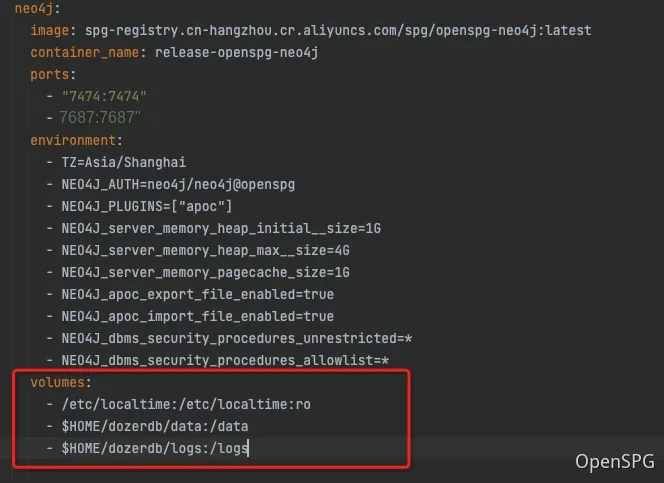
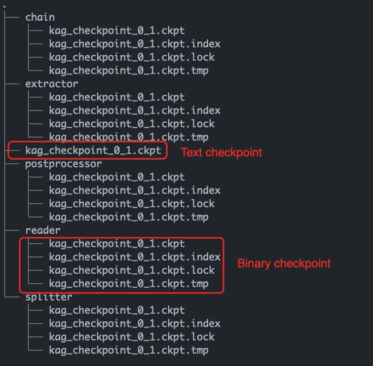

# FAQ

in the process of using, if you encounter any related questions about OpenSPG or KAG, you can ask questions through GitHub Issue or participate in Discussions at GitHub Discussions. Your questions will settle down and help other small partners.   
Some problems may have been encountered before, you can search in the Issue. If you solve some problems in the process of using, you are also very welcome to interact in the community to solve and close the corresponding Issue.   


| | **Issue **    | **Discussions **    |
| --- | --- | --- |
| **OpenSPG **    | [https://github.com/OpenSPG/openspg/issues](https://github.com/OpenSPG/openspg/issues)    | [https://github.com/OpenSPG/KAG/discussions](https://github.com/OpenSPG/KAG/discussions)    |
| **KAG **    | [https://github.com/OpenSPG/KAG/issues](https://github.com/OpenSPG/KAG/issues)    | [https://github.com/OpenSPG/openspg/discussions](https://github.com/OpenSPG/openspg/discussions)    |


## question 1: figure storage configuration, model configuration, whether the vector configuration has built-in services 
the graph storage configuration and vector configuration have corresponding built-in services after the image is installed through the docker-compose.yml. For scenarios with low performance requirements and quick verification, you can directly use the following configurations

**Graph storage configuration **

```json
{
  "uri":"neo4j://release-openspg-neo4j:7687",
  "user":"neo4j"
}
```

the model service is not built in yet. You need to build the model Service or call a third-party API. For details, see: [Generate (chat) model configuration](https://openspg.yuque.com/ndx6g9/cwh47i/tx0gd5759hg4xi56)  [Representation (embedding) model](https://openspg.yuque.com/ndx6g9/cwh47i/nmq2aq4s11b6mgxx)

## Question 2: Why does the project configuration file kag_config.cfg not take effect after modification? 
Solution: Because the relevant metadata is stored in the server (openspg-server), you need to update the corresponding configuration to the server after modifying the current KAG file. Step: In the project Directory, run the next project update -- proj_path. To update the project configuration, and directly modify the corresponding configuration information in the OpenSPG server page. For other commands, please refer: [Command Line Tools](https://openspg.yuque.com/ndx6g9/cwh47i/rrcdpyq9gv13fcc8)

## Question 3: I want to keep or empty the data in the Neo4j image, how should I set it? 
If you need to configure the data on the host computer- $HOME/dozerdb/data:/data in the docker-compose.yml, remove the code and delete it anyway. Container when the data will also be lost, the default is not set. Same with MySQL.




## Question 4: After the generation model and the representation model are correctly configured and can be successfully accessed through the curl Command on the host machine, connection refused or timeout still appears in the knowledge question and answer page of the OpenSPG server. 
The OpenSPG Q &amp; A page conducts natural language Q &amp; A. The container that needs to be spg-server can normally access the vector service on the host machine. For students using docker desktop on windows or mac, you can specify the vector service base_url = http:/host.docker.int `ernal:11434/${path}` to access the host machine. For students using linux, you can specify base_url = `http://172.17.0.1:11434/${path}` access the host by accessing the gateway of the docker0 network. In addition, before starting the ollama service, export OLLAMA_HOST = 0.0.0.0:11434, configure ollama to listen to access requests from all addresses.  
At the same time, when we create a project, we will verify all the configurations and save them only after they pass the verification. 


## Question 5: My document is relatively large. I found that there are too many tokens consumed when calling the model service. How should I solve it? 
When using the product, the length of Chunk segmentation can be appropriately adjusted according to the actual situation, for example, from 200 to 2000 or even higher. The smaller the segmentation length, the better the subsequent extraction effect is, and can be adjusted according to the actual situation. 

## Question 6: Why can't I find the corresponding Python Package? No matching distribution found for openspg-knext = = xxxx 
the openspg package is deployed in pypi.org. You can check whether the corresponding package exists at the following address:   
[https://pypi.org/project/openspg-kag](https://pypi.org/project/openspg-kag)  
[https://pypi.org/project/openspg-knext](https://pypi.org/project/openspg-knext)  
if the version that reported the error already exists, please check whether the local environment has been proxied or forwarded to other pypi warehouses.   
If the wrong version is not found in pypi.org, please contact us in time.

## Question 7: Is the front-end code open source kag-model when 
**front End Code **: At present, there is no open source plan for the front-end code. The future will judge whether it is open source or not after evaluating the community usage.  
**kag-model **: KAG's subsequent work priorities for kag-model optimization. We will open source in subsequent versions. KAG's subsequent plans are as follows: 

+ domain knowledge injection to realize the fusion of Domain concept graph and entity graph 
+ kag-model optimization to improve the efficiency of image composition and question answering
+ hallucination Inhibition of Knowledge Logic Constraints

## Question 8: How to view the contents of a checkpoint file 
The KAG framework supports two types of checkpoint formats: text and binary. The text format is used for recording execution logs and is located at the top level of the ckpt directory. The binary format is used for recording intermediate results from various stages of task execution, such as the graph data extracted by the Extractor component. 

+ **Viewing Statistics **




```bash
less kag_checkpoint_0_1.ckpt
```

It records the number of nodes, edges, and graphs constructed from each record. 


+ **Viewing ****binary**

The binary format of the checkpoint is based on ZODB for key-value storage. Users can refer to the official ZODB documentation for more detailed usage information: [https://zodb.org/en/latest/](https://zodb.org/en/latest/)

Here is a sample program that extracts all the raw graph data from the checkpoint file of the extractor component and writes it into a JSONL file for further analysis and optimization:   


```bash
import json
import pickle
from ZODB import DB
from ZODB.FileStorage import FileStorage


storage = FileStorage("extractor/kag_checkpoint_0_1.ckpt")
db = DB(storage)
connection = db.open()
print(len(connection.root.data))
graphs = []
for k, v in connection.root.data.items():
    """
    The data is pickled to prevent it from being modified by ZODB in subsequent processes. 
    So it needs to be deserialized upon reading.
    """
    graphs+=pickle.loads(v)
with open("extracted_subgraphs.jsonl", "w") as writer:
    for g in graphs:
        writer.write(json.dumps(g.to_dict(), ensure_ascii=False))
        writer.write("\n")
```

It's important to note that ZODB can track modifications to objects within the program and automatically sync these changes to the file. Therefore, we use pickle to serialize the data into an immutable byte sequence before writing it to ZODB, to prevent any modifications by ZODB in subsequent processing components. When reading the data, we need to use pickle to deserialize it and retrieve the original data. 

## Question 9 How to custom KagBuilder & KagSolver Task
The KAG framework introduced a registry-based code and configuration management mechanism in version 0.6. Users can override the built-in components of KAG and register their custom implementations to replace the default ones. For more details, please refer to the [KagBuiler & KagSolver customization](https://openspg.yuque.com/ndx6g9/cwh47i/ui1vgeez17zuqxsa)

  
  
  
  

