# Quick Start

# 1 Pre-Requirements 
## 1.1 Hardware Requirements
```bash
CPU ≥ 8 cores;
RAM ≥ 32 GB;
Disk ≥ 100 GB;
```

## 1.2 Software Requirements 
+ **operating System **

```bash
macOS System：macOS Monterey 12.6 or later
Linux System：CentOS 7 / Ubuntu 20.04 or later
Windows System：Windows 10 LTSC 2021 or later
```

+ **application software **

```bash
macOS / Linux System：Docker，Docker Compose
Windows System：WSL 2 / Hyper-V，Docker，Docker Compose

Docker ≥ 24.0.0 & Docker Compose ≥ v2.26.1.
```

## 1.3 Generate model
KAG supports all generative model services with OpenAI-compatible class interfaces, such as DeepSeek, Qwen, OpenAI, etc.

Developers can go to the official websites of large commercial models such as [deepseek official website](https://www.deepseek.com/), [tongyi official website](https://tongyi.aliyun.com/), [openai official website](https://chat.openai.com/) to complete account registration and activation of model services in advance, obtain the api-key, and fill it in the subsequent project configuration.

KAG also supports docking with the generative model prediction services provided by Ollama, Xinference, etc. For details, please refer to the relevant chapters on model services. **In the quick start stage, it is strongly recommended to purchase a commercial large model API to complete the trial run verification.**

## **1.4 Representation model **
KAG supports representation model services with OpenAI-compatible class interfaces, such as OpenAI, Silicon Mobility, etc.

Developers can go to the official website of [Silicon flow website](https://docs.siliconflow.cn/api-reference/embeddings/create-embeddings), [openai official website](https://chat.openai.com/) and other commercial model websites to complete account registration and activation of model services in advance, obtain the API key, and fill it in the subsequent project configuration.

KAG also supports docking with representation model prediction services provided by Ollama, Xinference, etc. For details, please refer to the relevant chapters on model services. **In the quick start stage, it is strongly recommended to purchase a commercial large model API to complete the trial run verification.**

# 2 **Service deployment**
## 2.1 Start the service
```bash
# set HOME enviroment var（only for Windows Users）
# set HOME=%USERPROFILE%

# get docker-compose.yaml file
$ curl -sSL https://raw.githubusercontent.com/OpenSPG/openspg/refs/heads/master/dev/release/docker-compose-west.yml -o docker-compose-west.yml
# service start
$ docker compose -f docker-compose-west.yml up -d
```

Tip: If you want to persist data in a local directory, you can do this through Docker's volumes configuration. This way, the data will not be lost even if the container is restarted or deleted. Add the following content to the volumes of mysql and neo4j in docker-compose.yml

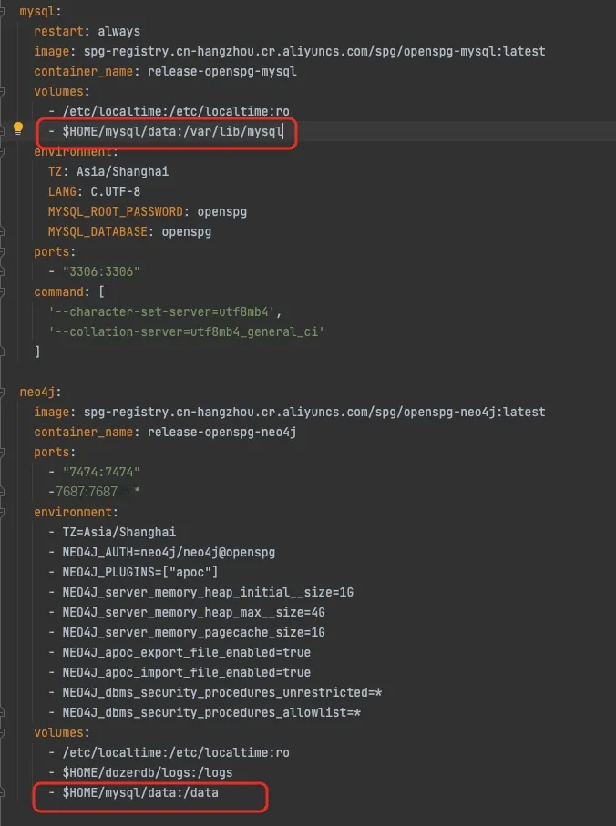


## 2.2 **View Status**
```yaml
$ docker ps
```

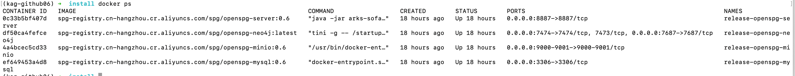

```yaml
$ docker logs -f release-openspg-server
```

The following log shows the successful start of the openspg server

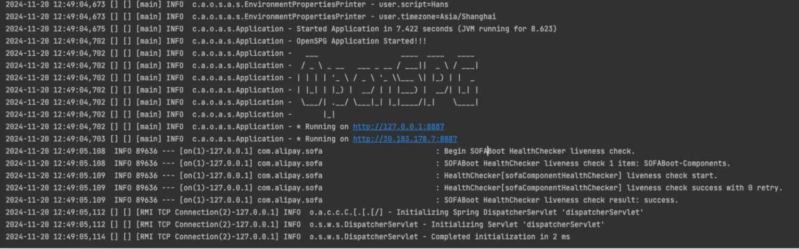

## 2.3 **Product Access**
Enter [http://127.0.0.1:8887](http://127.0.0.1:8887) in the browser to access the OpenSPG-KAG product interface.

```sql
# Default login information:
# Default Username: openspg
# Default password: openspg@kag

# The default password must be changed before it can be used. 
# If you forget the password, you can reinitialize it in the database with the following command:
UPDATE kg_user SET `gmt_create` = now(),`gmt_modified` = now(),`dw_access_key` ='efea9c06f9a581fe392bab2ee9a0508b2878f958c1f422f8080999e7dc024b83' where user_no = 'openspg' limit 1;
```

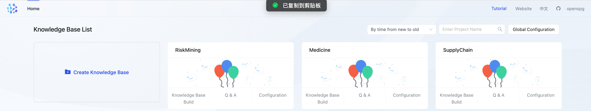

# 3 **KAG usage (product mode) **
This product provides a visual interface for OpenSPG-KAG, supporting users to build, ask and manage private domain knowledge bases on the page. At the same time, the modeling results can be viewed intuitively.  
When used in production mode, the KAG package python package is built into the openspg container, providing default building and reasoning question-answering capabilities. The calls to the generation model and representation model in the knowledge extraction and graph reasoning stages are all initiated from the openspg server container environment.

[快速开始](https://openspg.yuque.com/ndx6g9/0.5/nbb1bn3wegwue6yo?inner=zb7FU)

## 3.1 **Create a knowledge base**
### 3.1.1 Global configuration
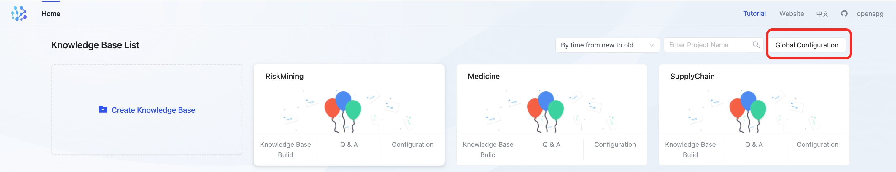

+ **Common Configuration**

user can custom database & vector model & prompt in common configuration

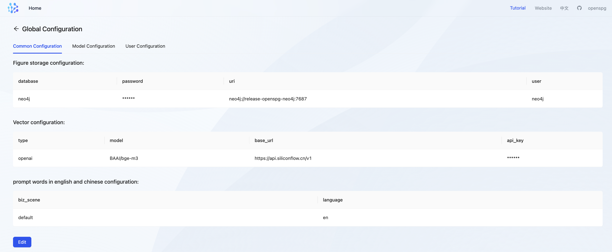

    - **database configuration **

By default, the local openspg-neo4j graph storage database can be filled in. Example:

```json
{
  "database":"neo4j", # default datahbase name, which will be replaced by namespace of knowledge base
  "uri":"neo4j://release-openspg-neo4j:7687", # neo4j server address, which can be replaced by customized neo4j server which is accessbile
  "user":"neo4j", # neo4j username, default to neo4j
  "password":"neo4j@openspg", # neo4j password, default to neo4j@openspg
}
```

    - **vector configuration**

For details, refer to the [Representation (embedding) model](https://openspg.yuque.com/ndx6g9/docs_en/nmq2aq4s11b6mgxx). Example of configuring a commercial  embedding model service such as siliconflow:

```json
{
  "type":"openai", # KAG supports openai compatible interface of embedding service
  "model":"BAAI/bge-m3", # model name of embedding service
  "base_url":"https://api.siliconflow.cn/v1", # url of embedding service
  "api_key":"your api key"
}
```

    - **prompt**

Required. Used to determine whether to use Chinese (zh) or English (en) when calling the model. Example:

```json
{
  "biz_scene":"default", # biz_scene for kag template
  "language":"en", # en for english and zh for chinese
}
```

+ **Model configuration**

KAG Supports Open-AI compatible generative Model APIs (chatgpt, deepseek, qwen2, etc.)，provides maas, vllm, ollama and other modes, for details, refer to [Generate (chat) model configuration](https://openspg.yuque.com/ndx6g9/docs_en/tx0gd5759hg4xi56). 

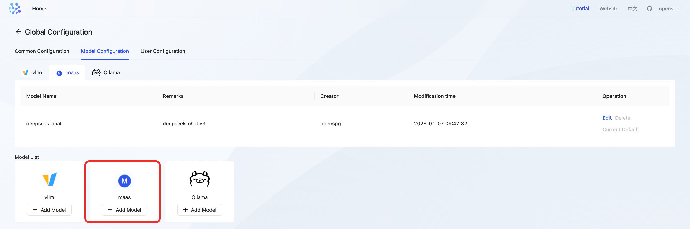

    - **maas**

```json
{
  "model": "deepseek-chat",
  "base_url": "https://api.deepseek.com",
  "api_key": "deepseek api key"
}
```

+ **User Configuration**

Account management can be done in User Configuration, including create/delete user, change password, etc.

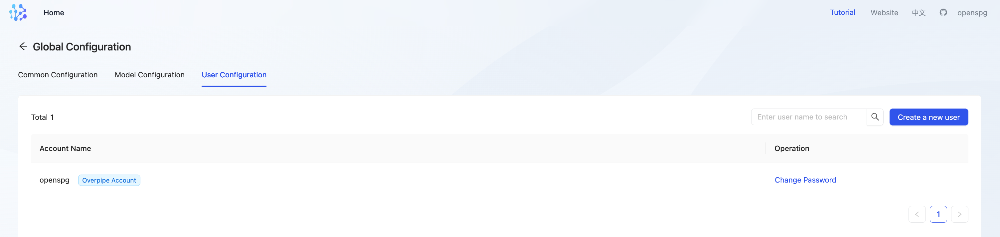

### 3.1.2 **New Knowledge Base **
User can use global configuration for specific knowledge base, or customize a new configuration.

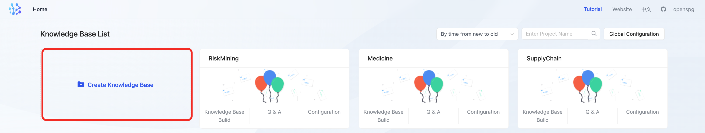

+ **namespace and graphStore configuration**

we can use default configuration which was settled in global conf, default database name would be replaced by name of knowledge base.


+ **vector configuration & prompts **

we can use default configuration which was settled in global conf.

**Special attention: **embedding vectors generated by different representation models cannot be mixed even if they have the same dimensions; Therefore, in the knowledge base configuration, the configuration related to the representation model cannot be modified once it is set. 

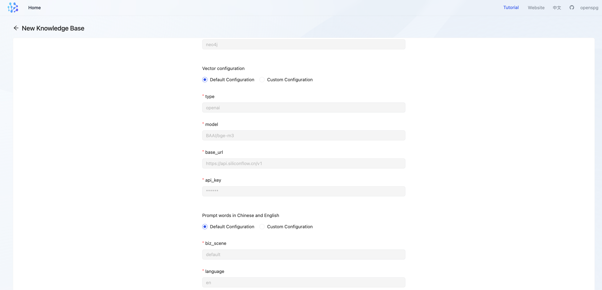

## 3.2 **Import documents **
### 3.2.1 Create a build task
Enter the knowledge base Build => Create task to initiate knowledge building tasks. Users can download sample files  [David Eagleman.txt](https://openspg.yuque.com/attachments/yuque/0/2025/txt/32480677/1735889862217-c48e42ce-696d-45d5-8903-08e84bf5f841.txt) [Karl Deisseroth.txt](https://openspg.yuque.com/attachments/yuque/0/2025/txt/32480677/1735889862633-c2cc2584-b4d7-4990-8398-3a73dd95a8a3.txt) [Thomas C. Sudhof.txt](https://openspg.yuque.com/attachments/yuque/0/2025/txt/32480677/1735889862788-86c08705-ca8a-4f01-bb69-f87d60c4f736.txt) for multi-hop Q&A tasks testing.


### 3.2.2 **Check knowledge extraction Results**
Users can view the graph data by clicking on the [Knowledge Exploration] menu on the product side.

Users can refer to [Knowledge Exploration](https://openspg.yuque.com/ndx6g9/cwh47i/mzq74eaynm4rqx4b) doc for detail.

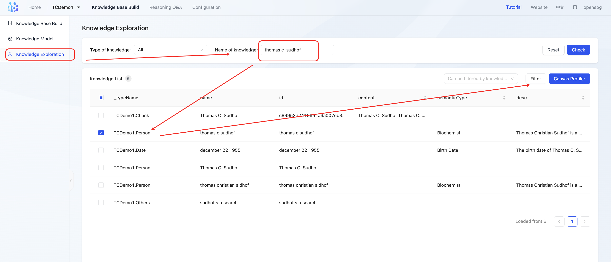


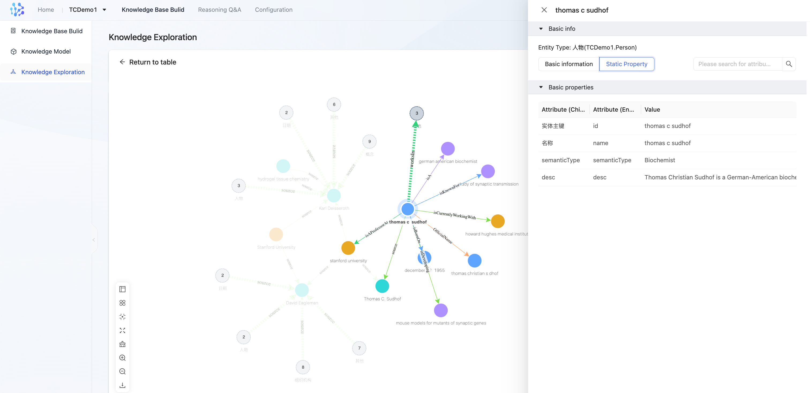

## 3.3 **Reasoning Questions and Answers **
Enter the question `Which Stanford University professor works on Alzheimer's?` and wait for the result to return. 

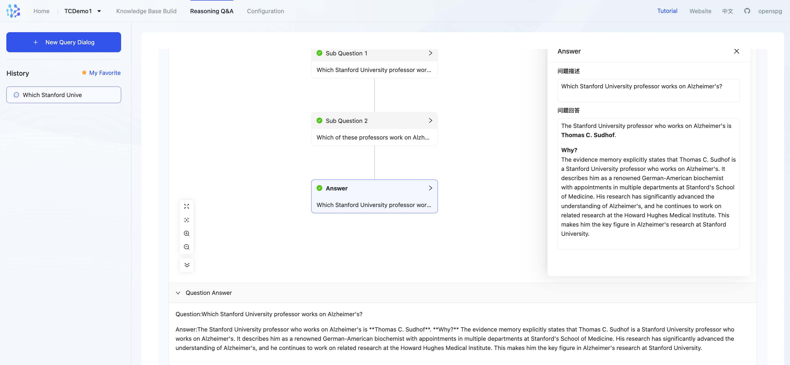

# 4 **KAG usage (developer mode)**
In the context of private domain knowledge bases, the effectiveness of graph construction and reasoning-based question answering is closely tied to schema design, knowledge extraction prompts, the selection of representation models, question planning prompts, graph retrieval algorithms, and answer generation prompts. These customizations are not yet exposed on the product side, requiring users to leverage the KAG developer mode to implement their customizations.

When using the developer mode, users execute the KAG Python package code in their local environment. The OpenSPG server solely provides capabilities such as schema management, reasoning execution, and graph database adaptation. Calls to generative models and representation models during the knowledge extraction and graph reasoning phases are initiated from the local environment.

[快速开始](https://openspg.yuque.com/ndx6g9/0.5/nbb1bn3wegwue6yo?inner=S8PoP)

## 4.0、Video Tutorial
[此处为语雀卡片，点击链接查看](https://www.yuque.com/ndx6g9/docs_en/rs7gr8g4s538b1n7#MP5s2)

## 4.1 **Environment configuration **
### 4.1.1 **Pre-dependency**
+ **OpenSPG-Server **

**KAG relies on OpenSPG-Server for metadata management and image storage services. Refer to the first and second parts of this document to complete the server deployment.**

### 4.1.2 **Virtual Environment Installation**
```bash
# Install conda
# conda installation ：https://docs.anaconda.com/miniconda/

# Install python virtual env：
$ conda create -n kag-demo python=3.10 && conda activate kag-demo
```

## 4.2 **Code Clone**
```bash
# code clone：
$ git clone https://github.com/OpenSPG/KAG.git

# KAG installation: 
$ cd ./KAG && pip install -e .

# confirmation
$ knext --version
$ knext --help
Usage: knext [OPTIONS] COMMAND [ARGS]...

Options:
  --version  Show the version and exit.
  --help     Show this message and exit.

Commands:
  project   Project client.
  reasoner  Reasoner client.
  schema    Schema client.
  thinker   Thinker client.
```

## 4.3 **Create a knowledge base**
### 4.3.1 **New Project **
+ **enter the project examples Directory**

```bash
$ cd kag/examples
```

+ **edit Project Configuration**

```bash
$ vim ./example_config.yaml
```

```yaml
#------------project configuration start----------------#
openie_llm: &openie_llm
  api_key: key
  base_url: https://api.deepseek.com
  model: deepseek-chat
  type: maas

chat_llm: &chat_llm
  api_key: key
  base_url: https://api.deepseek.com
  model: deepseek-chat
  type: maas

vectorize_model: &vectorize_model
  api_key: key
  base_url: https://api.siliconflow.cn/v1/
  model: BAAI/bge-m3
  type: openai
  vector_dimensions: 1024
vectorizer: *vectorize_model

log:
  level: INFO

project:
  biz_scene: default
  host_addr: http://127.0.0.1:8887
  id: "1"
  language: en
  namespace: TwoWikiTest
#------------project configuration end----------------#

#------------kag-builder configuration start----------------#
kag_builder_pipeline:
  chain:
    type: unstructured_builder_chain # kag.builder.default_chain.DefaultUnstructuredBuilderChain
    extractor:
      type: schema_free_extractor # kag.builder.component.extractor.schema_free_extractor.SchemaFreeExtractor
      llm: *openie_llm
      ner_prompt:
        type: default_ner # kag.builder.prompt.default.ner.OpenIENERPrompt
      std_prompt:
        type: default_std # kag.builder.prompt.default.std.OpenIEEntitystandardizationdPrompt
      triple_prompt:
        type: default_triple # kag.builder.prompt.default.triple.OpenIETriplePrompt
    reader:
      type: dict_reader # kag.builder.component.reader.dict_reader.DictReader
    post_processor:
      type: kag_post_processor # kag.builder.component.postprocessor.kag_postprocessor.KAGPostProcessor
      similarity_threshold: 0.9
    splitter:
      type: length_splitter # kag.builder.component.splitter.length_splitter.LengthSplitter
      split_length: 100000
      window_length: 0
    vectorizer:
      type: batch_vectorizer # kag.builder.component.vectorizer.batch_vectorizer.BatchVectorizer
      vectorize_model: *vectorize_model
    writer:
      type: kg_writer # kag.builder.component.writer.kg_writer.KGWriter
  num_threads_per_chain: 1
  num_chains: 16
  scanner:
    type: 2wiki_dataset_scanner # kag.builder.component.scanner.dataset_scanner.MusiqueCorpusScanner
#------------kag-builder configuration end----------------#

#------------kag-solver configuration start----------------#
search_api: &search_api
  type: openspg_search_api #kag.solver.tools.search_api.impl.openspg_search_api.OpenSPGSearchAPI

graph_api: &graph_api
  type: openspg_graph_api #kag.solver.tools.graph_api.impl.openspg_graph_api.OpenSPGGraphApi

exact_kg_retriever: &exact_kg_retriever
  type: default_exact_kg_retriever # kag.solver.retriever.impl.default_exact_kg_retriever.DefaultExactKgRetriever
  el_num: 5
  llm_client: *chat_llm
  search_api: *search_api
  graph_api: *graph_api

fuzzy_kg_retriever: &fuzzy_kg_retriever
  type: default_fuzzy_kg_retriever # kag.solver.retriever.impl.default_fuzzy_kg_retriever.DefaultFuzzyKgRetriever
  el_num: 5
  vectorize_model: *vectorize_model
  llm_client: *chat_llm
  search_api: *search_api
  graph_api: *graph_api

chunk_retriever: &chunk_retriever
  type: default_chunk_retriever # kag.solver.retriever.impl.default_fuzzy_kg_retriever.DefaultFuzzyKgRetriever
  llm_client: *chat_llm
  recall_num: 10
  rerank_topk: 10

kag_solver_pipeline:
  memory:
    type: default_memory # kag.solver.implementation.default_memory.DefaultMemory
    llm_client: *chat_llm
  max_iterations: 3
  reasoner:
    type: default_reasoner # kag.solver.implementation.default_reasoner.DefaultReasoner
    llm_client: *chat_llm
    lf_planner:
      type: default_lf_planner # kag.solver.plan.default_lf_planner.DefaultLFPlanner
      llm_client: *chat_llm
      vectorize_model: *vectorize_model
    lf_executor:
      type: default_lf_executor # kag.solver.execute.default_lf_executor.DefaultLFExecutor
      llm_client: *chat_llm
      force_chunk_retriever: true
      exact_kg_retriever: *exact_kg_retriever
      fuzzy_kg_retriever: *fuzzy_kg_retriever
      chunk_retriever: *chunk_retriever
      merger:
        type: default_lf_sub_query_res_merger # kag.solver.execute.default_sub_query_merger.DefaultLFSubQueryResMerger
        vectorize_model: *vectorize_model
        chunk_retriever: *chunk_retriever
  generator:
    type: default_generator # kag.solver.implementation.default_generator.DefaultGenerator
    llm_client: *chat_llm
    generate_prompt:
      type: resp_simple # kag/examples/2wiki/solver/prompt/resp_generator.py
  reflector:
    type: default_reflector # kag.solver.implementation.default_reflector.DefaultReflector
    llm_client: *chat_llm

#------------kag-solver configuration end----------------#
```

Please remember to fill in the `api_key` field of `chat_llm`and `openie_llm` with your DeepSeek API key, and fill in the `api_key` field of `vectorize_model` with your SiliconFlow API key.

+ **create Project **(One-to-one mapping with the knowledge base in the product): 

```bash
$ knext project create --config_path ./example_config.yaml
```

+ **directory Initialization **

After creating a project, a directory with the same name as the `namespace` field in the project configuration (e.g., `TwoWikiTest` in the example) will be created under the kag/examples directory, and the KAG project code framework will be initialized.


Users can modify one or more of the following files to customize the business-specific knowledge graph construction and reasoning-based question answering.

```yaml
TwoWikiTest
  ├── builder
  │   ├── data
  │   ├── indexer.py
  │   └── prompt
  │   		├── ner.py
  │   		├── std.py
  │   		└── tri.py
  ├── kag_config.cfg
  ├── reasoner
  ├── schema
  │   ├── TwoWikiTest.schema
  └── solver
      ├── evaForHotpotqa.py
      └── prompt
          ├── logic_form_plan.py
          └── resp_generator.py
```

### 4.3.2 **update the project (Optional)**
If there are any configuration changes, you may refer to the content of this section to update the configuration  on the server side.

+ **enter the project examples Directory **

```bash
$ cd kag/examples/TwoWikiTest
```

+ **edit Project Configuration**

Note: Due to the varying usage of different representation models, it is not recommended to update the `vectorizer` configuration after the project has been created. If there is a need to update the `vectorizer` configuration, it is advised to create a new project instead.

```bash
$ vim ./kag_config.yaml
```

Once again, please ensure that all `api-key` fields have been correctly filled in.

+ **run command: **

```bash
$ knext project update --proj_path ./
```

## 4.4 **Import documents **
+ **Enter the project directory**

```bash
$ cd kag/examples/TwoWikiTest
```

+ **Obtain the corpus file**

The test corpus data for the 2wiki dataset is located at `examples/2wiki/builder/data/2wiki_corpus.json`, which contains 6,119 documents and 1,000 question-answer pairs. To quickly run through the entire process, there is also a `2wiki_sub_corpus.json` file in the directory, which includes only 3 documents. We will use this smaller dataset as an example for experimentation.  

Copy the corpus file to the corresponding directory in the `TwoWikiTest` project:

```bash
$ cp ../2wiki/builder/data/2wiki_sub_corpus.json builder/data/
```

+ **Edit schema(Optional)  **

User can refere to [Declarative Schema](https://openspg.yuque.com/ndx6g9/cwh47i/fiq6zum3qtzr7cne) to customize `schema/TwoWikiTest.schema` file.

+ **Submit the updated schema to SPG server**

```bash
$ knext schema commit
```

+ **Execute the build task.**

Define the build script in the `builder/indexer.py` file:

```bash
$ vim ./builder/indexer.py
```

```python
import os
import logging
from kag.common.registry import import_modules_from_path

from kag.builder.runner import BuilderChainRunner

logger = logging.getLogger(__name__)


def buildKB(file_path):
    from kag.common.conf import KAG_CONFIG

    runner = BuilderChainRunner.from_config(KAG_CONFIG.all_config["kag_builder_pipeline"])
    runner.invoke(file_path)

    logger.info(f"\n\nbuildKB successfully for {file_path}\n\n")


if __name__ == "__main__":
    import_modules_from_path(".")
    dir_path = os.path.dirname(__file__)
    # Set the `file_path` to the path of the previously prepared corpus file.
    file_path = os.path.join(dir_path, "data/2wiki_sub_corpus.json")

    buildKB(file_path)

```

+ **Builder Chain running **

Run the`indexer.py` script to complete the graph construction of unstructured data

```bash
$ cd builder
$ python ./indexer.py
```

Once the build script is launched, a checkpoint directory for the task will be generated under the current working directory(i.e., `./builder`), recording the checkpoints and statistical information of the construction pipeline.

```shell
builder
├── ckpt
│   ├── chain
│   ├── extractor
│   ├── kag_checkpoint_0_1.ckpt
│   ├── postprocessor
│   ├── reader
│   └── splitter
├── data
│   ├── 2wiki_sub_corpus.json
├── indexer.py
```

Use the following command to view the statistical information of the extraction task, such as how many nodes/edges are extracted from each document:

```shell
$ less ckpt/kag_checkpoint_0_1.ckpt
```

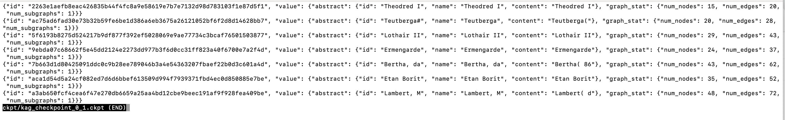

Use the following command to check how many document entries have been successfully processed and written to the graph database:

```shell
$ wc -l ckpt/kag_checkpoint_0_1.ckpt
```

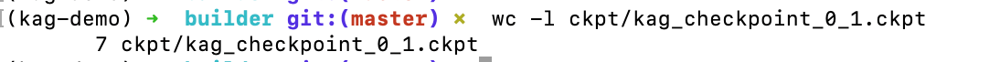

The KAG framework provides a checkpoint-based resumption feature. If the task is interrupted due to program errors or other external reasons (such as insufficient LLM balance), you can re-execute `indexer.py`. KAG will automatically detect the checkpoint files and reuse the existing results.

+ **Result Inspection**

Currently, KAG offers [knowledge exploration](https://openspg.yuque.com/ndx6g9/cwh47i/mzq74eaynm4rqx4b) capabilities on the product side, along with the corresponding [API documentation](https://openspg.yuque.com/ndx6g9/cwh47i/qvbgge62p7argtd2).


## 4.5 **Reasoning Questions and Answers**
+ **Enter the project directory**

```shell
cd kag/examples/TwoWikiTest
```

+ **Edit the QA script**

```bash
$ vim ./solver/qa.py
```

Paste the following content into `qa.py`.

```python
import json
import logging
import os
import time
from concurrent.futures import ThreadPoolExecutor, as_completed

from tqdm import tqdm

from kag.common.benchmarks.evaluate import Evaluate
from kag.solver.logic.solver_pipeline import SolverPipeline
from kag.common.conf import KAG_CONFIG
from kag.common.registry import import_modules_from_path

from kag.common.checkpointer import CheckpointerManager

logger = logging.getLogger(__name__)


class EvaFor2wiki:
    """
    init for kag client
    """

    def __init__(self):
        pass

    """
        qa from knowledge base,
    """

    def qa(self, query):
        resp = SolverPipeline.from_config(KAG_CONFIG.all_config["kag_solver_pipeline"])
        answer, traceLog = resp.run(query)

        logger.info(f"\n\nso the answer for '{query}' is: {answer}\n\n")
        return answer, traceLog

if __name__ == "__main__":
    import_modules_from_path("./prompt")
    evalObj = EvaFor2wiki()

    evalObj.qa("Which Stanford University professor works on Alzheimer's?")
```

+ **Execute the QA script:**

```bash
$ cd solver
$ python ./qa.py
```

## 4.6 **Other built-in cases**
you can enter the kag/examples directory to experience the cases brought in the source code. 

[Musique(Multi-hop Q&A)](https://openspg.yuque.com/ndx6g9/cwh47i/gfxqv13g1tks9cy7)

[Twowiki(Multi-hop Q&A)](https://openspg.yuque.com/ndx6g9/cwh47i/nqllvpvkv2c2ny8g)

[Hotpotqa(Multi-hop Q&A)](https://openspg.yuque.com/ndx6g9/cwh47i/pa09hxroyt48fv4z)

[Risk Mining Knowledge Graph](https://openspg.yuque.com/ndx6g9/cwh47i/merirblg8d1cbgkg)

[Enterprise Supply Chain Knowledge Graph](https://openspg.yuque.com/ndx6g9/cwh47i/tmebvz9z74rc4szu)

[Medical Knowledge Graph](https://ope
nspg.yuque.com/ndx6g9/cwh47i/bkvfaunnpl65rsrk)


## 4.7、FAQ
Please refer to the [FAQ](https://openspg.yuque.com/ndx6g9/cwh47i/thg06a4winnimtq2) section for details on how to view checkpoint content and customize extraction & QA task-related information.
