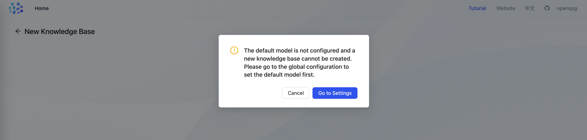
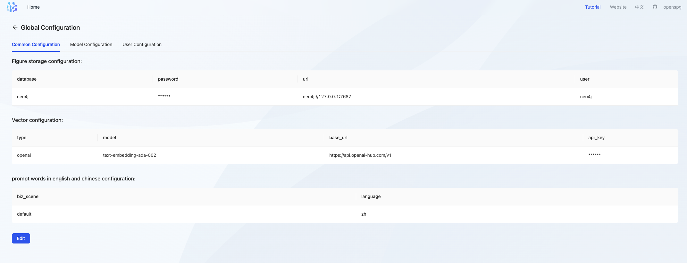
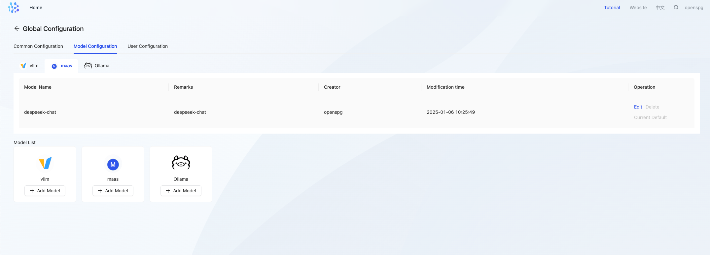
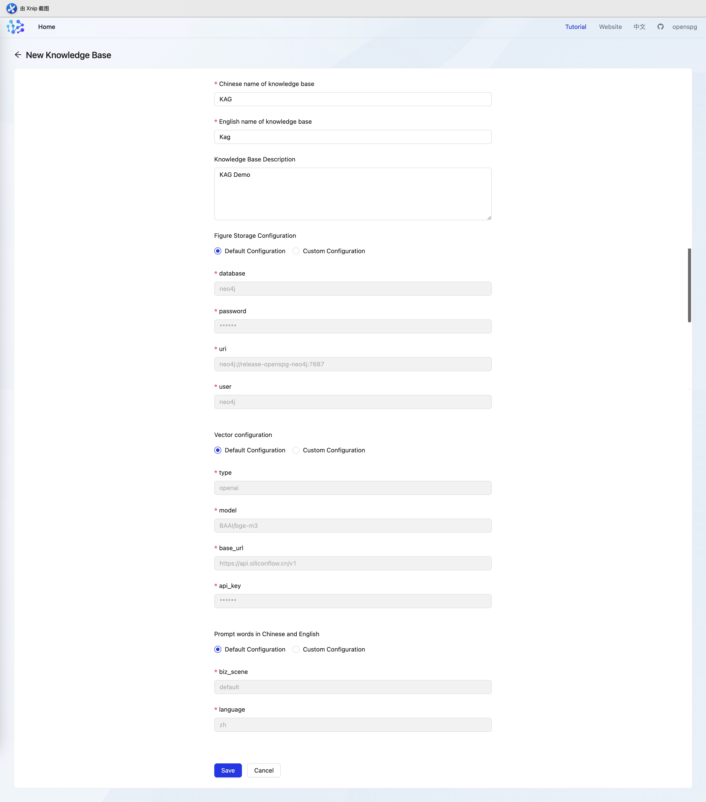
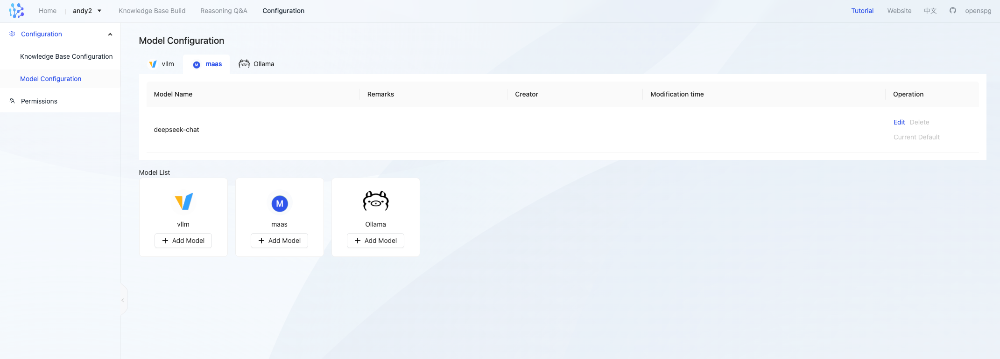
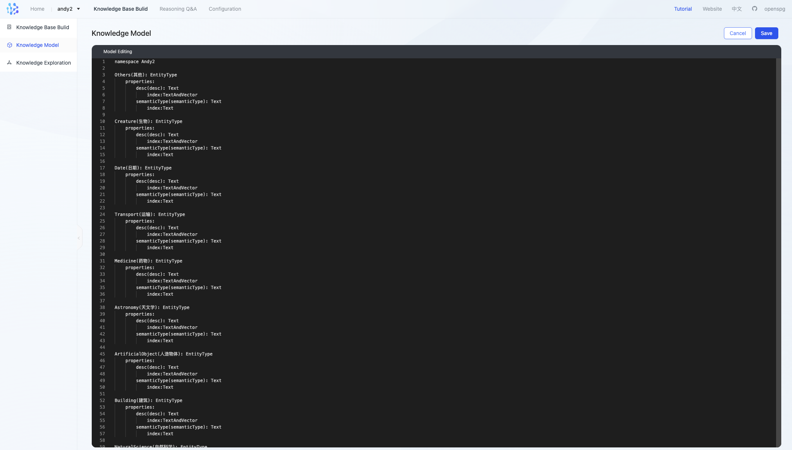
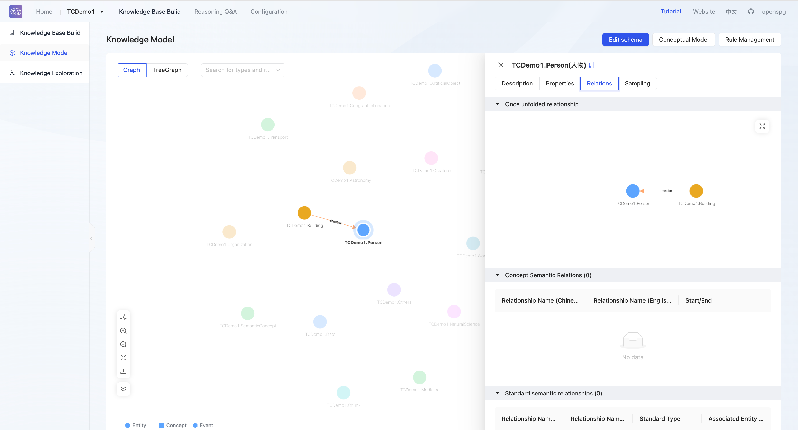
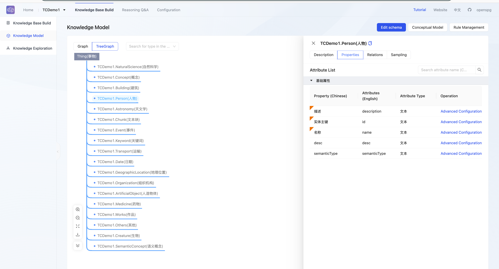
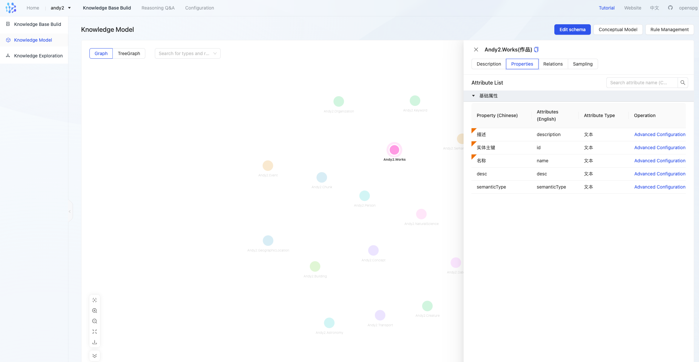

# KnowledgeBase Configuration

# 1、KnowledgeBase Configuration
## 1.1、Global Configuration
When you enter the page for the first time, you will be prompted to create a default global configuration when creating a knowledge base, which mainly includes general configuration (image storage configuration, vector configuration, prompt word configuration), model configuration, and user configuration. After the global configuration is successfully set up, the subsequent projects created can use it directly.



+ **General Configuration**

Global settings for image storage configuration, vector configuration, and prompt word configuration can be performed



+ **Model configuration**



## 1.2、Create knowledge base


### 1.2.1、Basic Configuration
+ Chinese name of knowledge base

Required. The Chinese name of the knowledge base, used for page display

+ English name of knowledge base

Required. The English name of the knowledge base must start with a capital letter and can only be a combination of letters and numbers, with a minimum of 3 characters. Used for schema prefixes and graph storage data isolation

+ ****Figure Storage Configuration

| **Parameter name** | **Parameter Description** |
| --- | --- |
| database | The database name of the graph storage is fixed and consistent with the English name of the knowledge base and cannot be modified |
| password | The default value of the built-in openspg-neo4j is: neo4j@openspg |
| uri | The default value of the built-in openspg-neo4j is: neo4j://release-openspg-neo4j:7687 |
| user | The default value of the built-in openspg-neo4j is: neo4j |


+ Vector configuration

Provides vector generation service, supports bge and openai-embedding. It is recommended to use bge-m3 for English and bge-base-zh for Chinese. For details, refer to Embedding Model Configuration.

Example of configuring a business presentation model service such as Silicon Mobility:

```json
{
    "type": "openai",
    "model": "BAAI/bge-m3",
    "base_url": "https://api.siliconflow.cn/v1",
    "api_key": "YOUR_API_KEY",
    "vector_dimensions": "1024"
}
```

+ **Model service availability testing**

When the configuration is saved, kag will call the large model API according to the representation model configuration. If the call fails, it will prompt that the save failed. Users can use the curl command in the openspg container to verify the service accessibility and whether the api-key has expired.

```bash
$ curl --request POST \
  --url https://api.siliconflow.cn/v1/embeddings \
  --header 'Authorization: Bearer <token>' \
  --header 'Content-Type: application/json' \
  --data '{
    "model": "BAAI/bge-large-zh-v1.5",
    "input": "Silicon-based mobile embedding is now available. Come and try it out!",
    "encoding_format": "float"
  }'
```

****

+ Prompt words in Chinese and English

Used to determine whether to use Chinese (zh) or English (en) when calling the model. Example:

```json
{
  "biz_scene":"default",
  "language":"zh"
}
```

### 1.2.2、Model configuration


Used for model construction and question-answering. Supports Open-AI compatible APIs (ChatGPT3.5, DeepSeek, Qwen2, etc.), provides MAAS, VLLM, Ollama and other modes, for details, refer to Generate (Chat) Model Configuration.

+ **Example of configuring commercial model generation services such as deepseek:**

```json
{
  "type": "maas",
  "base_url": "https://api.deepseek.com",
  "api_key": "deepseek api key",
  "model": "deepseek-chat"
}
```

+ **Model service availability testing**

When the configuration is saved, kag will call the large model api according to the generated model configuration. If the call fails, it will prompt that the save failed. Users can use the curl command in the openspg container to verify the service accessibility and whether the api-key has expired.

```bash

$ curl https://api.deepseek.com/chat/completions \
  -H "Content-Type: application/json" \
  -H "Authorization: Bearer <DeepSeek API Key>" \
  -d '{
        "model": "deepseek-chat",
        "messages": [
          {"role": "system", "content": "You are a helpful assistant."},
          {"role": "user", "content": "Hello!"}
        ],
        "stream": false
      }'
```

# 2、Schema management
Knowledge Base Management - Knowledge Model, enter the knowledge base schema management page

## 2.1、Editing the schema
When the knowledge base is created, some schemas are built in




```yaml
namespace TCDemo1

NaturalScience(自然科学): EntityType
	properties:
		semanticType(semanticType): Text
			index:Text
		desc(desc): Text
			index:TextAndVector

Concept(概念): EntityType
	properties:
		semanticType(semanticType): Text
			index:Text
		desc(desc): Text
			index:TextAndVector

Building(建筑): EntityType
	properties:
		semanticType(semanticType): Text
			index:Text
		creator(创作者): Person
		desc(desc): Text
			index:TextAndVector

Person(人物): EntityType
	properties:
		desc(desc): Text
			index:TextAndVector
		semanticType(semanticType): Text
			index:Text

Astronomy(天文学): EntityType
	properties:
		desc(desc): Text
			index:TextAndVector
		semanticType(semanticType): Text
			index:Text

Chunk(文本块): EntityType
	properties:
		content(content): Text
			index:TextAndVector

Event(事件): EntityType
	properties:
		semanticType(semanticType): Text
			index:Text
		desc(desc): Text
			index:TextAndVector

Keyword(关键词): EntityType
	properties:
		semanticType(semanticType): Text
			index:Text
		desc(desc): Text
			index:TextAndVector

Transport(运输): EntityType
	properties:
		semanticType(semanticType): Text
			index:Text
		desc(desc): Text
			index:TextAndVector

Date(日期): EntityType
	properties:
		desc(desc): Text
			index:TextAndVector
		semanticType(semanticType): Text
			index:Text

GeographicLocation(地理位置): EntityType
	properties:
		desc(desc): Text
			index:TextAndVector
		semanticType(semanticType): Text
			index:Text

Organization(组织机构): EntityType
	properties:
		desc(desc): Text
			index:TextAndVector
		semanticType(semanticType): Text
			index:Text

ArtificialObject(人造物体): EntityType
	properties:
		semanticType(semanticType): Text
			index:Text
		desc(desc): Text
			index:TextAndVector

Medicine(药物): EntityType
	properties:
		semanticType(semanticType): Text
			index:Text
		desc(desc): Text
			index:TextAndVector

Works(作品): EntityType
	properties:
		desc(desc): Text
			index:TextAndVector
		semanticType(semanticType): Text
			index:Text

Others(其他): EntityType
	properties:
		semanticType(semanticType): Text
			index:Text
		desc(desc): Text
			index:TextAndVector

Creature(生物): EntityType
	properties:
		semanticType(semanticType): Text
			index:Text
		desc(desc): Text
			index:TextAndVector

SemanticConcept(语义概念): EntityType
	properties:
		semanticType(semanticType): Text
			index:Text
		desc(desc): Text
			index:TextAndVector
```

+ The knowledge base schema currently only provides one operation entry, and the operation mode is declarative schema.
+ Schema editing content supports:
    - Create new entity types and meta-concept types
    - Create new relation types: entity-to-entity, entity-to-meta-concept, entity-to-standard type
    - Modify entity types, meta-concept types, and relationship types to modify the Chinese and English names of attributes
    - Add/delete attributes and rules for entity types and relationship types
    - Delete entity types, meta-concept types, and relationship types
    - Add, modify, and delete constraints, indexes, and rules for attributes

## 2.2、Dot pattern
+ The schema is displayed on the canvas in the form of points and edges
+ You can quickly locate points or relationships based on type or relationship
+ The canvas tool in the lower left corner can be used to adjust and download the canvas



## 2.3、Tree Mode
+ Display the schema in a treeGraph and show the hierarchical relationship of the schema.



## 2.4 Schema Details
### 2.4.1、Entity Type Details
+ Click an EntityType to view its details, including description, attributes, relations, and entity sampling data.



### 2.4.2、RelationType Details
Click a RelationType to view the details, including description, attributes, StartEntityType, EndEntityType.  

