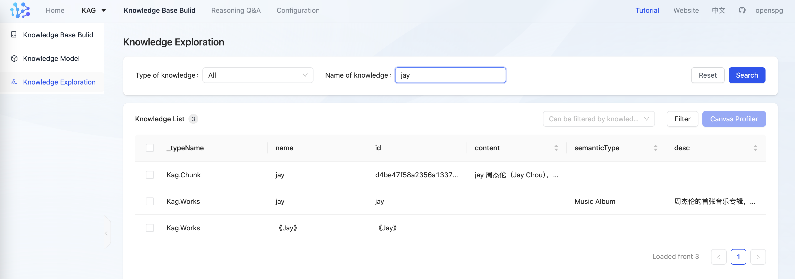
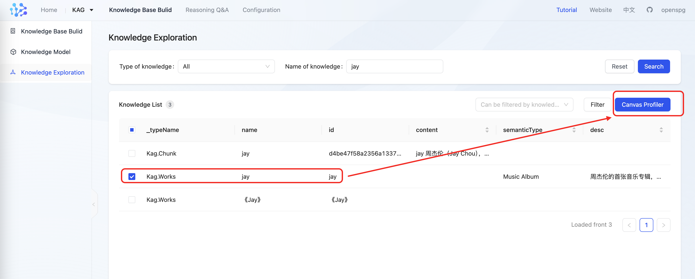
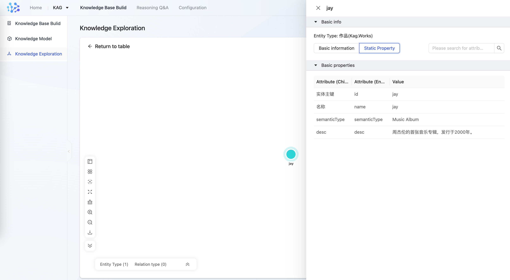
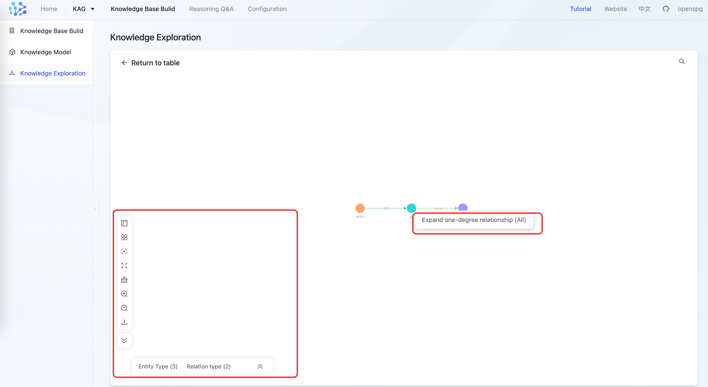
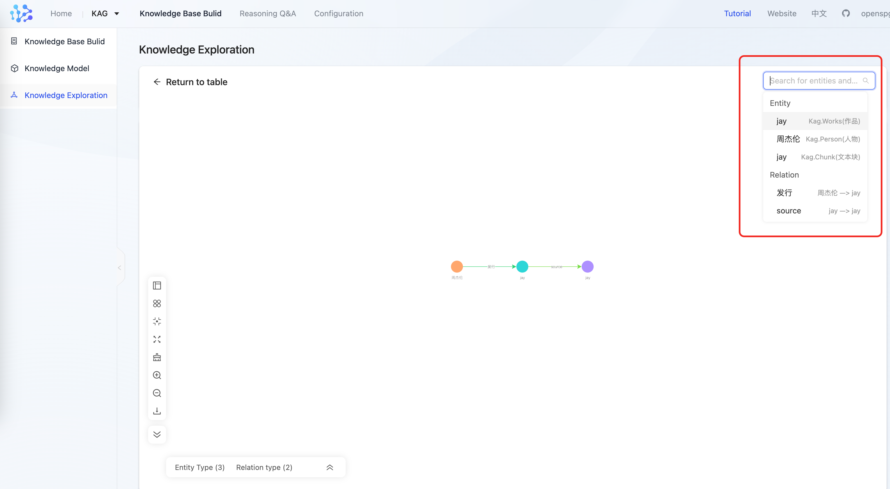
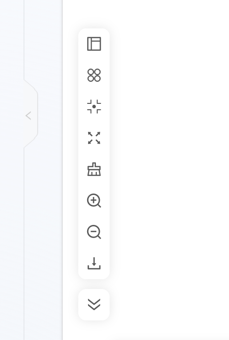

# Knowledge Exploration

KAG supports exploring and visualizing extracted knowledge in a graphical manner, currently offering three methods: 

+ Searching for entities 
+ Obtaining entity details, as well as the corresponding article snippets of the entity 
+ Acquiring the one-hop subgraph of an entity

## 1、Entity search 
Perform a fuzzy search for all entities that match the keywords. Any entity type attributes set with corresponding indexes in the schema and completed in the knowledge base can be retrieved. The predefined "name" field of entity types automatically has an index created by default.

```plain
Works(作品): EntityType
     properties:
        desc(描述): Text
            index: TextAndVector
```

After searching, the results can be further filtered by type or by attributes and their values.



## 2、Canvas exploration 
In the search list, select a knowledge point and enter canvas exploration, where you can query point details and one-hop subgraph on the canvas.



### 2.1、Entity detail
Click on a point on the canvas to view entity details.



+ Basic information：The source of the entity chunk
+ Static property：The attributes and attribute values of entities. If there are too many attributes, you can search for a single attribute and its value by the Chinese or English name of the attribute.

### 2.2、One-hop subgraph of an entity
+ One-degree expansion

Right-click on the entity point to expand the one-degree relationship (all), including outgoing and incoming edges.



+ Search

Quickly locate on the canvas based on points and edges



+ Canvas tools   
Layout switching, node merging, canvas adaptation, centering, zooming in, zooming out, full-screen mode, downloading, and collapsing toolbars.


