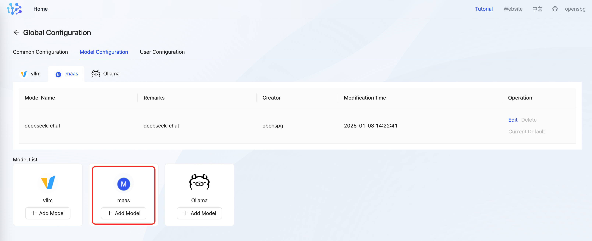
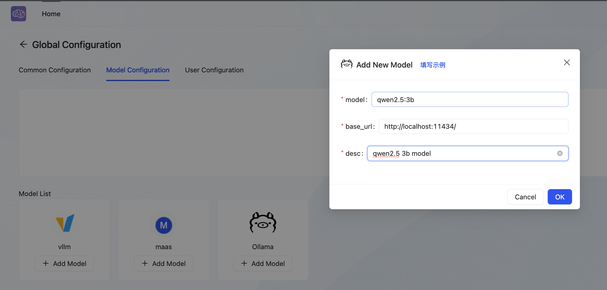
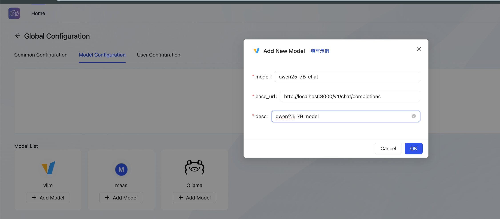

# Generative (chat) model configuration

when configuring the model generation service for kag, you can select business model apis or local model services based on vllm, ollama, and xinference. 

# 1. Commercial Model As A Service (MaaS) 
maas stands for (Model As Service). kag supports all online big model services that are compatible with openai, such as deepseek, qwen, and openai.   
Developers can go there themselves. [deepseek official website](https://www.deepseek.com/), [tongyi Thousand Questions official website](https://tongyi.aliyun.com/), [openai official website](https://chat.openai.com/), complete the account registration and model service opening in advance, and obtain the api-key and fill it in the subsequent project configuration. 

## 1.1** Product Mode Configuration **
in the product mode, the configuration is filled in the json string format. 

#### configuration Item 


    - **maas**

```json
{
  "model": "deepseek-chat",
  "base_url": "https://api.deepseek.com",
  "api_key": "deepseek api key"
}
```

#### Model Service Accessibility Test 
when the configuration is saving, KAG will first call the generative model api to test accessibility. You can use the curl Command in the openspg container to verify the accessibility of the service and whether the api-key has expired.

```bash
# replace <DeepSeek API Key> with your api-key

$ curl https://api.deepseek.com/chat/completions \
  -H "Content-Type: application/json" \
  -H "Authorization: Bearer <DeepSeek API Key>" \
  -d '{
        "model": "deepseek-chat",
        "messages": [
          {"role": "system", "content": "You are a helpful assistant."},
          {"role": "user", "content": "Hello!"}
        ],
        "stream": false
      }'
```

## 1.2 **Developer Mode **
you can change the large model that all aspects of kag depend on according to the the configuration file kag_config.yaml. User can define different LLM model and refer it in different stages of KAG-Builder or KAG-Solver.

```yaml
# gpt-3.5-turbo
openie_llm: &openie_llm
  api_key: your openai api_key
  base_url: https://api.openai.com
  model: gpt-3.5-turbo
  type: maas

chat_llm: &chat_llm
  api_key: key
  base_url: https://api.openai.com
  model: gpt-3.5-turbo
  type: maas
```

```bash
# qwen
openie_llm: &openie_llm
  api_key: put your tongyi api key here
  base_url: https://dashscope.aliyuncs.com/compatible-mode/v1
  model: qwen-plus
  type: maas

chat_llm: &chat_llm
  api_key: put your tongyi api key here
  base_url: https://dashscope.aliyuncs.com/compatible-mode/v1
  model: qwen-plus
  type: maas
```

```bash
# Deepseek
openie_llm: &openie_llm
  api_key: put your deepseek api key here
  base_url: https://api.deepseek.com
  model: deepseek-chat
  type: maas

chat_llm: &chat_llm
  api_key: put your deepseek api key here
  base_url: https://api.deepseek.com
  model: deepseek-chat
  type: maas
```

Note: In developer mode, after the configuration is modified, it needs to be synchronized to the server. Specific reference documents: [update Project Configuration](https://openspg.yuque.com/ndx6g9/cwh47i/rs7gr8g4s538b1n7#vmE7s).

# 2 **Local model service (vllm/ollama)**
## 2.1 **Model service startup**
kag supports the docking of openai large model inference services. You can choose one of the model service frameworks, such as ollama, vllm, and xinference, to build your own large Model Inference Service. 

### 2.1.1 **ollama Model Inference Service**
+ **installing ollama **
    - **mac User: **brew install ollama
    - **windows and linux users: **to [ollama official website](https://ollama.com/)download ollama 
+ **start the model service: **
    - **start ollama:**

```bash
# listening for all requests
$ export OLLAMA_HOST=0.0.0.0:11434
$ ollama serve
```

    - **pull model:**

```bash
$ ollama pull qwen2.5:3b
```

You can start the model service 

    - **test:**

```bash
# 发送测试请求
$ curl http://localhost:11434/v1/chat/completions \
    -H "Content-Type: application/json" \
    -d '{
        "model": "qwen2.5:3b",
        "messages": [
            {"role": "system", "content": "You are a helpful assistant."},
            {"role": "user", "content": "你是谁？"}
        ]
    }'

$ {"id":"chatcmpl-360","object":"chat.completion","created":1732100271,"model":"qwen2.5:3b","system_fingerprint":"fp_ollama","choices":[{"index":0,"message":{"role":"assistant","content":"我是来自阿里云的大规模语言模型，我叫通义千问。很乐意为您提供帮助，请您告诉我您具体的问题或需求是什么，期待与您的交流合作！"},"finish_reason":"stop"}],"usage":{"prompt_tokens":22,"completion_tokens":37,"total_tokens":59}}
```

### 2.1.2 **vllm Model Inference Service**
According to the official vLLM blog [vLLM: Easy, Fast, and Cheap LLM Serving with PagedAttention](https://blog.vllm.ai/2023/06/20/vllm.html)said: two experiments of reasoning LLaMA-7 B on NVIDIA A10 GPU and reasoning LLaMA-13 B on NVIDIA A100 GPU(40GB) were conducted. **In terms of throughput, vLLM is 24 times higher than the most basic HuggingFace Transformers and 3.5 times higher than TGI. **.

+ first of all, prepare a GPU environment, you can refer to this article: [GPU environment construction guide: how to use GPU in bare metal, Docker, K8s and other environments](https://www.lixueduan.com/posts/ai/01-how-to-use-gpu/)
+ to avoid interference, we recommend that you use conda to create a separate Python virtual environment to install vLLM.

```bash
$ conda create -n vllm_py310 python=3.10

$ conda activate vllm_py310

$ pip install vllm
```

+ **model download, you can download models through modelsope**

```bash
$ pip install modelscope
$ modelscope download --model Qwen/Qwen2.5-7B-Chat
```

+ **start the vllm service**

```bash
modelpath=/path/to/model/Qwen2.5-7B-Chat

# 
python3 -m vllm.entrypoints.openai.api_server \
        --model $modelpath \
        --served-model-name qwen25-7B-chat \
        --trust-remote-code

```

+ **send Test Request**

```bash
# replace model with predefined ${served-model-name} 
curl http://localhost:8000/v1/chat/completions \
    -H "Content-Type: application/json" \
    -d '{
        "model": "qwen25-7B-chat",
        "messages": [
            {"role": "system", "content": "You are a helpful assistant."},
            {"role": "user", "content": "你是谁？"}
        ]
    }'

```

### 2.1.3 **Container Access Host Model Service**
When a user runs kag in the product mode, it involves the request of accessing the model service outside the container. For the following situations: 

+ **the kag container and the model inference service are deployed on the same host:**
    - **Mac & Windows Environment: **access to host.docker.int ernal in the container can be routed to the service on the host, and modify the domain name corresponding to base_url in the generated model configuration.

```bash
# qwen2.5:3b within ollama can be accessied through:
$ curl http://host.docker.internal:11434/v1/chat/completions \
    -H "Content-Type: application/json" \
    -d '{
        "model": "qwen2.5:3b",
        "messages": [
            {"role": "system", "content": "You are a helpful assistant."},
            {"role": "user", "content": "who are you？"}
        ]
    }'
```

    - **Linux environment: **to access 172.17.0.1 in the container, you can access the host by accessing the gateway of the docker0 network, and modify the domain name corresponding to base_url in the generation model configuration.

```bash
# qwen2.5:3b within ollama can be accessied through:
$ curl http://172.17.0.1:11434/v1/chat/completions \
    -H "Content-Type: application/json" \
    -d '{
        "model": "qwen2.5:3b",
        "messages": [
            {"role": "system", "content": "You are a helpful assistant."},
            {"role": "user", "content": "你是谁？"}
        ]
    }'
```

+ **kag container and model inference service are deployed on different hosts:**

Request Routing is implemented by accessing the ip address of the host where the model service is located. 

## 2.2 **Model service configuration **
### 2.2.1 **Product Mode Configuration**
In the product mode, the configuration is filled in the json string format. 

+ **ollama configuration  **




```bash
# localhost need to be replaced with real host_addr, which can be accessied in container

{
  "client_type": "ollama",
  "base_url": "http://localhost:11434/",
  "model": "qwen2.5:3b"
}
```

+ **vllm configuration  **




```bash
# localhost need to be replaced with real host_addr, which can be accessied in container

{
  "client_type": "vllm",
  "base_url": "http://localhost:8000/v1/chat/completions",
  "model": "qwen25-7B-chat"
}
```

+ **other**

If you prefer to use other Model Inference Service Frameworks (such as xinference), you can build them yourself. Set client_type = vllm (equivalent to the default value) before calling, and base_url = xx. 

+ **model Service Availability Test**

When the configuration is saved, kag calls the big model api based on the generated model configuration. If the call fails, it prompts that the save fails. You can use the curl Command in the openspg container to verify the reachability of the service to avoid the impact of service calls when the model is stopped. For details, please refer to the section [Container Access Host Model Service](#mjSk7).

### 2.2.2 **Developer Mode Configuration **
you can change the large model that all aspects of kag depend on according to the configuration file kag_config.yaml.  
In developer mode, large model calls related to knowledge extraction and inference question and answer are initiated from the local environment where kag runs. The domain name corresponding to the model inference service, which needs to be resolved in the environment where the kag runs. 

+ **ollama**

```bash
# base_url need to be replaced with real host_addr which can accessied in kag runtime。
openie_llm: &openie_llm
  base_url: http://localhost:11434/
  model: qwen2.5:3b
  type: ollama

chat_llm: &chat_llm
  base_url: http://localhost:11434/
  model: qwen2.5:3b
  type: ollama
```

+ **vllm**

```bash
# localhost need to be replaced with real host_addr which can accessied in kag runtime。
openie_llm: &openie_llm
  base_url: http://localhost:8000/v1/chat/completions
  model: qwen25-7B-chat
  type: ollama

chat_llm: &chat_llm
  base_url: http://localhost:8000/v1/chat/completions
  model: qwen25-7B-chat
  type: ollama
```

Note: In developer mode, after the configuration is modified, it needs to be synchronized to the server. Specific reference documents: [update Project Configuration](https://openspg.yuque.com/ndx6g9/cwh47i/rs7gr8g4s538b1n7#vmE7s).
