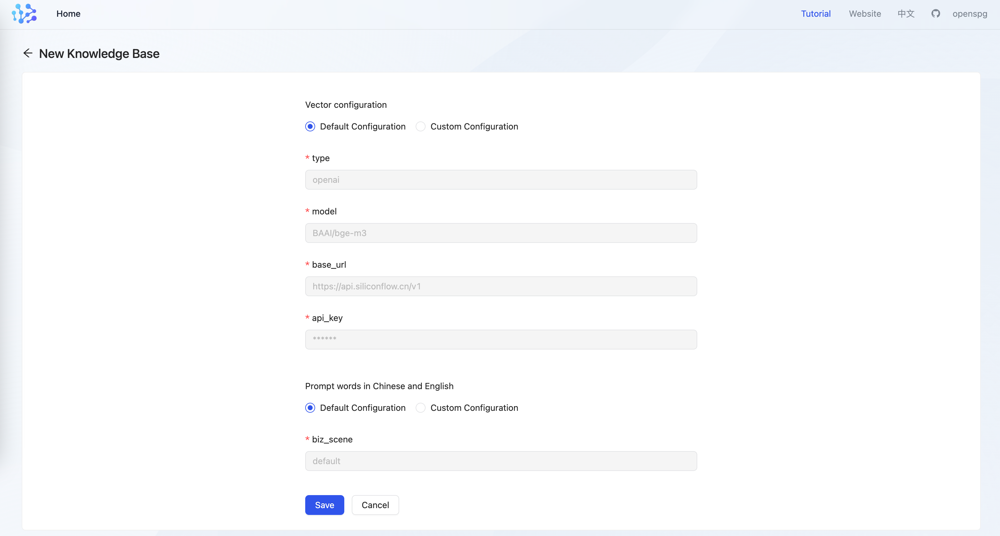

# Representation (embedding) model

KAG dependency represents the model service, which is used to generate entity attributes and query embedding vectors during Graph construction and inference Q &amp; A. For the vector settings of entity attributes, see the relevant chapter of "knowledge modeling.   
kag supports the representation model services of interfaces compatible with the openai class, such as openai and silicon-based flow. It also supports the representation model prediction services provided by ollama and xinference. At the same time, in the product mode, kag has built-in BAAI/bge-base-zh-v1.5 in the openspg-server container. The user can choose one of these ways to use.   
**Special attention: ****embedding ****vectors generated by different representation models cannot be mixed even if they have the same dimensions; Therefore, in the knowledge base configuration, the configuration related to the representation model cannot be modified once it is set. **

# Commercial** Model as a Service (MaaS)**
Developers can go there themselves. [Silicon-based flow official website](https://docs.siliconflow.cn/api-reference/embeddings/create-embeddings), [openai official website](https://chat.openai.com/), complete the account registration and model service opening in advance, and obtain the api-key and fill it in the subsequent project configuration. 

## **Product Mode Configuration **
in the product mode, the configuration is filled in the json string format.

#### configuration Item 


#### configuration Example
```bash
# replace base_url with siliconflow hostaddr
{
  "type": "openai",
  "model": "BAAI/bge-m3",
  "base_url": "https://api.siliconflow.cn/v1",
  "api_key": "YOUR_API_KEY",
  "vector_dimensions": "1024"
}
```

```bash
# base_url use openai default hostaddr
{
  "type": "openai",
  "model": "text-embedding-ada-002",
  "base_url": "https://api.openai.com/v1",
  "api_key": "YOUR_API_KEY",
  "vector_dimensions": "1536"
}
```

| **Parameter Name ** | **parameter Description ** |
| --- | --- |
| vectorizer | specifies the class name of the KAG Vectorizer. OpenAIVectorizer supports vectorized model services compatible with OpenAI and OpenAI API.  |
| model | visit [Models - OpenAI API ](https://platform.openai.com/docs/models/embeddings)view the available OpenAI presentation models, such as text-embedding-ada-002, text-embedded -3-small, and so on.    Visit [Embedding Models - siliconflow API ](https://docs.siliconflow.cn/api-reference/embeddings/create-embeddings)view the available presentation models, such as BAAI/bge-m3, etc.  |
| api_key | to get your api_key, go [silicon-based flow official website](https://docs.siliconflow.cn/api-reference/embeddings/create-embeddings), [openai official website](https://chat.openai.com/)get. |


#### model Service Availability Test
When the configuration is saved, kag calls the big model api based on the representation model configuration. If the call fails, it prompts that the save fails. You can use the curl Command in the openspg container to verify the reachability of the service and whether the api-key has expired.

```bash
# replace <token> with api-key acquired from model-api

$ curl --request POST \
  --url https://api.siliconflow.cn/v1/embeddings \
  --header 'Authorization: Bearer <token>' \
  --header 'Content-Type: application/json' \
  --data '{
      "model": "BAAI/bge-m3",
      "input": "硅基流动embedding上线，多快好省的 embedding 服务，快来试试吧"
    }'
```

## **Developer Mode**
you can change the representation model of all aspects of kag based on the  configuration file kag_config.yaml.

```bash
vectorize_model: &vectorize_model
  api_key: key
  base_url: https://api.siliconflow.cn/v1/
  model: BAAI/bge-m3
  type: openai
```

Note: Vector models cannot be mixed. If the model configuration needs to be modified, it is recommended to create a new knowledge base. 

# **Local Model Service (ollama) **
Indicates the local deployment of the model, which has a large resource overhead and workload. Only one example is provided here. If the developer is not clear about the specific details, we recommend that you purchase the business model api.

## **Model service startup**
### **ollama model reasoning service **
+ **Installing ollama **
    - **mac User: **brew install ollama 
    - **windows and linux users: **to [ollama official website](https://ollama.com/)download ollama 
+ **start the model service: **
    - **start ollama:**

```bash
# listening all requests
$ export OLLAMA_HOST=0.0.0.0:11434
$ ollama serve
```

    - **pull model: **

```bash
$ ollama pull bge-m3
```

    - **test:**

```bash
# service testing

$ curl http://127.0.0.1:11434/v1/embeddings -d '
    {
    "model": "bge-m3",
    "input": [
        "work"
    ]
}'
```

## **Product Mode Configuration **
### **Configuration Items & Examples **
In the product mode, the configuration is filled in the json string format. 

+ **configuration Item**


+ **configuration Example**

```bash
# replace base_url with real hostaddr
# OpenAIVectorizer will append postfix of "/embeddings", there is no need for user to provide url

vectorize_model: &vectorize_model
  api_key: EMPTY
  base_url: http://host.docker.internal:11434/v1
  model: bge-m3
  type: openai
  vector_dimensions: 1024

```

Note: Vector models cannot be mixed. If the model configuration needs to be modified, it is recommended to create a new knowledge base.

### **Representation model domain name settings **
when a user runs kag in the product mode, it involves the request of accessing the model service outside the container. For the following situations: 

+ **the kag container and the model inference service are deployed on the same host: **
    - **Mac & Windows Environment: **access to host.docker.int ernal in the container can be routed to the service on the host, and modify the domain name corresponding to base_url in the generated model configuration.

```bash
# bge-m3 can be accessed in container through: 

$ curl http://host.docker.internal:11434/v1/embeddings -d '
    {
    "model": "bge-m3",
    "input": [
        "work"
    ]
}'
```

    - **Linux environment: **to access 172.17.0.1 in the container, you can access the host by accessing the gateway of the docker0 network, and modify the domain name corresponding to base_url in the generation model configuration.

```bash
# bge-m3 can be accessed in container through: 

$ curl http://172.17.0.1:11434/v1/embeddings -d '
    {
    "model": "bge-m3",
    "input": [
        "work"
    ]
}'
```

+ **kag container and model inference service are deployed on different hosts: **

request Routing is implemented by accessing the ip address of the host where the model service is located. 

## **Developer mode configuration**
You can change the representation model of all aspects of kag based on the configuration file kag_config.yaml.

```bash
vectorize_model: &vectorize_model
  api_key: key
  base_url: https://api.siliconflow.cn/v1/
  model: BAAI/bge-m3
  type: openai
  vector_dimensions: 1024
```

Note: Vector models cannot be mixed. If the model configuration needs to be modified, it is recommended to create a new knowledge base.  
