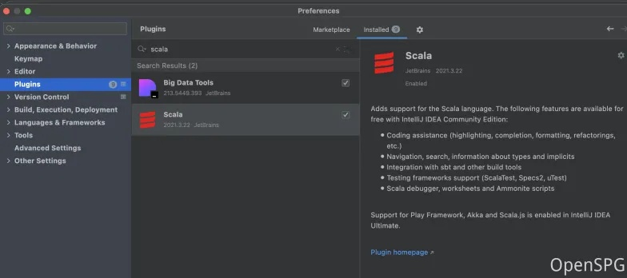
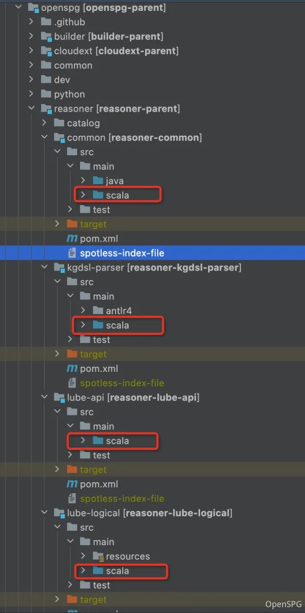
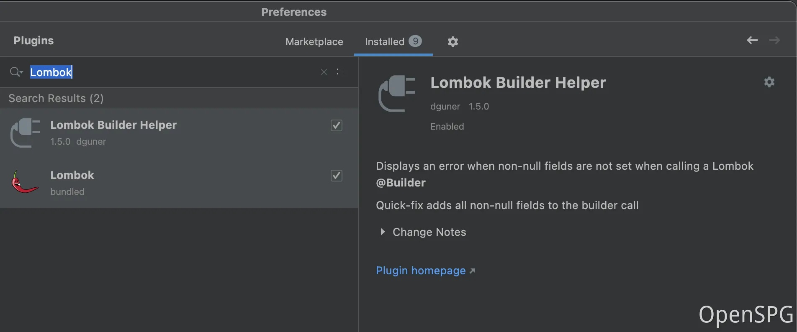
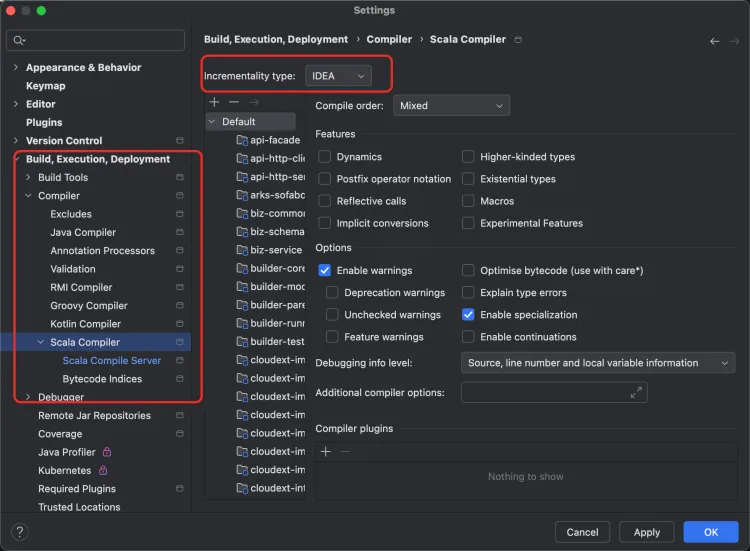

# OpenSPG Compilation & Deployment

# 1、Compilation Process
## 1.1、Pre-dependency 
+ **Java:**

java 18 (recommend OpenJDK version 18) 

+ **Maven**:

maven version 3.8 (recommend Maven version 3.8.5) 

+ **Scala:**

idea Installs the scala plug-in and sets the scala directory under the reason to Sources Root. 





+ **Lombok:**

idea Install the Lombok plugin 



+ **Set Incrementality Type to IDEA**

Settings > Build, Execution, Deployment > Compiler > Scala Compiler Set Incrementality Type to IDEA



## 1.2、Source code download 
clone the OpenSPG source code and open it in the IDE 

```bash
git clone git@github.com:OpenSPG/openspg.git
```

**subsequent commands must be executed in the root directory of the openspg code library. **

## 1.3、Source code compilation 
execute the mvn compilation Command 

```bash
mvn clean install -Dmaven.test.skip=true -Dspotless.check.skip -Dspotless.apply.skip
```

## 1.4、Start Mirroring
Start MySQL, Graph, and other containers locally

```bash
sh dev/test/docker-compose.sh
```

## 1.5、Start the server 
the startup server Portal is located

```bash
com.antgroup.openspg.server.arks.sofaboot.Application
```

**At present, the front-end code is not open source. If you need to use http:// 127.0.0.1:8887 to operate the front-end visualization page, please install it through mirror image.**

****

# **2、**Compilation Example(Mac)
**Environment： MacBook Air **

**Chip： Apple M1**

## **2.1、Install Homebrew**
**After installing Homebrew, it is used to install git, wget, java and other tools. If it has already been installed, you can ignore it directly**

```shell
## Install Homebrew
/bin/bash -c "$(curl -fsSL https://raw.githubusercontent.com/Homebrew/install/HEAD/install.sh)"
## Edit .zshrc
vim ~/.zshrc
## Add the following line
export PATH="/opt/homebrew/bin:/opt/homebrew/sbin:$PATH"
## Make the changes take effect
source ~/.zshrc
##Verify that Homebrew
brew --version
brew update
```

[此处为语雀卡片，点击链接查看](https://www.yuque.com/ndx6g9/docs_en/mudrfu5ibk4eh26g#UCqa2)


## **2.2、Install git and wget**
```shell
brew install git
brew install wget
git --version
wget --version
```

[此处为语雀卡片，点击链接查看](https://www.yuque.com/ndx6g9/docs_en/mudrfu5ibk4eh26g#rzpsS)


## **2.3、Install Maven And JAVA**
```shell
cd /Users/opt
## Install maven 3.8.5
wget https://alipay-sdtag.oss-cn-qingdao.aliyuncs.com/openspg/apache-maven-3.8.5.zip
## unzip
unzip apache-maven-3.8.5.zip
## Install JAVA 18 （Other environment versions can be downloaded manually from https://jdk.java.net/archive/）
wget https://download.java.net/java/GA/jdk18.0.2/f6ad4b4450fd4d298113270ec84f30ee/9/GPL/openjdk-18.0.2_macos-aarch64_bin.tar.gz
## unzip
tar -xzvf openjdk-18.0.2_macos-aarch64_bin.tar.gz

## Setting Environment Variables
vim ~/.zshrc
## Add java and maven addresses to PATH. Note: /Users/opt needs to be changed to your local installation path.
export PATH="/Users/opt/jdk-18.0.2.jdk/Contents/Home/bin:/Users/opt/apache-maven-3.8.5/bin:/opt/homebrew/bin:/opt/homebrew/sbin:$PATH"
## Make the changes take effect
source ~/.zshrc
## Verify
java -version
mvn -v
```

[此处为语雀卡片，点击链接查看](https://www.yuque.com/ndx6g9/docs_en/mudrfu5ibk4eh26g#pXUIC)


## **2.4、Download OpenSPG source code, compile and start**
```shell
cd /Users/opt

## Download openspg source code
git clone --depth=1 https://github.com/OpenSPG/openspg.git

## 1.Open OpenSPG through IDEA
## 2.Install Lombok and Scala plugins
## 3.Set Incrementality Type to IDEA
##  Settings > Build, Execution, Deployment > Compiler > Scala Compiler Set Incrementality Type: Zinc -> IDEA

## Compiling the code
mvn clean install -Dmaven.test.skip=true -Dspotless.check.skip -Dspotless.apply.skip

## Start Docker Docker. Desktop installation address(https://www.docker.com/products/docker-desktop/)

## Install mysql, neo4j image dependencies
sh dev/test/docker-compose.sh

##Start the application
com.antgroup.openspg.server.arks.sofaboot.Application

```

[此处为语雀卡片，点击链接查看](https://www.yuque.com/ndx6g9/docs_en/mudrfu5ibk4eh26g#AmMes)

