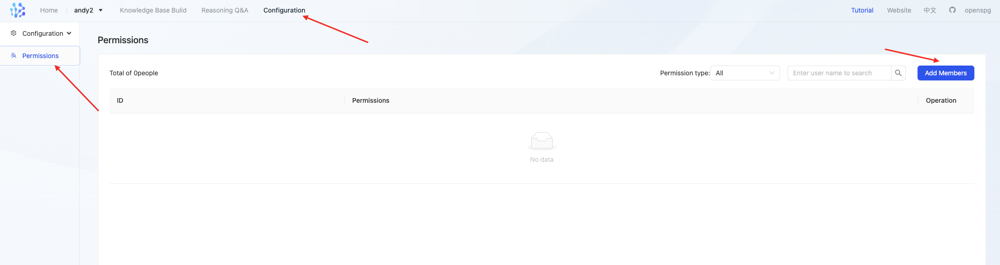
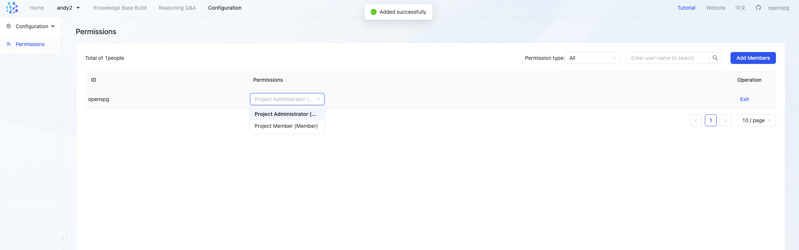
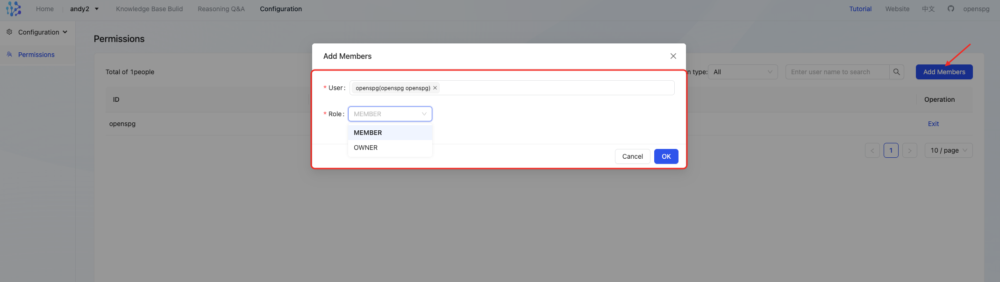
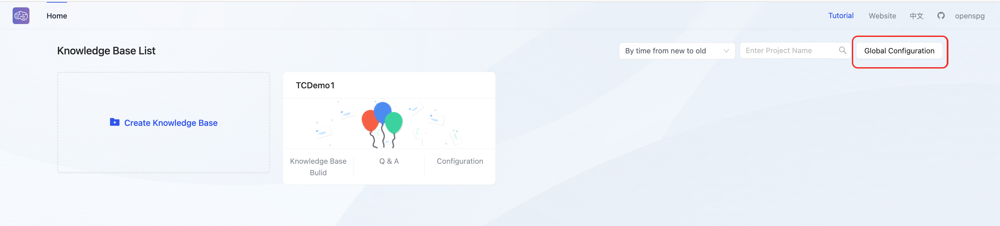
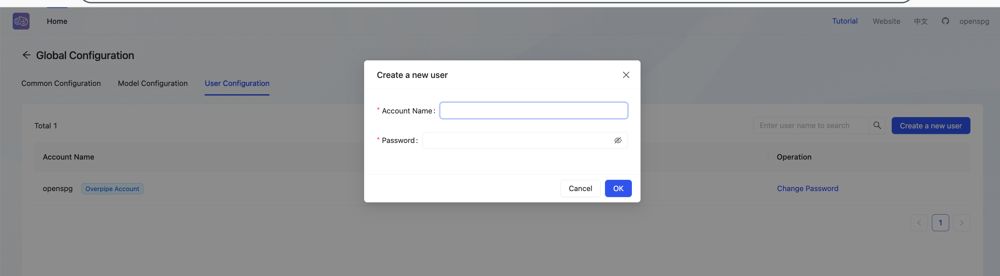

# Permission Management

## 1、Knowledge Base Permissions

Knowledge Base - Permissions tab page, you can set user knowledge base permission management

### 1.1 Permission Type
+ Owner: Knowledge base creator, can operate knowledge base schema, assign knowledge base administrators and members, exit, and delete other members of the knowledge base
+ Member:Can operate the knowledge base schema and exit the knowledge base

### 1.2 Permission List
+ List all authorized user information in the knowledge base, including user name, permission type, and operation
+ Filter: You can filter by permission type or fuzzy search by user name
+ Operation: The current user can exit the knowledge base, and the project administrator can delete other members of the knowledge base

### 1.3 Add Member

+ User: Supports fuzzy search by user name. The searched users are from the system users added in global configuration. If the user cannot be found, please ask the system administrator to add the user first and then assign permissions.
+ Role: Owner, Member

# 2、User Configuration
## 2.1、add user

##  

