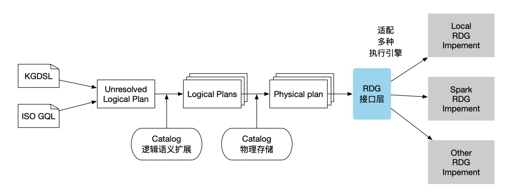

# RDG

## 1. Introduction of RDG
The design inspiration for RDG (Resilient Distributed Graph) comes from the core programming abstraction of Apache Spark - Resilient Distributed Dataset (RDD). The RDG model inherits the design philosophy of RDD and simplifies the expression and processing of graph data operations by abstracting complex graph operations into a series of standard operators such as Map, Filter, ReduceByKey, etc.

RDG serves as an advanced abstraction layer for graph computing, aiming to provide a unified interface for integrating multiple physical execution engines. By adapting the RDG interface, it is possible to transform the Labeled Property Graph (LPG) into a Semantic-enhanced Programmable Graph (SPG), greatly enhancing the application value of existing systems.



## 2. Adaptation Method
To adapt OpenSPG to a new physical engine, the main task is to implement your own RDG class. As the following, we will introduce the core interface of RDG:

### 1. RDG Interface
The code for the RDG interface can be referenced in [the provided link](https://github.com/OpenSPG/openspg/blob/master/reasoner/lube-physical/src/main/scala/com/antgroup/openspg/reasoner/lube/physical/rdg/RDG.scala). Here is a brief description of the interface:

| Interface | Paramter | Description |
| --- | --- | --- |
| patternScan | pattern: Pattern | Matching graph structure based on a given starting vertex. The pattern can be a vertex, an edge, or even a subgraph of one degree. |
| expandInto | target: PatternElement<br/>pattern: Pattern | Expanding the current graph intermediate results. The target is the overlapping vertex between the current graph structure and the structure to be matched. |
| filter | expr: Rule | Filtering graph intermediate results based on the rule expression. |
| groupBy | by: List[Var]<br/>aggregations: Map[Var, Aggregator] | Performing aggregation calculations.<br/>Unlike aggregating tabular data, aggregating graph data requires deduplication of vertices and edges based on subgraph structures. |
| addFields | fields: Map[Var, Expr] | Computing expressions and adding the results to the graph. |
| dropFields | fields: Set[Var] | Removing unnecessary data and properties to reduce the size of intermediate results. |
| orderBy | groupKey: List[Var]<br/>sortItems: List[SortItem]<br/>limit: Int | Aggregating, sorting, and truncating the results. |
| linkedExpand | pattern: EdgePattern[LinkedPatternConnection] | Logical linking.<br/>During the inference process, certain edges are obtained through logical calculations or model predictions. This interface is commonly used in spatio-temporal reasoning and concept tree mounting. |
| cache | None | Caching the current RDG data.<br/>Generally used to suspend the current inference task and enter a sub-inference task. |
| join | other: RDG<br/>joinType: JoinType<br/>onAlias: List[(String, String)]<br/>lhsSchemaMapping: Map[Var, Var]<br/>rhsSchemaMapping: Map[Var, Var] | Joining two RDG results together.<br/>Multiple JoinTypes need to be supported, and alias mapping is required due to potential namespace overlap. |
| ddl | ddlOps: List[DDLOp] | Generating new knowledge, including vertices, edges, and properties. |
| select | cols: List[Var], as: List[String] | Selecting relevant information from the subgraph structure and outputting it in a tabular data format. |
| fold and unfold | mapping: List[(RichVar, List[Var]) | Used in repeat scenarios to merge and expand repeat edges. |


### 2. PropertyGraph and LocalReasonerSession
Once you have completed the implementation of the RDG, you can create RDGs using the PropertyGraph class and associate them with your own graph storage using the LocalReasonerSession. The interfaces you need to implement are as follows:

| Interface | Paramter | Description |
| --- | --- | --- |
| KGReasonerSession.loadGraph | graphLoaderConfig: GraphLoaderConfig | Loading a property graph and returning a PropertyGraph object. |
| PropertyGraph.createRDG | alias: String<br/>types: Set[String] | Creating an RDG based on a given inference starting vertex type. |
| PropertyGraph.createRDG | alias: String, rdg: RDG | Creating a sub-inference task RDG based on a given RDG and starting veterx alias. |


## Example of LocalRunner
LocalRunner is an inference engine that is implemented on a single machine and has complete inference capabilities. The code for LocalRunner is open source and can be referenced at: 

| Module | Reference/Link |
| --- | --- |
| LocalRDG | [https://github.com/OpenSPG/openspg/blob/master/reasoner/runner/local-runner/src/main/java/com/antgroup/openspg/reasoner/runner/local/rdg/LocalRDG.java](https://github.com/OpenSPG/openspg/blob/master/reasoner/runner/local-runner/src/main/java/com/antgroup/openspg/reasoner/runner/local/rdg/LocalRDG.java) |
| LocalPropertyGraph | [https://github.com/OpenSPG/openspg/blob/master/reasoner/runner/local-runner/src/main/java/com/antgroup/openspg/reasoner/runner/local/impl/LocalPropertyGraph.java](https://github.com/OpenSPG/openspg/blob/master/reasoner/runner/local-runner/src/main/java/com/antgroup/openspg/reasoner/runner/local/impl/LocalPropertyGraph.java) |
| LocalReasonerSession | [https://github.com/OpenSPG/openspg/blob/master/reasoner/runner/local-runner/src/main/java/com/antgroup/openspg/reasoner/runner/local/impl/LocalReasonerSession.java](https://github.com/OpenSPG/openspg/blob/master/reasoner/runner/local-runner/src/main/java/com/antgroup/openspg/reasoner/runner/local/impl/LocalReasonerSession.java) |


## Adapting RDG based on Spark (Pseudocode):
In the adaptation for Spark, we use RDDs to store graph data, similar to GraphX. We also use RDDs to store intermediate results during inference. Here is some pseudocode to demonstrate the adaptation process:   

### 1. SparkRDG
```plain
public class SparkRDG extends RDG<SparkRDG> {
    private SparkContext sc;
    private RDD<Result>  rstRdd;
    private RDD<String>  startIds;

    public SparkRDG(SparkContext sc, RDD<String> ids) {
        this.sc = sc;
        this.startIds = ids;
    }

    @Override
    public SparkRDG patternScan(Pattern pattern) {
        rstRdd = startIds.map(
            // Implementing map to match the corresponding pattern
        )
    }

    /**
     * expand graph pattern
     */
    @Override
    public SparkRDG expandInto(PatternElement target, Pattern pattern) {
        rstRdd = rstRdd.keyBy(
            // Keying the previously matched subgraphs by target for the next round of matching 
        ).map(
            // Implementing a matching function to complete the pattern matching
        )
    }
}
```

### 2. SparkPropertyGraph
```plain
public class SparkPropertyGraph implements PropertyGraph<SparkRDG> {
    private SparkContext sc;
    private RDD<VertexGraph> graph;   //VertexGraph represents a custom graph structure

  public class SparkPropertyGraph(SparkContext sc) {
		  this.sc = sc;
	}

	public void loadGraph(Map<String, Object> config) {
    	this.graph = ...     //Loading the graph, considering using RDDs to store the graph similar to GraphX
    	this.graph.persist();
	}

	@Override
	public SparkRDG createRDG(Set<String> types) {
    	// Constructing an RDG by finding vertices of types from the graph
	}

	@Override
	public SparkRDG createRDG(Object id, String alias) {
    	// Constructing an RDG by finding a specific alias as the starting vertex from other RDGs
	}
}
```
