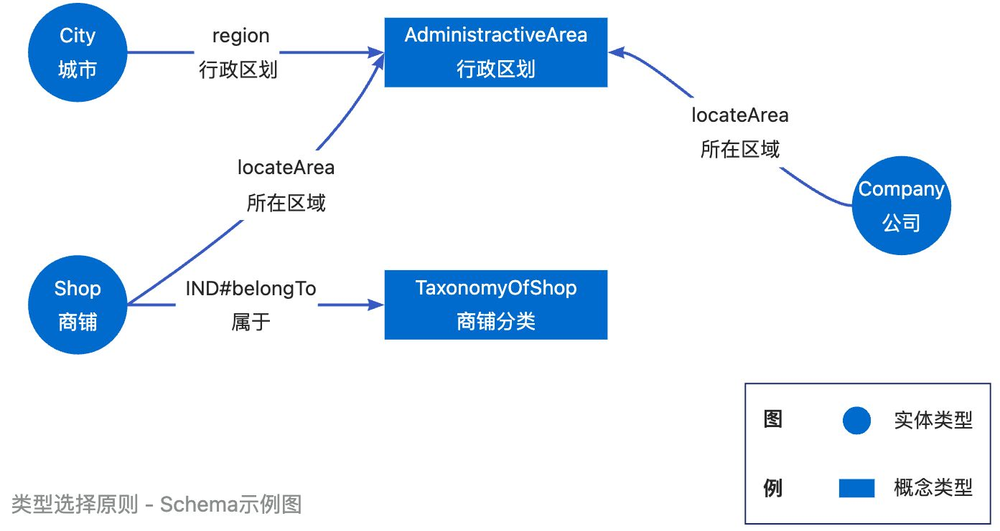
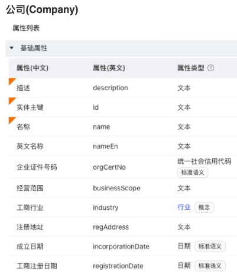
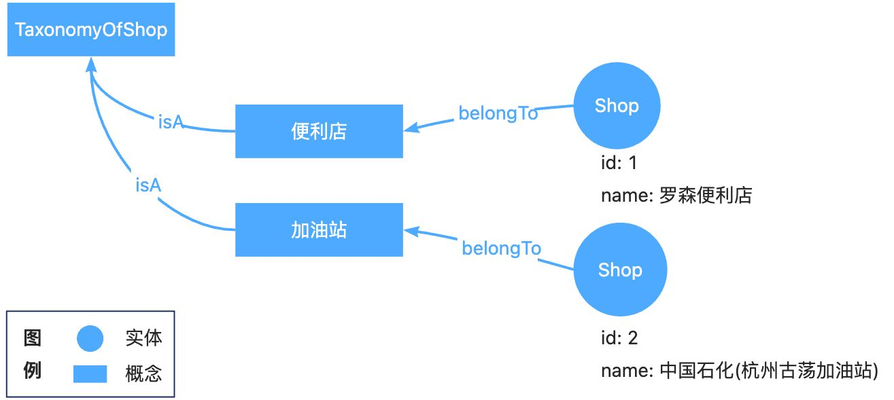
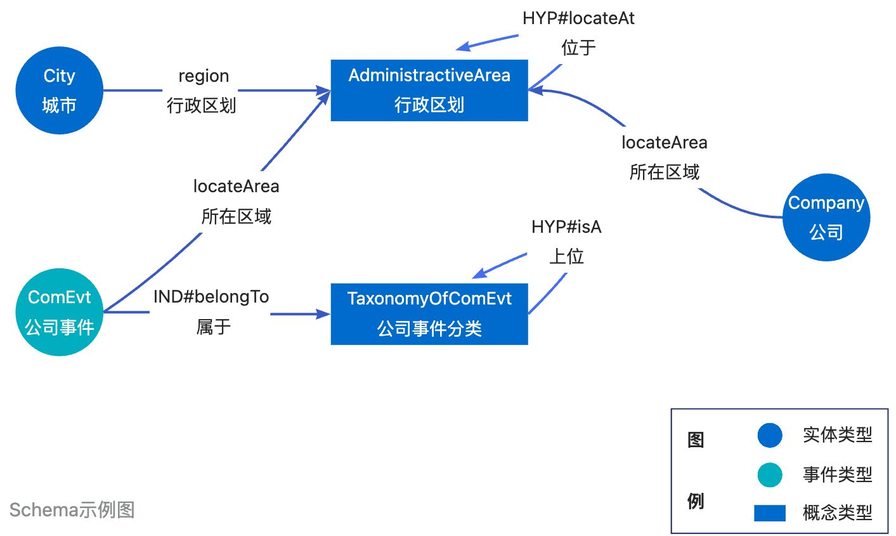

# Best Practices for Knowledge Modeling

In order to facilitate a better understanding and application of constructing knowledge graphs with OpenSPG, we have summarized seven principles from the best practices of SPGSchema modeling. Each principle is accompanied by relevant examples for clarification. It is expected that these principles will address any doubts during modeling and fully leverage the efficient and powerful knowledge expression capabilities of OpenSPG.

# 1 Principle of Type Selection


### Principle 1: Use entity types or event types for complex and diverse structures
:::info
**Explanation: **When an object requires rich properties to describe it, such as a "company," it is suitable to use entity types for modeling. This is because it not only uses a single name but also utilizes information such as business scope, company registration number, and registered address to describe the entity.

:::



### Principle 2: Use concept types for flat categorization labels
:::info
**Explanation: **When the target object is merely a linguistic or textual classification label and the focus is on expressing relationships such as hierarchy, inclusion, and causality between labels, it is suitable to use concept types for modeling. For example, expressions like "ore extraction" and "ore smelting" can be used as labels for industrial classification. The difference between concepts and entities/events is as follows:

+ **Complex vs. Simple structure: **For example, in the case of a company type, there are multiple attributes defined, such as the administrative region it belongs to, the industry it operates in, and the category of its products, with each attribute being associated with a specific concept type. On the other hand, administrative regions, industry categories, and product categories are concept classifications with a simple structure, emphasizing the hierarchical relationship between categories.
+ **Conflict resolution for identical modeling: **For example, for Hangzhou City, if it is being described in terms of its specialties, population, area code, etc., it should be modeled using an entity type. However, Hangzhou City can also be used from the perspective of administrative divisions, mainly to indicate that Hangzhou City is located in Zhejiang Province, and Zhejiang Province is located in China. In this case, Hangzhou City, Zhejiang Province, and China all belong to instances of administrative divisions, emphasizing their geographical relationship. In such cases, it is recommended to create both an entity type and a concept type, and import Hangzhou City as instances of both types.

:::

Taking the following schema as an example:

```yaml
namespace CKG

AdministractiveArea(行政区划): ConceptType
  hypernymPredicate: locateAt
    
... ...

City(城市): EntityType
  properties:
    localProducts(特产): Product
      constraint: MultiValue
    population(人口数量): Integer
    areaCode(区号): Text
    region(行政区划): AdministractiveArea
```

```plain
“City(城市)”的实体:
{
  "id": "hz",
  "name": "杭州市",
  "areaCode": "0571",
  "region": "中国-浙江省-杭州市"
}

“AdministractiveArea(行政区划)”的概念：
 中国 <-locateAt- 浙江省 <-locateAt- 杭州市
```


### Principle 3: Use the principle of dynamic categorization for entities/events with multiple types
:::info
**Explanation: **In the objective world, there can be multiple classifications for the same object. For example, the classification of shops can include supermarkets, convenience stores, gas stations, car wash shops, etc. If we were to model these different perspectives as separate entity types, it would lead to a type explosion in the knowledge graph, which would make data construction and reasoning applications very challenging. SPG solves this problem by using a combination of type definition and concept classification.

:::

Taking the example of a shop, during modeling, we first create an entity type called "Shop" and then create a concept type called "Shop Category" for classification. It is important to note that the concept type should be defined before the entity type.

```yaml
namespace World

TaxonomyOfShop(商铺分类): ConceptType
  hypernymPredicate: isA

Shop(商铺): EntityType
  desc: 诸如便利店和加油站等
  properties:
     locateArea(所在区域): AdministractiveArea
     address(地址): Text     
     contactPhone(联系电话): STD.ChinaTelCode
     IND#belongTo(属于): TaxonomyOfShop
```

Then prepare concept data for "Shop Category" for importing：

```plain
超市
便利店
加油站
洗车店
```

Importing instance data for "Shop," as follows:

```plain
id,name,locateArea,address,contactPhone,belongTo

1,罗森便利店,杭州市,浙江省杭州市西湖区西溪路588号1层,0571-85801525,便利店

2,中国石化(杭州古荡加油站),杭州市,浙江省杭州市西湖区天目山路331号,0571-85220839,加油站
```

By using the value of the "belongsTo" property, a relation from the instance to the concept will be automatically generated, achieving classification of the entity.



During querying, we can directly use the concept type "TaxonomyOfShop" to refer to the "Shop" type, thereby retrieving the corresponding entities based on the concept. This achieves the same effect as modeling with separate types but greatly simplifies data querying and maintenance.

```graphql
MATCH (s:`TaxonomyOfShop`/`便利店`) RETURN s
# 返回id为1的"罗森便利店"实体

MATCH (s:`TaxonomyOfShop`/`加油站`) RETURN s
# 返回id为1的"中国石化(杭州古荡加油站)"实体
```


Additionally, SPGSchema also supports using rules as the basis for concept attachment, where the concept name to be attached is determined by performing operations on the entity's properties using rules.

For example, we can automatically classify entities based on keywords in their names by defining concept rules as follows. 

```graphql
Define (s:Shop)-[p:belongTo]->(o:`TaxonomyOfShop`/`便利店`) {
    Structure {
        (s)
    }
    Constraint {
        R1("是便利店"): s.name like "%便利店%"
    }
}

Define (s:Shop)-[p:belongTo]->(o:`TaxonomyOfShop`/`加油站`) {
    Structure {
        (s)
    }
    Constraint {
        R1("是加油站"): s.name like "%加油站%"
    }
}
```


When importing instance data for "Shop," the "belongsTo" property is no longer imported.

```plain
id,name,city,address,contactPhone

1,罗森便利店,杭州市,浙江省杭州市西湖区西溪路588号1层,0571-85801525

2,中国石化(杭州古荡加油站),杭州市,浙江省杭州市西湖区天目山路331号,0571-85220839
```

After the data import is complete, querying can retrieve the values and relations of the "belongsTo" property. 

```graphql
MATCH (s:Shop WHERE id="1")-[p:belongTo]-(o) RETURN s,p,o
```


:::warning
**Note:** If a concept has defined induction rules but the "belongsTo" property values are imported during data import, the results of the rule calculations will take precedence.

:::


### ****Principle 4: Concept types do not inherit
:::info
**Explanation:** Concept types can only have the parent class "Thing" and cannot inherit other types. This is because concept types inherently have a hierarchical relation, implying inheritance semantics. If concept types were to inherit, it would result in conflicting semantics.

:::


# 2 Principle of property/relation selection
### Principle 5: The direction of relations follows the principle of from active to passive, and vice versa is prohibited..
:::info
**Explanation:** Event types can point to any type, entity types cannot point to event types, and concept types can only point to other concept types, while the reverse is prohibited.

+ **Events can point to any type: **Events are independent actions that occur, and entity/concept/standard types are associated with events as passive participants. Therefore, event types can point to any type, while the reverse is prohibited.
+ **Entities cannot point to event types: **Entities are complex objects with multiple attributes, and they can establish relations with other entities actively. However, concept types and standard types can only be used as attribute types of entities. Since entities do not generate events automatically, they are not directly related to events.
+ **Concepts cannot point to complex types: **Concepts are flat categorization labels that abstractly describe a set of entities with common characteristics. Therefore, they can only be used by events or entities to define attribute types, and the reverse is prohibited.

:::




### Principle 6: Only the seven semantic relations specified by the system are allowed between concept types. 
+ HYP: Hypernym, refers to the relation where a broader or more general concept includes or encompasses another more specific or particular concept. The available predicates are "isA" and "locateAt", while other predicates are yet to be expanded.
+ SYNANT: Synonymy/Antonymy, expresses whether concepts are synonymous or antonymous to each other. The available predicates are "synonym" and "antonym", while other predicates are yet to be expanded.
+ CAU: Causality, represents the relation where one event or action (cause) leads to another event or action (effect). The available predicate is "leadTo", while other predicates are yet to be expanded.
+ SEQ: Sequentiality, refers to a sequence of events or actions that occur in a specific order. The available predicate is "happenedBefore", while other predicates are yet to be expanded.
+ IND: Induction, refers to the relation where general concepts are derived from a group of entities with common characteristics. The available predicate is "belongTo", while other predicates are yet to be expanded.
+ INC: Inclusion, expresses the relation between a part and a whole. The available predicate for this relationship is "isPartOf", while other predicates are yet to be expanded.
+ USE: Usage, expresses the relation of function or purpose.

### Principle 7: Standardization of attributes is recommended but not mandatory
:::info
**Explanation: **It is recommended to standardize attributes using concept types, standard types, and entity types as much as possible. This is because SPGSchema automatically generates equivalent relations based on attributes, simplifying the creation and maintenance of relations. Especially when the attribute values of an entity are modified, the relation instances will automatically synchronize based on the attribute values, ensuring that the relation remains consistent with the description of the attribute values. SPGSchema suggests using attributes instead of creating relations whenever possible. Relation creation should only be used when it is necessary to configure attributes on the relation or define logical relations.

:::


