# Modeling Visualization

## I. Entrance
After creating a project, the corresponding project card will be displayed on the project list page; click "Knowledge Base Build" and then click "Knowledge Model" to enter the Schema viewing page.

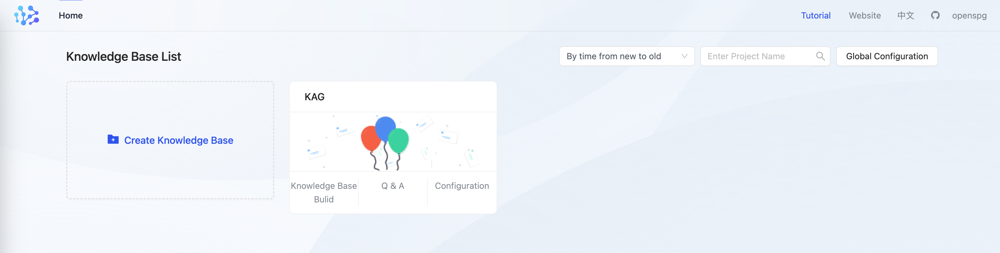

## II. Knowledge Model: 
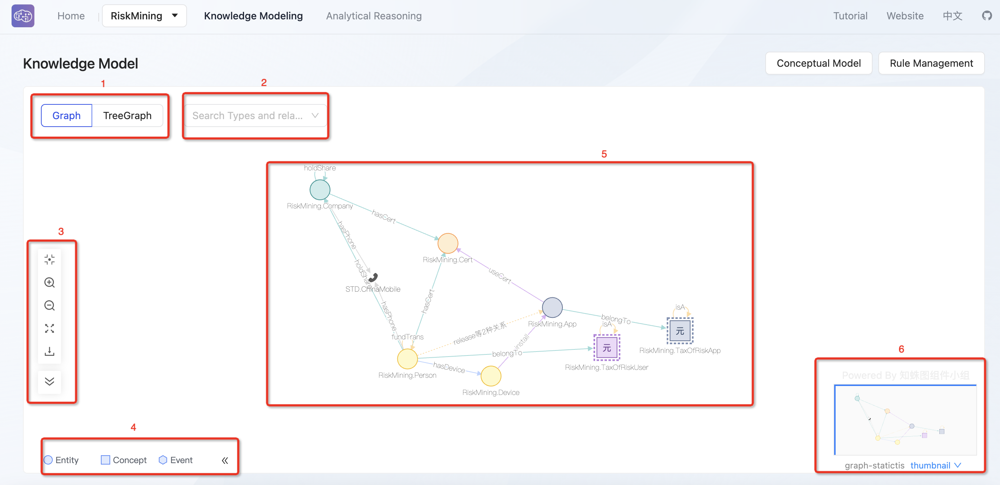

### Graph Mode: 
It is divided into graph and treegraph.

+ Graph allows you to view entity types and the relationships between types, while treegraph shows the hierarchical relationships of entity types.

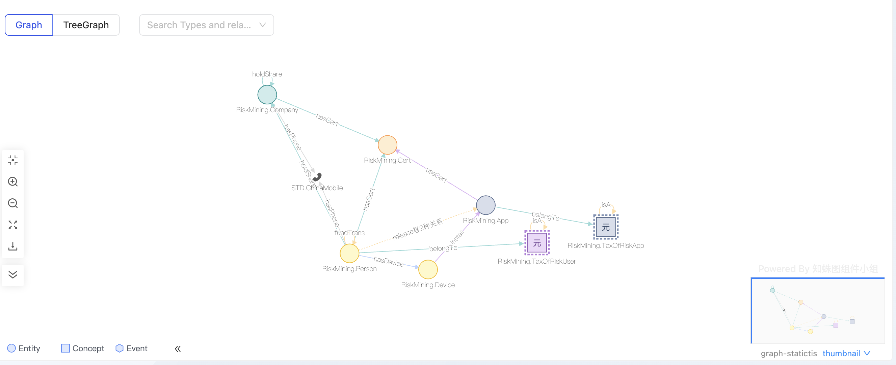

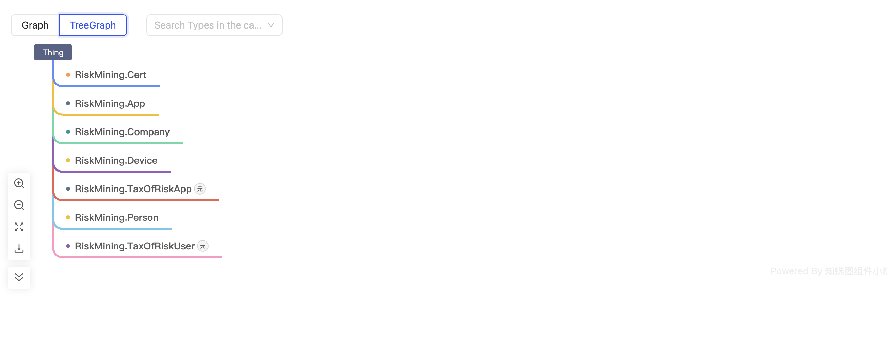

### Search box: 
+ Users can find nodes on the canvas by entering node types.
+ The selected node expands to show node details.

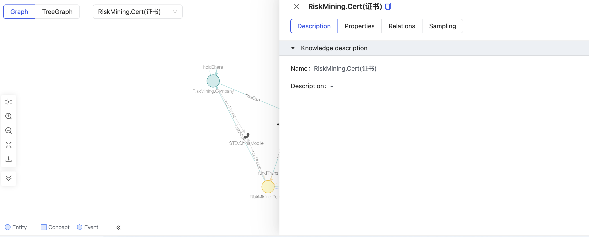

### Canvas tools:
Including center, zoom in, zoom out, full screen, download, and collapse toolbar.

+ Clicking on center, zoom in, zoom out, and full screen adjusts the canvas size and node size and position.
+ Clicking download will export the current canvas in PNG format.

### Canvas legend: 
+ Divided into entity types, concept types, and event types.

### Canvas center area:
Displays the created schema, including node types and the types of relationships between node types.

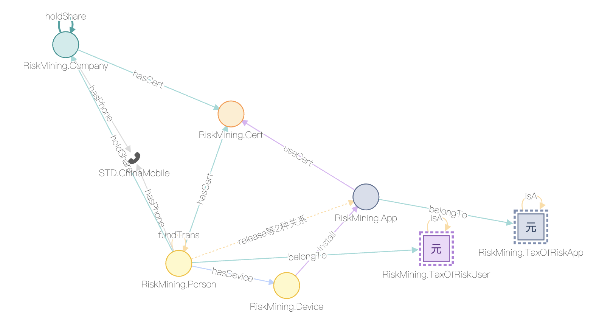

Nodes corresponding to types can be viewed according to the legend in the lower left corner, with standard types displayed on the canvas in the form of icons, such as phone numbers.

**Double-clicking or right-clicking** a node expands to show node details.

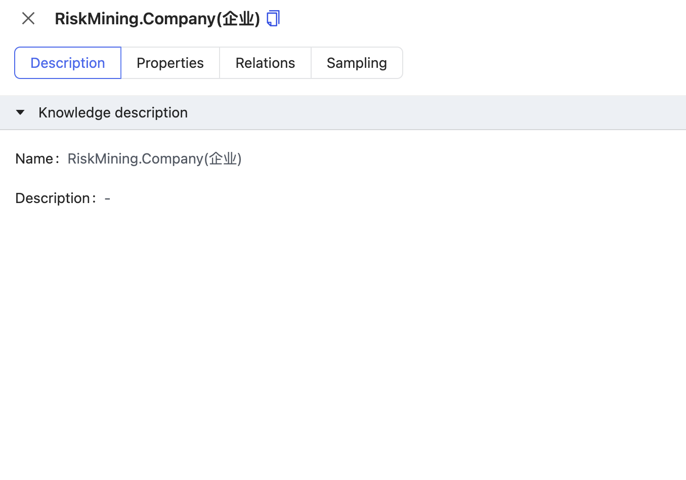

#### Node details: 
Display the description, attributes, relationships, and data sampling of the node.

1. Description: Shows the name (name) and description (description) of the node.

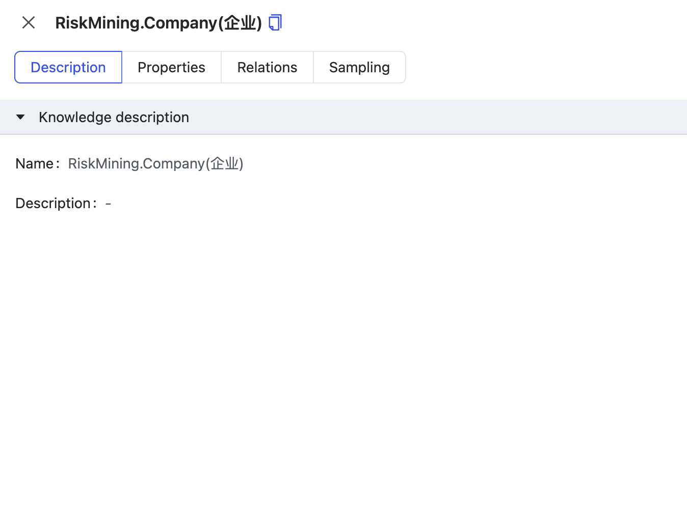

2. Properties: Displays the property information of the node, including attribute name (Chinese & English), property type, and advanced configuration (constraint type); supports searching for attributes.

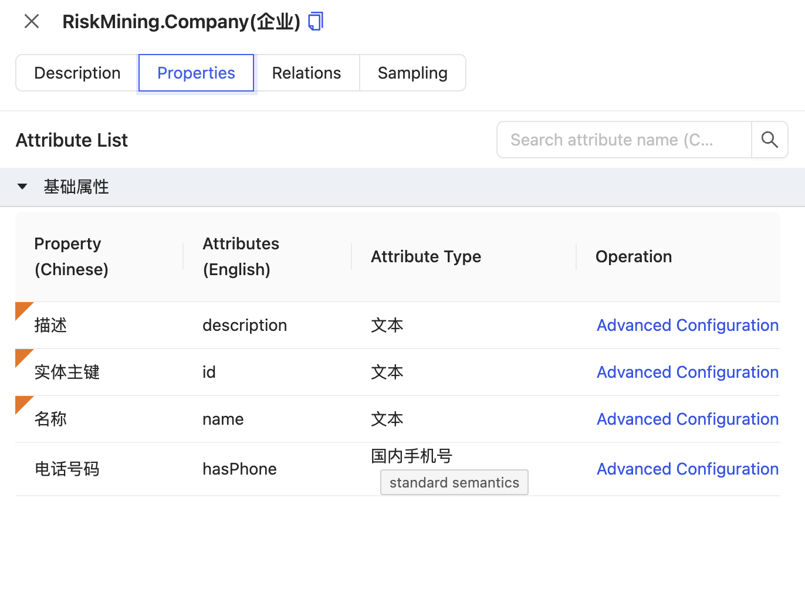

3. Relations: Displays all relationships connected to the current node: divided into one-degree expansion relationships, concept/event/standard/entity type relationships (one-degree expansion relationships are a collection of concept/event/standard/entity type relationships).

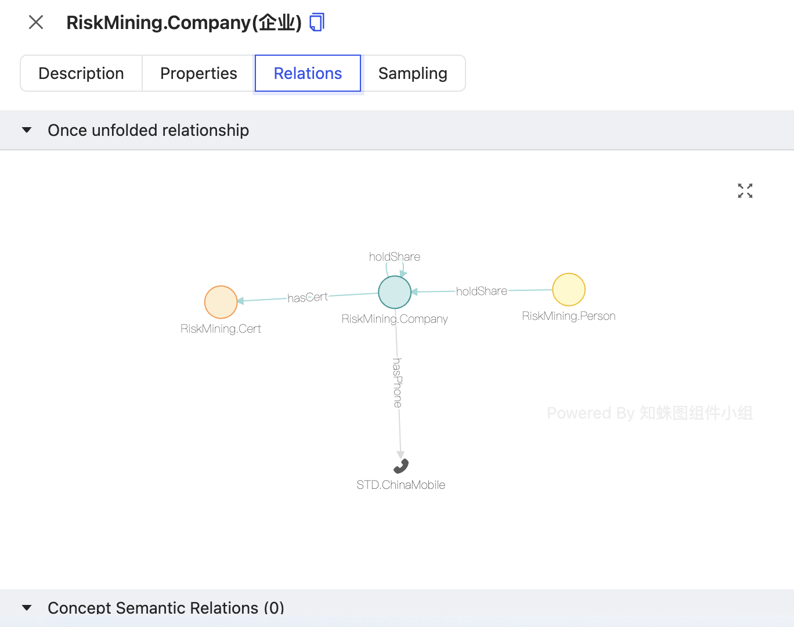

4. Sampling: Displays a data sample of the current node; by default, 10 data entries are sampled.

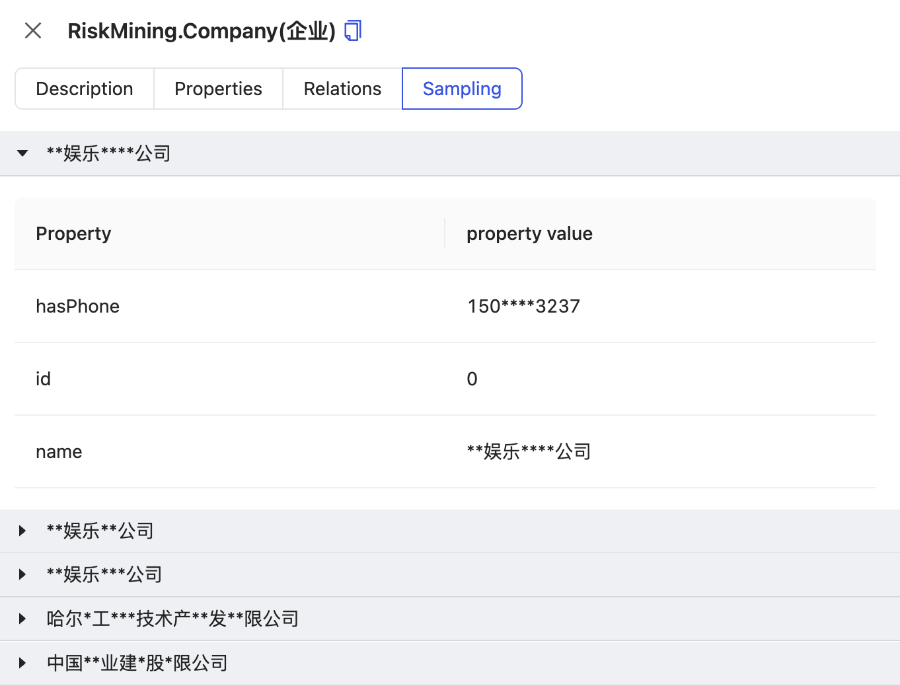

### Canvas thumbnail: 
Shows a thumbnail of the current canvas, with statistics on node types and relationship types.

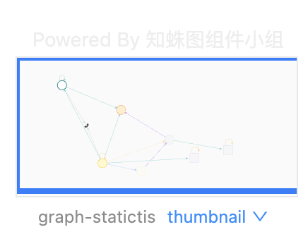

## III. Concept Model:
Displays a collection of concepts in the current project, including concept types, sub-concepts, and the hierarchical relationships between concepts.

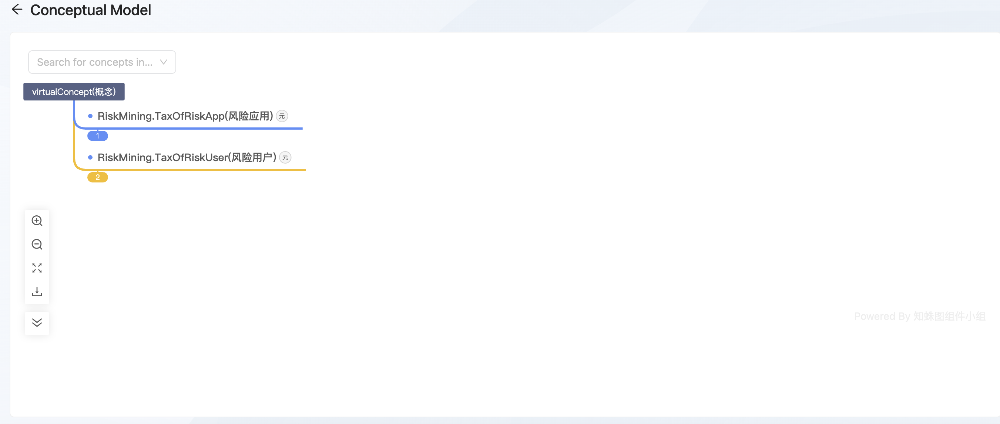

+ The concept canvas uses a tree mode to display concept types and the number of sub-concepts under concept types.
+ By default, only concept types and the number of sub-concepts under concept types are displayed; you can double-click on the number under concept types to expand and view sub-concepts.
+ Clicking on a concept type displays a detail panel of the concept type, with information consistent with the node's detail panel.

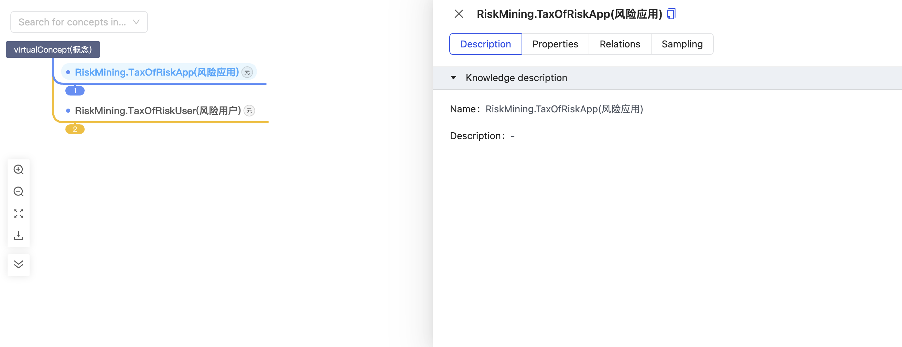

+ Clicking on a concept displays a detail panel of the concept; the detail panel includes description, attributes, and rules.

#### Node details:
    1. Description: Shows the concept name (name), concept description (description), parent concept, concept type, and aliases.

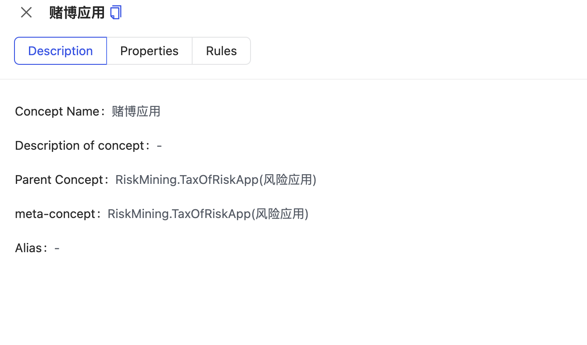

    2. Properties: Displays the attributes and attribute values of the current concept.

    3. Rules: If rules for reasoning are written on the current concept, they are displayed specifically.

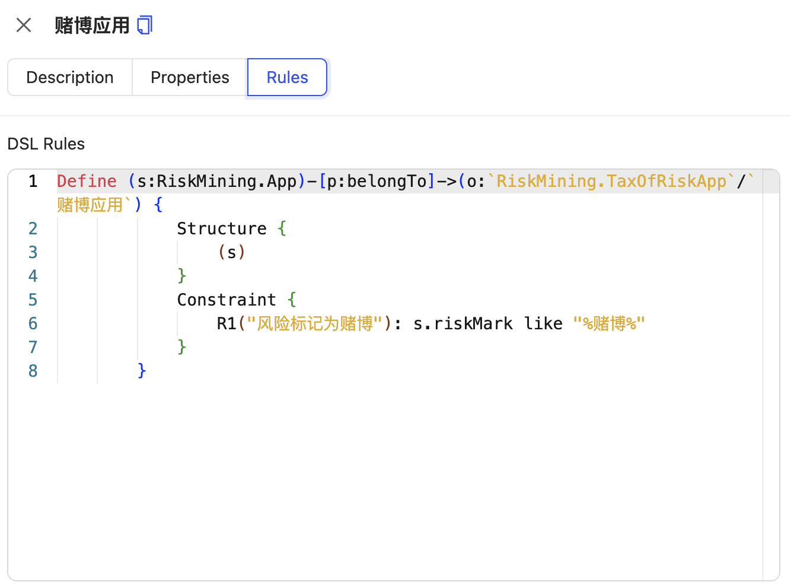

## IV. Rule Management: 
Displays all rules in the current project, including rules on entity type attributes, relationship types, and concepts.

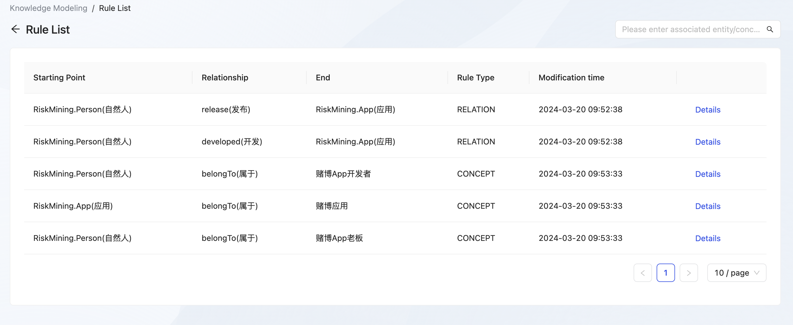

Displays the starting point (s), relationship (p), and endpoint (o) of rules, rule type, rule modification events, and rule details.

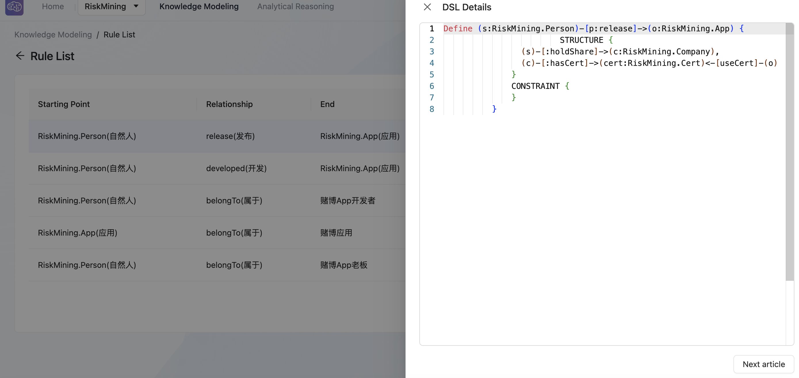

1. Attribute rules: The starting point is the entity type, the relationship is the attribute name, and the endpoint is the attribute value (not displayed on the rule list).
2. Relationship rules: The starting point is the entity type, the relationship is the relationship type, and the endpoint is the entity type.
3. Concept rules: The starting point is the entity type, the relationship is the relationship type, and the endpoint is the sub-concept.

