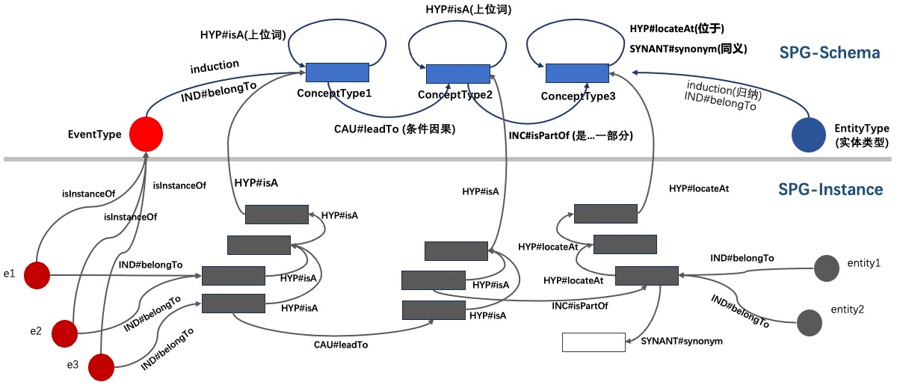

# Semantic Classification of Concept

### HYP: Hypernym relation
Refers to the relation where a broader or more general concept includes or encompasses a more specific or specialized concept.

+ **isA**

      Is a type of...

+ **locateAt**

Is located at...

+ **mannerOf** 

A is a specific implementation or way of B. Similar to "isA," but used for verbs. For example, "auction" → "sale"

### SYNANT: Synonymy/Antonymy relation
Expresses whether concepts are synonymous or antonymous to each other.

+ **synonym**

Expresses synonyms.

+ **antonym**

Expresses antonyms. 

+ **symbolOf**

A symbolically represents B. For example, "red" → "passion". 

+ **distinctFrom**

A and B are different members of a set, and something that belongs to A cannot belong to B. For example, "August" → "September".

+ **definedAs**

A and B have significant overlap in meaning, but B is a more explanatory version of A. For example, "peace" → "absence of war". 

+ **locatedNear**

A and B are usually found near each other. For example, "chair" → "table". 

+ **similarTo**

A and B are similar. For example, "blender" → "food processor".

+ **etymologicallyRelatedTo**

A and B have a common origin. For example, "folkmusiikki" → "folk music".

### CAU: Causal relation
Represents a type of relation where one event or action (cause) leads to the occurrence of another event or action (result). 

+ **leadTo**

Expresses the logical rule through which an event is generated, such as an instance of event A generating an instance of event B under specified conditions. This predicate is recognized by the system as an intention for instance generation, used for implementing the instance propagation of events.

+ **causes**

Expresses a constant causal relation without any conditional constraints.

+ **obstructedBy**

A is a goal that can potentially be hindered by B, where B acts as an obstacle to hinder the realization of A. For example, "sleep" → "noise".

+ **causesDesire**

A triggers a desire or need for B in a person, where the state or event of A stimulates a desire or need for B. For example, "hunger" → "go to the store". 

+ **createdBy**

B is a process or motive that creates A. For example, "cake" → "baking".

### SEQ: Sequential relation
Refers to a series of events or actions that occur in a specific order. 

+ **happendedBefore**

A occurs before B.

+ **hasSubevent**

A and B are events, where B is a sub-event that occurs as part of A. For example, "eating" → "chewing".

+ **hasFirstSubevent**

A is an event that begins with sub-event B. For example, "sleeping" → "closing eyes".

+ **hasLastSubevent**

A is an event that ends with sub-event B. For example, "cooking" → "cleaning the kitchen".

+ **hasPrerequisite**

In order for A to occur, B needs to occur; B is a prerequisite for A. For example, "dreaming" → "sleeping".

### IND: Induction relation
Refers to the relation between individual entities and conceptual generalizations derived from a class of entities with common characteristics. 

+ **belongTo**

This relation is commonly used in SPG to describe the classification relation from entity types to concept types. For example, "company event" → "company event category".

### INC: Inclusion relation
Expresses the relation between parts and the whole. 

+ **isPartOf**

A is a part of B.

+ **hasA**

B belongs to A as an inherent part or due to societal constructs. HasA is often the reverse relation of PartOf. For example, "bird" → "wing". 

+ **madeOf**

A is made up of B. For example, "bottle" → "plastic". 

+ **derivedFrom**

A is derived from or originated from B, used to express composite concepts.

+ **hasContext**

A is a word used in the context of B, where B can be a subject area, technical field, or regional dialect. For example, "astern" → "ship".

### USE: Usage relation
Expresses the relation of purpose or usage. 

+ **usedFor** 

A is used for B, where the purpose of A is B. For example, "bridge" → "crossing over water". 

+ **capableOf**

A is capable of doing B. For example, "knife" → "cutting".

+ **receivesAction**

B is an action that can be performed on A. For example, "button" → "press".

+ **motivatedByGoal**

Someone does A because they desire outcome B; A is a step towards achieving goal B. For example, "competition" → "winning".

